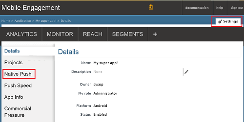
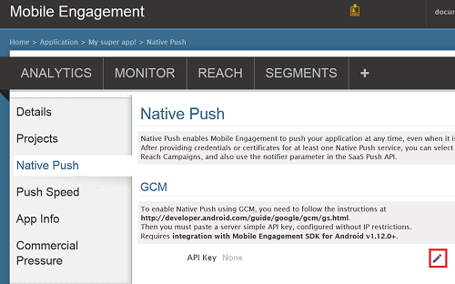
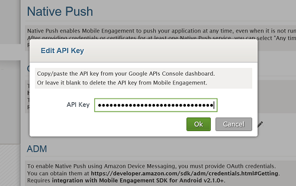
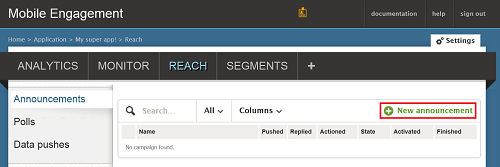
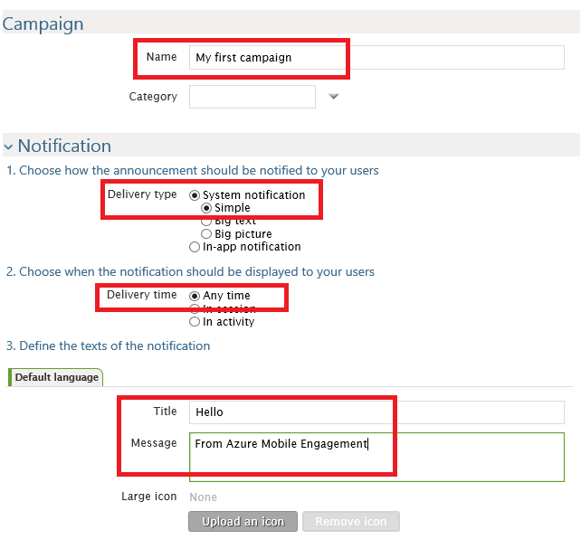
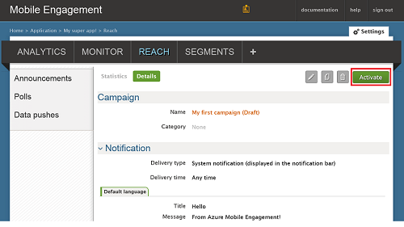

###Gewähren des mobilen Engagement Zugriffs auf Ihre GCM API-Schlüssel

Damit Mobile Engagement Pushbenachrichtigungen in Ihrem Auftrag senden können, müssen Sie den Key-API Zugriff gewähren. Dies ist durch Konfigurieren und den Key in das Mobile Engagement Portal eingeben.

1. In der klassischen Azure-Portal stellen Sie sicher, dass Sie wir für dieses Projekt verwenden möchten, und klicken Sie dann auf die Schaltfläche **mit einbeziehen** , klicken Sie unten in der app befinden:

    

2. Klicken Sie dann auf die **Einstellungen** -> **Systemeigenen Pushbenachrichtigungen** Abschnitt zur Eingabe des GCM Keys:

    

3. Klicken Sie auf das Symbol **Bearbeiten** vor **API-Schlüssel** im Abschnitt **Einstellungen GCM** , wie unten dargestellt:

    

4. Das Popup fügen Sie des GCM Serverschlüssels Sie vor dem ein, und klicken Sie dann auf **Ok**.

    

##Senden einer Benachrichtigung zu Ihrer Anwendung

Wir werden nun eine einfache Pushbenachrichtigungen Benachrichtigung für eine Marketingkampagne erstellen, die einer der Pushbenachrichtigung an unserem app sendet.

1. Navigieren Sie zur Registerkarte **erreicht haben** Ihre Mobile Engagement-Portal an.

2. Klicken Sie auf **neue Ankündigung** , um Ihre Pushbenachrichtigungen Benachrichtigung für eine Marketingkampagne zu erstellen.

    

3. Richten Sie das erste Feld der dienen mithilfe der folgenden Schritte aus:

    

    ein. Benennen Sie Ihre für eine Marketingkampagne ein.

    b. Wählen Sie als *Benachrichtigung des Systems -> einfach*die **Übermittlung geben** : Dies ist der einfache Android Pushbenachrichtigungen Benachrichtigung, die einen Titel und eine kleine Textzeile features.

    c. Aktivieren Sie **Übermittlungszeitpunkt** als *jederzeit* zu der App Zugriff auf eine Benachrichtigung gesendet werden, ob die app oder nicht gestartet wird.

    d. In der Benachrichtigung Text Geben Sie den **Titel** der vorliegen wird in fett in der Pushbenachrichtigungen.

    e. Geben Sie Ihre **Nachricht**

4. Führen Sie einen Bildlauf nach unten, und klicken Sie im Abschnitt **Inhalt** , und wählen Sie **nur die Benachrichtigung**.

    

5. Dies sind die grundlegendsten für eine Marketingkampagne möglich festlegen. Jetzt einen Bildlauf nach unten erneut, und klicken auf die Schaltfläche **Erstellen** , um Ihre Campaign zu speichern.

6. Letzter Schritt: Klicken Sie auf **Aktivieren** , um Ihre für eine Marketingkampagne zum Senden von Pushbenachrichtigungen zu aktivieren.

    