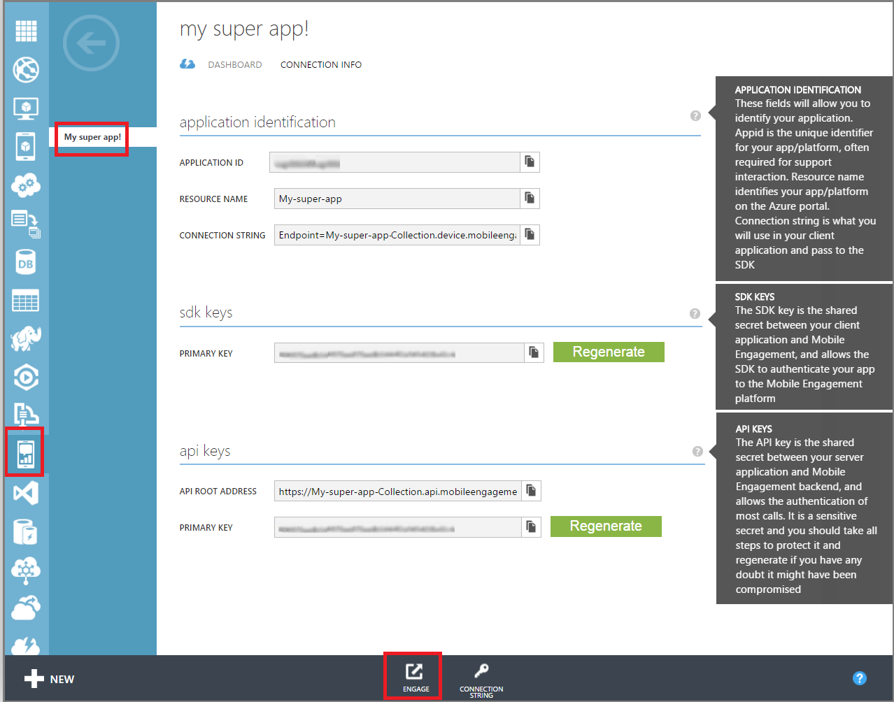
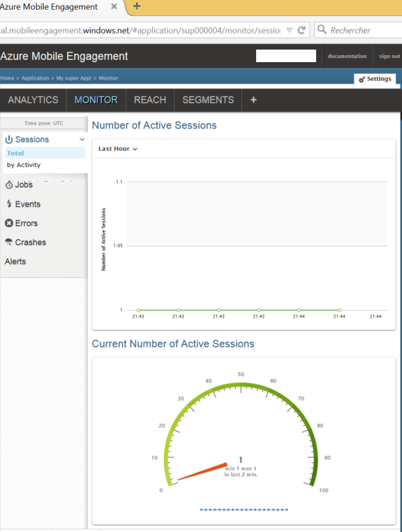

In diesem Abschnitt wird gezeigt, wie Ihre app auf die Mobile Engagement Back-End-Herstellen einer Verbindung mithilfe des Projekts Mobile in Echtzeit Überwachungsfeature werden kann. 

1. Ihr Konto **Azure Mobile Engagement** stellen Sie sicher, dass Sie die app auswählen, überwachen und Verwalten von im Portal **Mobile Engagement** werden soll. Navigieren Sie auf das Portal Mobile Engagement durch Klicken auf die Schaltfläche **mit einbeziehen** unten aus. 

     

2. Im Portal Mobile Engagement landen. Wenn die Registerkarte Monitor nicht ausgewählt ist, klicken Sie auf dem **Monitor**auf.

3. Der Monitor ist bereit zum Anzeigen von einem beliebigen Gerät in Echtzeit, die Ihre app gestartet werden kann.
     
4. Starten Sie jetzt die app. Wenn Ihre Integration korrekt ist, was bedeutet, dass Ihre app nun mit dem Mobile Engagement Back-End verbunden ist und von Daten damit senden ist sollte eine Sitzung auf dem Bildschirm angezeigt werden.  
    
     

