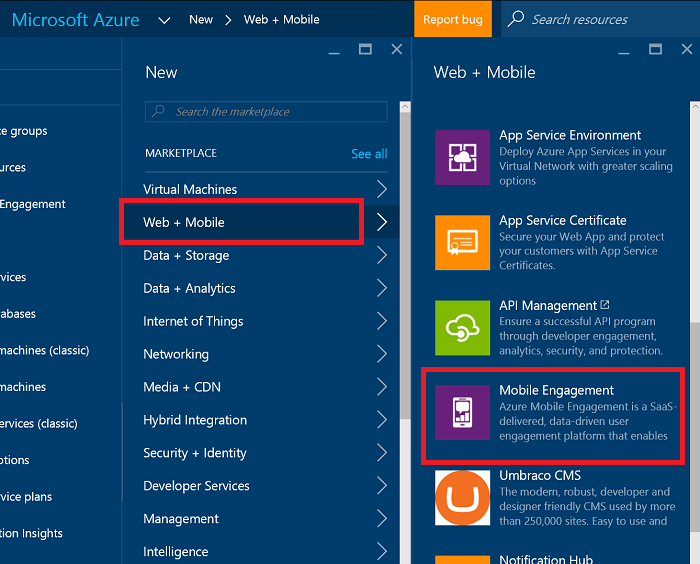
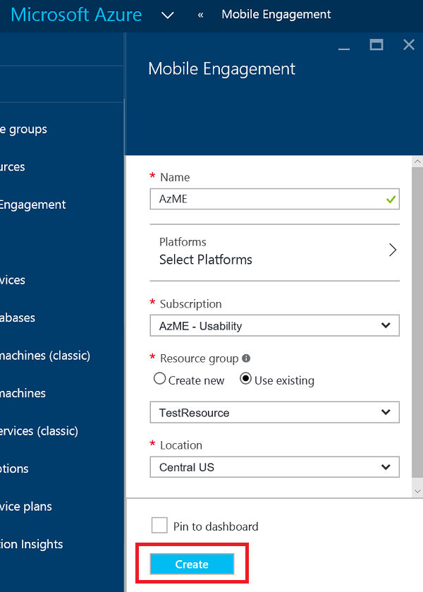
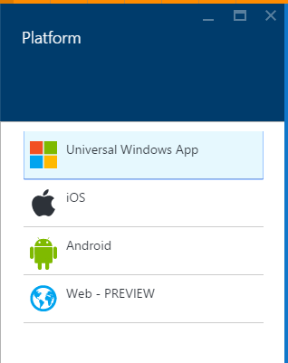
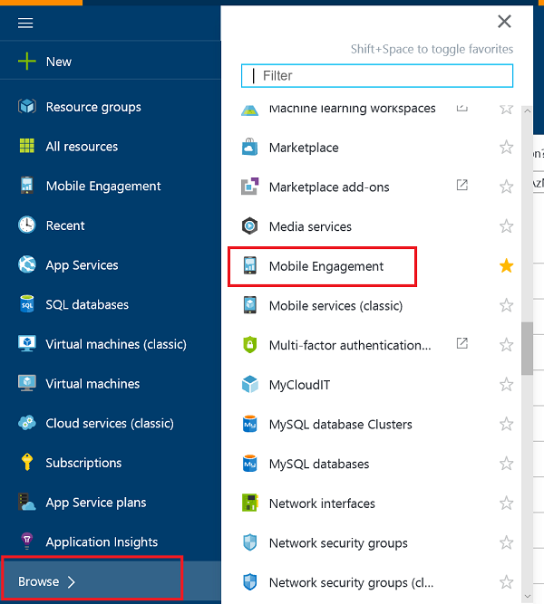
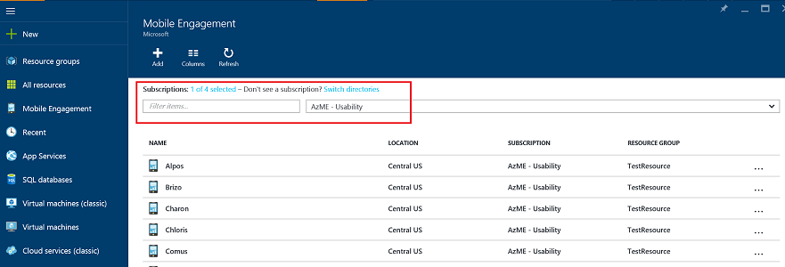
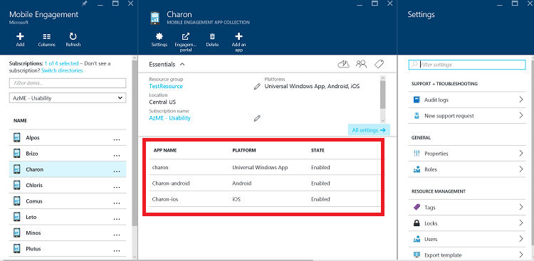
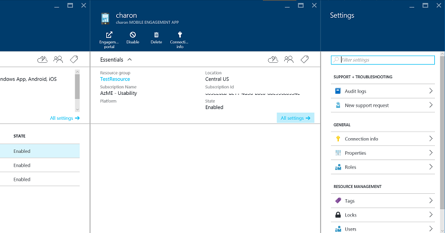
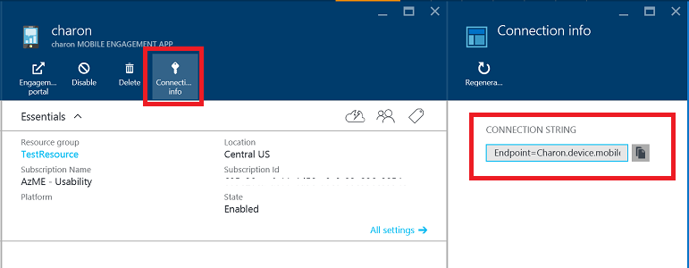

1. Melden Sie sich bei der [Azure-Portal](https://portal.azure.com).

2. Klicken Sie auf **neu**, und dann auf **Web + Mobile** **mobilen Engagement**.

    

3. In das **Neue Mobile Engagement App Websitesammlung** Blade, das angezeigt wird, erstellen Sie eine App-Auflistung anstelle einer App wie in der klassischen Azure-Portal. Geben Sie die folgenden Informationen ein:

    

    - **Name**: der Name Ihrer *Anwendung Websitesammlung* 
    - **Plattformen**: Wählen Sie Zielplattformen für Ihre app auf das Plattformen Blade werden von geöffnet. Z. B. Wenn Sie eine app für iOS und Android sowohl möchten wählen Sie dann auf beiden Plattformen und erhalten Sie zwei apps unter dieser Websitesammlung app erstellt. 

    

    - **Abonnements**: Wählen Sie das Azure Abonnement aus. 
    - **Ressourcengruppe**: Wählen Sie die Azure Ressourcengruppe Azure Ressource (Mobile Engagement App Websitesammlung) soll. Sie können auswählen, um eine neue zu erstellen.  
    - **Standort**: Region, in die die Daten zu dieser app Websitesammlung & app gespeichert werden kann werden.

5. Die Mobile Engagement app-Sammlungen durchsuchen Sie, indem Sie auf **Durchsuchen** , und suchen Sie nach **Mobile Engagement**

    

6. Sie dargestellt werden eine Liste der Websitesammlungen für Mobile Engagement App - stellen Sie sicher, dass es im selben Azure-Abonnement, in dem Sie Ihre App-Sammlung erstellt.

    

7. Klicken Sie auf die App-Sammlung, die Sie erstellt haben, im vorherigen Schritt von der App-Websitesammlung Ressource Blade öffnen, in dem der anderen apps präsentieren innerhalb dieser Websitesammlung app angezeigt werden soll. 

    

8. Klicken Sie auf der App für die Plattform erstellt, die für einen entwickelt wurde. 

    

9. Klicken Sie auf **Verbindungsinformationen** Befehlsschaltfläche nach oben, um das Blade Verbindungsinformationen zu öffnen, und kopieren die Verbindungszeichenfolge von dort aus. 

    
