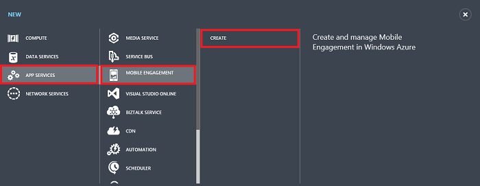
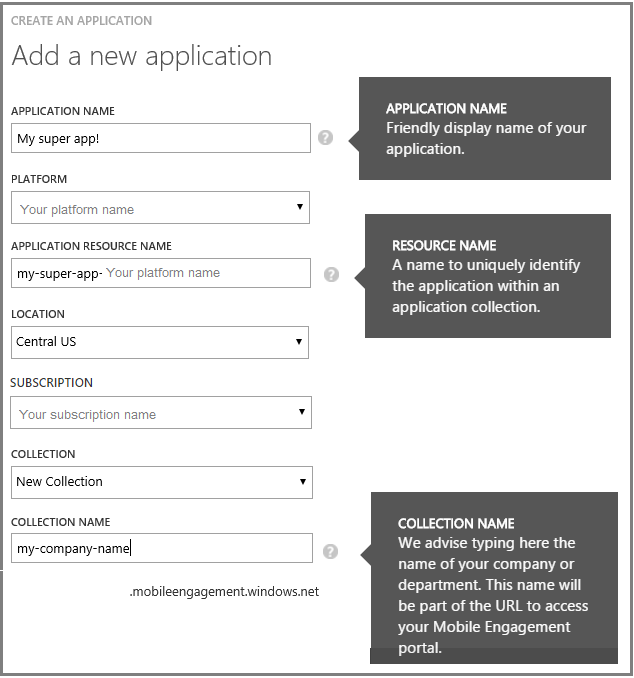

1. Melden Sie sich bei der [Klassischen Azure-Portal](https://manage.windowsazure.com), und klicken Sie dann auf **+ neue** am unteren Rand des Bildschirms.

2. Klicken Sie auf **Dienste App**, und dann auf **Mobile Engagement** **Erstellen**.

    

3. Geben Sie im Popup, das angezeigt wird, die folgenden Informationen ein:

    

    - **Name der Anwendung**: Namen der Anwendung. 
    - **Plattform**: Target Platform für die app. Sie müssen eine Engagement Mobile-app pro Plattform erstellen, die Sie für die mobile Anwendung verwendet werden. 
    - **Ressourcenname Anwendung**: Name, an dem dieser Anwendung zugegriffen per APIs und URLs werden. 
    - **Standort**: Region/Data Center, wo diese app und die app-Websitesammlung gehostet werden werden.
    - **Sammlung**: Wählen Sie eine zuvor erstellte Sammlung oder wählen Sie 'Neue Websitesammlung' aus.
    - **Name der Websitesammlung**: die Gruppe von Applications darstellt. Dadurch wird auch sichergestellt, dass alle Ihre apps in einer Gruppe sind, die aggregierten Berechnung der Metrik verwendet werden kann. Sie sollten Ihr Firmenname oder Abteilung hier anwendbar verwenden.

4. Wählen Sie die app, die Sie einfach auf der Registerkarte **Applications** erstellt haben.

5. Klicken Sie auf **VERBINDUNGSINFORMATIONEN** akzeptieren, um die Verbindungseinstellungen in der SDK-Integration in der mobilen app versetzt angezeigt werden.

6. Kopieren die **VERBINDUNGSZEICHENFOLGE** : Dies ist, was Sie benötigen diese app in Ihrer Anwendungscode identifizieren und Verbinden mit Mobile Engagement aus der App.

    

