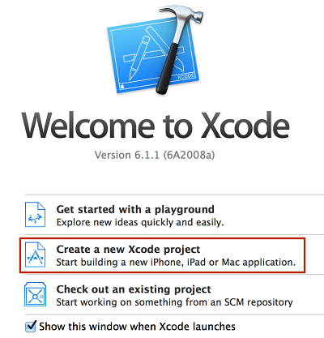
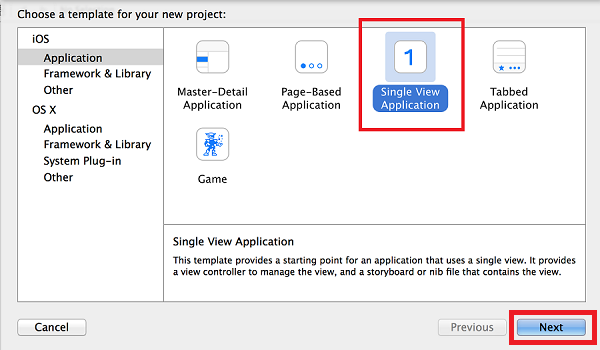
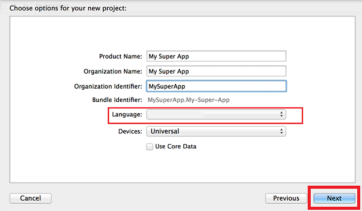

1. Starten Sie **Xcode** , und wählen Sie im Popupfenster, **Erstellen Sie ein neues Xcode Projekt**.

    

2. Wählen Sie **Einzelne Ansicht aus**, und klicken Sie dann auf **Weiter**.

    

3. Füllen Sie die **Produktnamen**, **Organisationsname**und **Organisations-ID**ein. Wählen Sie **Ziel + C** oder **Swift** in der **Sprache** Auswahl basierend auf der app aus.

    

> [AZURE.IMPORTANT] Stellen Sie sicher, dass die ID-Paket übereinstimmt mit, was Sie in der Verwaltungskonsole Apple Entwicklertools für AppId definiert haben und dass Sie ein entsprechendes Zertifikat dafür haben. 

Xcode wird die demoApp erstellen, in der wir Mobile Engagement integrieren.

