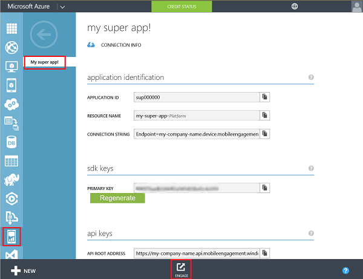
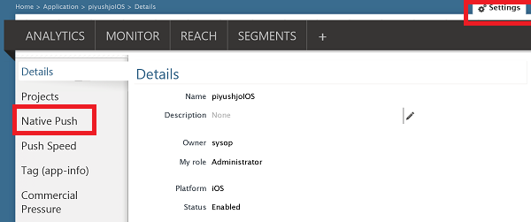
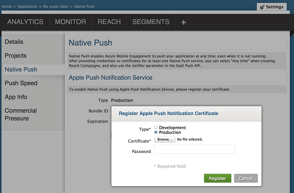
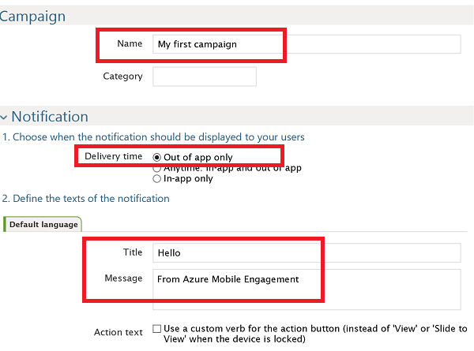
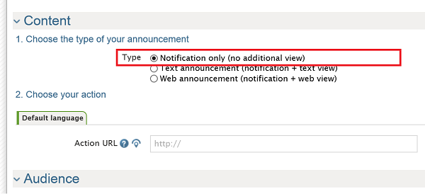
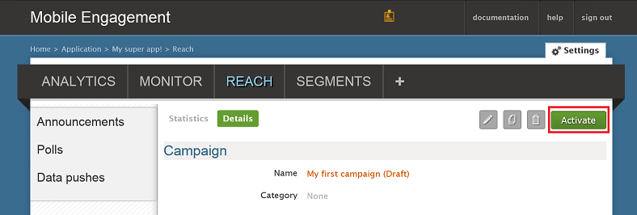
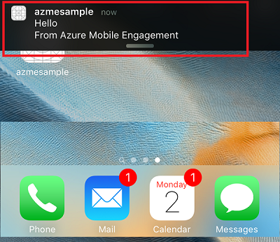
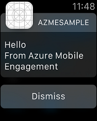

###Gewähren des Zugriffs auf Ihre Mobile Engagement-Zertifikat Pushbenachrichtigungen

Damit Mobile Engagement Pushbenachrichtigungen in Ihrem Auftrag senden können, müssen Sie ihm Zugriff auf Ihr Zertifikat gewähren. Dies ist durch Konfigurieren und das Zertifikat in das Mobile Engagement Portal eingeben. Stellen Sie sicher, dass Sie Ihre P12 Zertifikat abrufen, wie im [Apple Dokumentation](https://developer.apple.com/library/prerelease/ios/documentation/IDEs/Conceptual/AppDistributionGuide/AddingCapabilities/AddingCapabilities.html#//apple_ref/doc/uid/TP40012582-CH26-SW6) erläutert

1. Navigieren Sie zu Ihrem Engagement Mobile-Portal. Vergewissern Sie sich in der richtigen sind, und klicken Sie dann auf die Schaltfläche **mit einbeziehen** , klicken Sie unten auf:

    

2. Klicken Sie auf **der Einstellungsseite im Portal Engagement** . Vorhanden klicken Sie auf Abschnitt **Systemeigenen Pushbenachrichtigungen** Ihr Zertifikat p12 hochladen:

    

3. Wählen Sie Ihre p12, Hochladen Sie, und geben Sie Ihr Kennwort ein:

    

##Senden einer Benachrichtigung zu Ihrer Anwendung

Wir werden nun eine einfache Pushbenachrichtigung für eine Marketingkampagne erstellen, die eine Pushbenachrichtigungen an unserem app senden:

1. Navigieren Sie zur Registerkarte **erreicht haben** Ihre Mobile Engagement-Portal an.

2. Klicken Sie auf **Neue Ankündigung** , um Ihre Pushbenachrichtigungen für eine Marketingkampagne erstellen

    

3. Einrichten der ersten Felder der dienen:

    

    -   Geben Sie einen **Namen** für Ihre für eine Marketingkampagne 
    -   Wählen Sie den **Übermittlungszeitpunkt** als **bei nur-app Abmelden**: Dies ist der einfache Apple Pushbenachrichtigungen Benachrichtigung, die features von Text.
    -   Geben Sie, Benachrichtigungstext zuerst den **Titel** der ersten Zeile der Pushbenachrichtigungen verwendet wird.
    -   Geben Sie Ihre **Nachricht** , die der zweiten Zeile werden

4. Wählen Sie einen Bildlauf nach unten, und im Inhaltsabschnitt **nur Benachrichtigung**

    

5. Dies sind die grundlegendsten für eine Marketingkampagne festlegen. Jetzt einen Bildlauf nach unten, und klicken Sie auf die Schaltfläche zum Speichern Ihrer Pushbenachrichtigungen Benachrichtigung für eine Marketingkampagne **Erstellen** . 

6. Klicken Sie abschließend - auf **Aktivieren** , um Pushbenachrichtigungen Benachrichtigung sendet. 

    

7. Sie werden möglicherweise erhalten Sie die Benachrichtigung auf Ihrem iOS-Gerät in der Mitte Benachrichtigung wie folgt aus:

    

8. Wenn Sie eine Apple Watch gepaart mit diesem iOS-Gerät haben, werden Sie die Benachrichtigung auf Ihrem Apple Watch angezeigt:

    

 

 