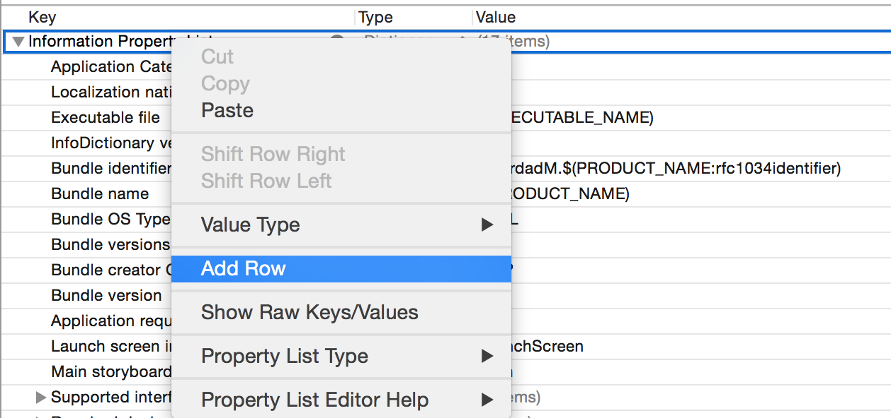
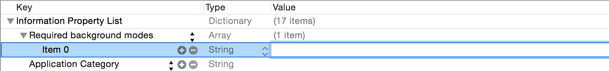
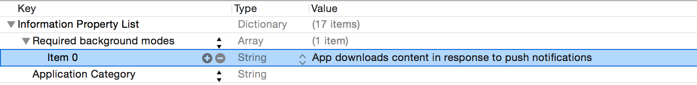

> [AZURE.IMPORTANT] Wenn Sie um Pushbenachrichtigungen von Mobile Engagement zu erhalten, müssen Sie aktivieren `Silent Remote Notifications` in Ihrer Anwendung. Sie müssen den Wert Remote-Benachrichtigung zu der Matrix UIBackgroundModes in der Datei "Info.plist" hinzufügen.

1. Open `info.plist` Datei im Projekt
2. Klicken Sie mit der rechten Maustaste auf das erste Element in der Liste (`Information Property List`), und fügen Sie eine neue Zeile hinzu.

    

3. Geben Sie in der neuen Zeile`Required background modes`

    

4. Klicken Sie auf den Pfeil nach links, um die Zeile erweitern
5. Fügen Sie den folgenden Wert zu dem Element 0`App downloads content in response to push notifications`

    

6. Nachdem Sie die Änderung vornehmen, sollte der XML "Info.plist" die folgenden Schlüssel und Wert enthalten:

        <key>UIBackgroundModes</key>
        <array>
        <string>remote-notification</string>
        </array>

7. Wenn Sie **Xcode 7 +** und **iOS 9 +**verwenden:
    - Aktivieren Sie in Ziele **Pushbenachrichtigungen** > Ihren Zielnamen > Funktionen.
