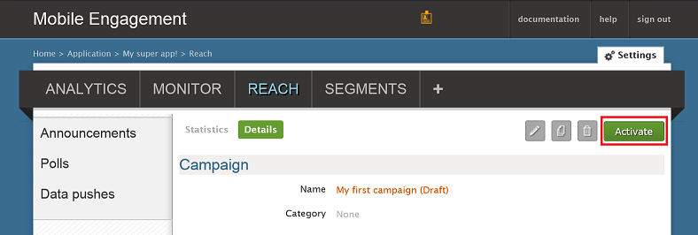

Wir werden nun eine einfache Pushbenachrichtigungen Benachrichtigung für eine Marketingkampagne erstellen, die einer der Pushbenachrichtigung an unserem app sendet.

1. Navigieren Sie zur Registerkarte **erreicht haben** Ihre Mobile Engagement-Portal an.

2. Klicken Sie auf **neue Ankündigung** , um Ihre Pushbenachrichtigungen Benachrichtigung für eine Marketingkampagne zu erstellen.

    

3. Richten Sie das erste Feld der dienen mithilfe der folgenden Schritte aus:

    

    ein. Geben Sie einen **Namen** für Ihre für eine Marketingkampagne ein.

    b. Wählen Sie unter *jederzeit* **Übermittlungszeitpunkt** aus.

    d. Geben Sie den **Titel** in die Benachrichtigungstext - fett in der Pushbenachrichtigungen.

    e. Geben Sie Ihre **Nachricht**

4. Führen Sie einen Bildlauf nach unten, und klicken Sie im Abschnitt **Inhalt** , und wählen Sie **nur die Benachrichtigung**.

    

5. Dies sind die grundlegendsten für eine Marketingkampagne möglich festlegen. Jetzt einen Bildlauf nach unten erneut, und klicken auf die Schaltfläche **Erstellen** , um Ihre Campaign zu speichern.

6. Letzten Schritt: Klicken Sie auf **Aktivieren** , der für eine Marketingkampagne aktivieren und Pushbenachrichtigungen zu senden.

    

 