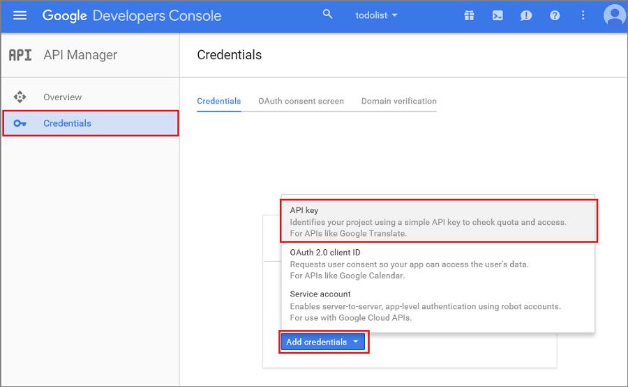

1. Navigieren Sie zu den [Google-Cloud-Verwaltungskonsole](https://console.developers.google.com/project), melden Sie sich mit Ihrer Gmail-Kontoanmeldeinformationen. 
 
2. Klicken Sie auf **Projekt erstellen**, geben Sie den Namen eines Projekts, und klicken Sie auf **Erstellen**. Wenn Sie aufgefordert werden, führen Sie die SMS-Überprüfung, und klicken Sie erneut auf **Erstellen** .

       

     Geben Sie in Ihrem neuen **Projektnamen ein** , und klicken Sie auf **Projekt erstellen**.

3. Klicken Sie dann auf **Projektinformationen**, und klicken Sie auf die Schaltfläche **Dienstprogramme und vieles mehr** . Notieren Sie die **Projektnummer**an. Sie müssen diesen Wert als Festlegen der `SenderId` Variable in der Client-app.

    

4. Klicken Sie im Projektdashboard unter **Mobile-APIs**auf **Google Cloud Messaging**, klicken Sie auf der nächsten Seite auf **API aktivieren** und annehmen der Vertragsbedingungen. 

    

     

5. Klicken Sie in dem Projektdashboard auf **Anmeldeinformationen** > **Create Credential** > **API-Schlüssel**. 

    

6. **Erstellen Sie einen neuen Product Key**klicken Sie auf **Server-Taste**, geben Sie einen Namen für den Key, klicken Sie auf **Erstellen**.

7. Notieren Sie den Wert **API-Taste** .

    Sie verwenden diese API Schlüsselwert Azure mit GCM authentifizieren und Senden von Pushbenachrichtigungen für Ihre app zu aktivieren.

