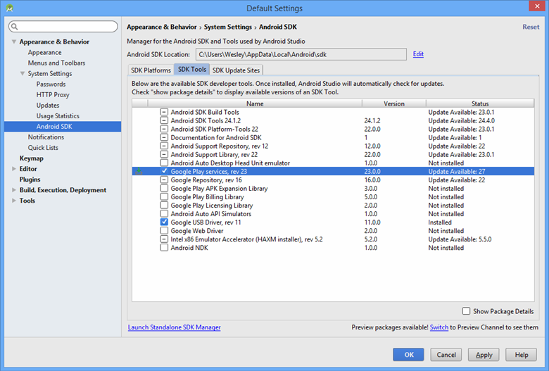
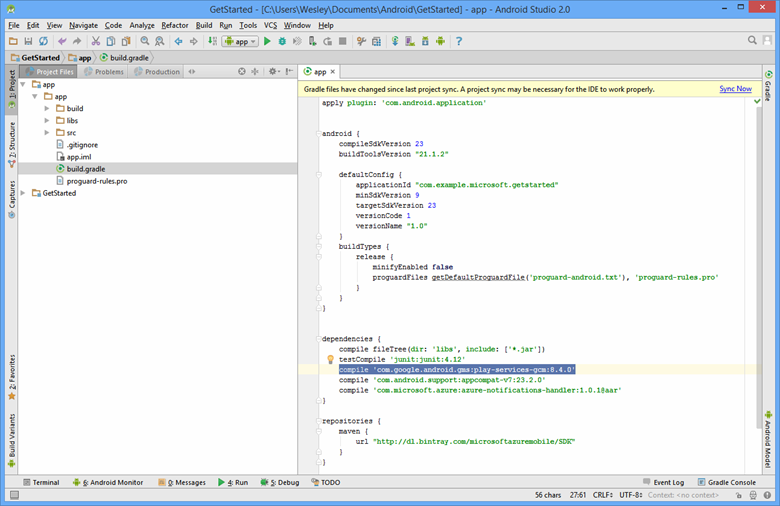

1. Öffnen Sie den Android SDK-Manager, indem Sie auf das Symbol auf der Symbolleiste von Android Studio oder durch Klicken auf **Extras** -> **Android** -> **SDK-Manager** im Menü. Suchen Sie nach Zielversion des Android SDK verwendet wird, die in Ihrem Projekt, öffnen Sie sie durch Klicken auf **Paketdetails anzeigen**, und wählen Sie **Google APIs**, aus, wenn er noch nicht installiert ist.

2. Klicken Sie auf der Registerkarte **SDK-Tools** . Wenn Sie Google Play-Dienst bereits installiert haben, klicken Sie auf **Wiedergabe Google-Diensten** , wie unten dargestellt. Klicken Sie dann auf **Übernehmen** , zu installieren. 
 
    Notieren Sie sich den Pfad SDK zur Verwendung in einem späteren Schritt. 

    

3. Öffnen Sie die Datei **build.gradle** im Verzeichnis app an.

    

4. Fügen Sie diese Zeile unter *Abhängigkeiten*an: 

        compile 'com.google.android.gms:play-services-gcm:9.2.0'

5. Klicken Sie auf das Symbol **Synchronisieren Projekt mit Gradle Dateien** in der Tool-Leiste.

6. Öffnen Sie **AndroidManifest.xml** und fügen Sie dieses Tag der *Anwendung* Kategorie hinzu.

        <meta-data android:name="com.google.android.gms.version"
            android:value="@integer/google_play_services_version" />
 

