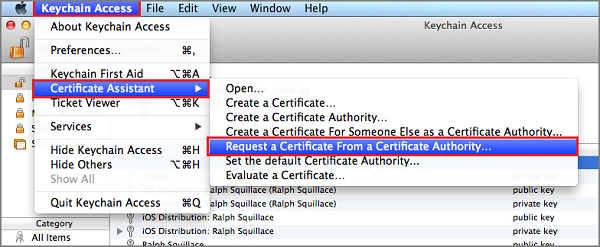

##Generieren Sie die Datei Zertifikat signieren anfordern.

Die Apple Pushbenachrichtigungen Benachrichtigung Service (APNS) verwendet Zertifikate, um Ihre Pushbenachrichtigungen authentifizieren. Befolgen Sie diese Anweisungen zum Erstellen des erforderlichen Pushbenachrichtigungen Zertifikats zum Senden und Empfangen von Benachrichtigungen. Weitere Informationen zu diesen Konzepten finden Sie unter der offiziellen [Apple Pushbenachrichtigungen Benachrichtigungsdienst](http://go.microsoft.com/fwlink/p/?LinkId=272584) Dokumentation.

Generieren Sie, die bei der Anmeldung CSR Certificate Request ()-Datei, die von Apple verwendet wird, um ein Zertifikat signierte Pushbenachrichtigungen zu generieren.

1. Auf Ihrem Mac, führen Sie das Tool Schlüsselbundverwaltung. Sie können in den Ordner **Dienstprogramme** oder dem **anderen** Ordner auf der Schnellstartleiste Wähltastatur geöffnet werden.

2. **Schlüsselbund**, erweitern Sie **Zertifikat-Assistenten**klicken Sie auf **ein Zertifikat von einer Zertifizierungsstelle... anfordern**.

    

3. Wählen Sie Ihre **Benutzer e-Mail-Adresse** und **Allgemeiner Name** , stellen Sie sicher, dass **auf dem Datenträger gespeicherte** ausgewählt ist, und dann auf **Weiter**. Lassen Sie das Feld **Zertifizierungsstelle e-Mail-Adresse** leer, da es nicht erforderlich ist.

    

4. Geben Sie einen Namen für die Datei signieren CSR Certificate Request () in **Speichern unter**, wählen Sie den Speicherort in der **Stelle, an der**ein, und klicken Sie auf **Speichern**.

    

    Dies speichert die CSR-Datei in den ausgewählten Speicherort; am Standardspeicherort befindet sich der Desktop. Beachten Sie den Speicherort für diese Datei ausgewählt wurde.

Als Nächstes Sie registriert Ihre app mit Apple, Pushbenachrichtigungen aktivieren, und diese exportierte CSR zum Erstellen eines Zertifikats Pushbenachrichtigungen hochladen.

##Registrieren Sie Ihre app für Pushbenachrichtigungen

Um Pushbenachrichtigungen zu einer app für iOS senden können, müssen Sie Ihrer Anwendung bei Apple registrieren und auch für Pushbenachrichtigungen registrieren.  

1. Wenn Sie Ihre app nicht bereits registriert haben, navigieren Sie zu der <a href="http://go.microsoft.com/fwlink/p/?LinkId=272456" target="_blank">iOS Provisioning Portal</a> im Apple-Entwicklercenter melden Sie sich mit Ihrem Apple-ID, **Bezeichnern**, klicken Sie auf und dann auf **App-IDs**, und klicken Sie abschließend auf die **+** melden, um eine neue app zu registrieren.

    

2. Aktualisieren Sie die folgenden drei Felder für Ihre neue app, und klicken Sie dann auf **Weiter**:

    * **Name**: Geben Sie einen beschreibenden Namen für Ihre app in das Feld **Name** im Abschnitt **Beschreibung der App-ID** ein.
    
    * **Paket Bezeichner**: Geben Sie unter dem Abschnitt **Explizite App-ID** in das Formular ein **Paket Bezeichner** `<Organization Identifier>.<Product Name>` wie in der [App Verteilung Handbuch](https://developer.apple.com/library/mac/documentation/IDEs/Conceptual/AppDistributionGuide/ConfiguringYourApp/ConfiguringYourApp.html#//apple_ref/doc/uid/TP40012582-CH28-SW8)erwähnt. *Organisations-ID* und *Produktname* , die Sie verwenden müssen übereinstimmen, die Organisations-ID und Produktname, bei der Erstellung Ihres Projekts XCode erfolgen soll. In der nachstehenden Screeshot *NotificationHubs* ist als einer Organisation Bezeichner und *GetStarted* als den Namen des Produkts verwendet wird. Sicherzustellen, dass dies den Werten entsprechen, in Ihrem Projekt XCode erfolgen soll, ermöglicht Ihnen das richtige publishing Profil mit XCode verwenden. 
    
    * **Pushbenachrichtigungen**: Aktivieren Sie die Option **Pushbenachrichtigungen** im Abschnitt **App-Dienste** .

    

    Dies Ihre App-ID generiert und fordert Sie auf, um die Informationen zu bestätigen. Klicken Sie auf **Registrieren** , um die neue App-ID bestätigen

    Nachdem Sie auf **Registrieren**klicken, wird der Bildschirm zur **Registrierung abgeschlossen** , wie unten dargestellt angezeigt. Klicken Sie auf **Fertig**.

    

3. Suchen Sie im Developer Center, klicken Sie unter App-IDs die app-ID, die Sie gerade erstellt haben, und klicken Sie auf in einer Zeile.

    

    Durch Klicken auf die app-ID wird die app-Details angezeigt werden. Klicken Sie auf die Schaltfläche " **Bearbeiten** " unten.

    

4. Durchführen eines Bildlaufs an den unteren Rand des Bildschirms, und klicken Sie auf die Schaltfläche **Zertifikat erstellen** unter dem Abschnitt **Pushbenachrichtigungen Entwicklung SSL-Zertifikat**.

    

    Der Assistent "IOS Zertifikat hinzufügen" wird angezeigt.

    > [AZURE.NOTE] In diesem Lernprogramm verwendet ein Entwicklungszertifikat. Die gleiche Weise wird verwendet, wenn Sie ein Zertifikat für die Herstellung registrieren. Denken Sie aber daran, dass Sie beim Senden von Benachrichtigungen desselben Typs Zertifikat verwenden.

5. Klicken Sie auf **Datei auswählen**, und navigieren Sie zu dem Speicherort, in dem Sie die CSR-Datei gespeichert, die Sie in der ersten Aufgabe erstellt, dann klicken Sie auf **generieren**.

    

6. Nachdem das Zertifikat vom Portal erstellt wurde, klicken Sie auf die Schaltfläche **Download** , und klicken Sie auf **Fertig**.

    

    Dies das Zertifikat downloads und auf Ihren Computer im Ordner Downloads gespeichert.

    

    > [AZURE.NOTE] Standardmäßig wird die heruntergeladene Datei ein Entwicklungszertifikat **aps_development.cer**bezeichnet.

7. Doppelklicken Sie auf die heruntergeladene Pushbenachrichtigungen Zertifikat **aps_development.cer**.

    Dadurch wird das neue Zertifikat im Schlüsselbund, installiert, wie unten dargestellt:

    

    > [AZURE.NOTE] Der Namen in das Zertifikat möglicherweise unterschiedlich sein, aber es wird vorangestellt werden **Entwicklung Apple iOS Pushbenachrichtigungen Services:**.

8. In Schlüsselbundverwaltung mit der rechten Maustaste des neue Pushbenachrichtigungen Zertifikats, das Sie in der Kategorie **Zertifikate** erstellt haben. Klicken Sie auf **Exportieren**, Namen Sie der Datei einen, wählen Sie das Format **P12** , und klicken Sie dann auf **Speichern**.

    

    Stellen Sie eine Notiz des Dateinamens und den Speicherort des Zertifikats exportierte P12 ein. Es wird zum Aktivieren der Authentifizierung mit APNS verwendet werden.

    >[AZURE.NOTE] In diesem Lernprogramm erstellt eine QuickStart.p12-Datei. Ihr Name und Speicherort weicht möglicherweise.

##Erstellen eines Profils provisioning, für die app

1. Wählen Sie wieder in <a href="http://go.microsoft.com/fwlink/p/?LinkId=272456" target="_blank">iOS Provisioning Portal</a> **Profile bereitgestellt**, wählen Sie **Alle**, und klicken Sie dann auf die **+** , um ein neues Profil zu erstellen. Dies startet den Assistenten **Hinzufügen iOS Provisiong Profil**

    

2. Wählen Sie als Provisiong Profil **iOS-App-Entwicklung** in der **Entwicklung** aus, und klicken Sie auf **Weiter**. 

3. Als nächstes wählen Sie die app-ID, die soeben aus der **App-ID** Dropdown-Liste erstellte aus, und klicken Sie auf **Weiter**

    

4. Klicken Sie im Bildschirm **Zertifikate auswählen** wählen Sie Ihre üblichen Entwicklungszertifikat zum Signieren von Code, und klicken Sie auf **Weiter**. Dies ist keine Pushbenachrichtigungen Zertifikat, das Sie gerade erstellt haben.

    

5. Als nächstes wählen Sie die **Geräte** zu Testzwecken verwenden aus, und klicken Sie auf **Weiter**

    

6. Wählen Sie einen Namen für das Profil **Profilnamen**aus, klicken Sie auf **generieren**.

    

7. Beim Erstellen des neuen provisioning Profils klicken Sie auf zum Herunterladen und installieren es auf dem Computer des Xcode Entwicklung. Klicken Sie dann auf **Fertig**.

    

