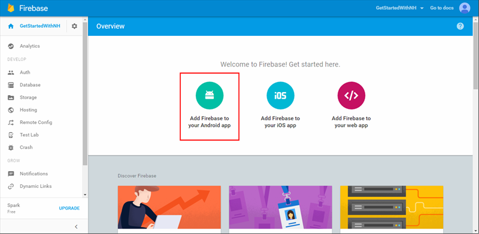

1. Melden Sie sich der [Firebase Console](https://firebase.google.com/console/). Wenn Sie eine bereits besitzen, erstellen Sie ein neues Firebase Projekt.
2. Nach der Erstellung des Projekts klicken Sie auf **Firebase hinzufügen, zu Ihrer Android-Anwendung** und folgen Sie den Anweisungen zur Verfügung gestellt.

    

3. Klicken Sie in der Firebase-Konsole auf das Rädchen für ein Projekt, und klicken Sie dann auf **Project Settings**.

    

4. Klicken Sie auf der Registerkarte **Cloud Messaging** in Ihrem Projekt Einstellungen, und kopieren Sie den Wert der **Absender-ID**und **Server-Taste** .  Diese Werte werden so konfigurieren Sie die Benachrichtigung Hub Zugriffsrichtlinie und Ihre Ereignishandler Benachrichtigung in der app später verwendet werden.
  