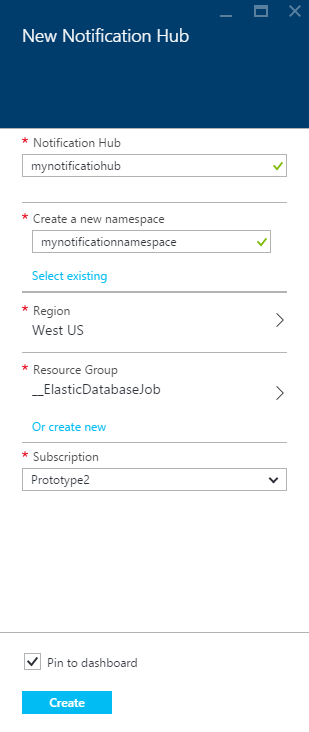
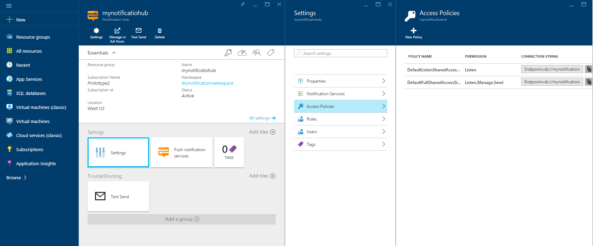

1. Melden Sie sich bei der [Azure-Portal](https://portal.azure.com), und klicken Sie dann auf **+ neue** am oberen Rand des Bildschirms nach links.

2. Klicken Sie auf **neu**, und klicken Sie dann **Web + Mobile**. Führen Sie einen Bildlauf nach unten aus, falls erforderlich, und klicken Sie auf die **Benachrichtigung Hub**.

    

3. Stellen Sie sicher, dass Sie einen eindeutigen Namen im Feld **Benachrichtigung Hub** angeben. Wählen Sie die gewünschte **Region**, **Abonnement** und **Ressourcengruppe** (Wenn bereits vorhanden). 
 
    Wenn Sie bereits über einen Dienst Bus Namespace, den Sie den Hub in erstellen möchten haben, wählen Sie diese über die Option **Bestehende auswählen** , in das Feld " **Namespace** ".  Andernfalls können Sie den Standardnamen der erstellt wird basierend auf den Hubnamen, solange Sie der Namespacenamen verfügbar ist. 

    Sobald Sie bereit sind, klicken Sie auf **Erstellen**.

    

4. Nachdem der Namespace und Benachrichtigung-Hub erstellt werden, wird der jeweiligen Portalseite geöffnet werden. 

    
       
5. Klicken Sie auf **Einstellungen** und dann auf **Access Richtlinien** : Notieren Sie die von zwei Verbindungszeichenfolgen, die Sie zur Verfügung gestellt werden nach Bedarf Pushbenachrichtigungen später verarbeitet werden.

    
