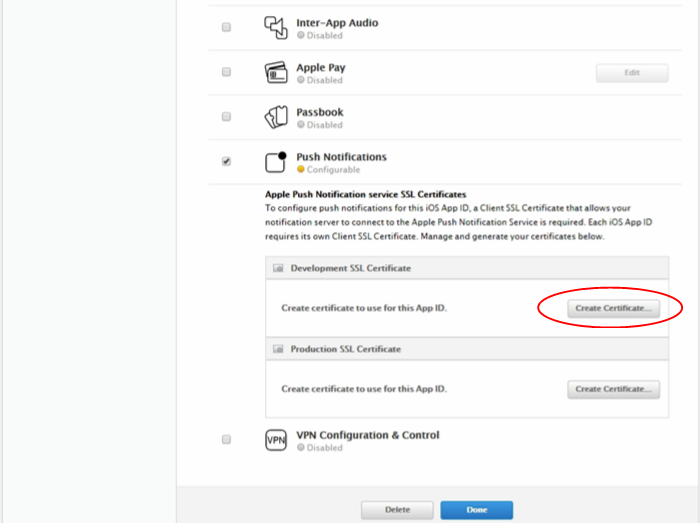
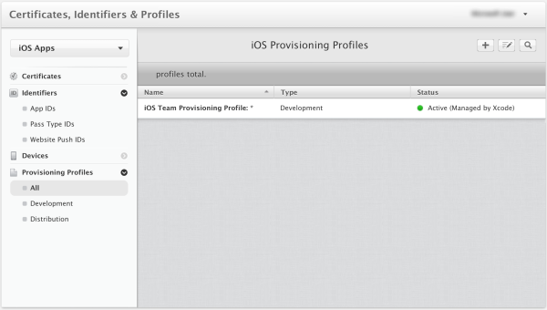
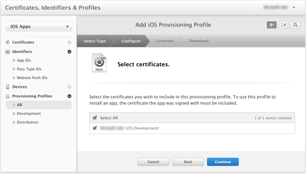

Um die app für Pushbenachrichtigungen durch Apple Pushbenachrichtigungen Benachrichtigung Service (APNS) zu registrieren, müssen Sie ein neues Zertifikat für Pushbenachrichtigungen, App-ID und provisioning Profil für das Projekt auf Apple Entwicklerportal erstellen. Die App-ID wird die Konfiguration Einstellungen enthalten, mit denen Ihre app zu senden und Empfangen von Pushbenachrichtigungen. Diese Einstellungen umfasst das Pushbenachrichtigungen Benachrichtigung Zertifikat mit Apple Pushbenachrichtigungen Benachrichtigung Service (APNS) beim Senden und Empfangen von Pushbenachrichtigungen Authentifizierung erforderlich. Weitere Informationen zu diesen Konzepten finden Sie unter der offiziellen [Apple Pushbenachrichtigungen Benachrichtigungsdienst](http://go.microsoft.com/fwlink/p/?LinkId=272584) Dokumentation.

####Generieren Sie die Datei Zertifikat anfordern bei der Anmeldung für das Zertifikat Pushbenachrichtigungen

Diese Schritte führen Sie durch das Zertifikat signieren Anforderung erstellen. Hiermit wird generieren ein Zertifikat Pushbenachrichtigungen mit APNS verwendet werden.

1. Auf Ihrem Mac, führen Sie das Tool Schlüsselbundverwaltung. Sie können in den Ordner **Dienstprogramme** oder dem **anderen** Ordner auf der Schnellstartleiste Wähltastatur geöffnet werden.

2. **Schlüsselbund**, erweitern Sie **Zertifikat-Assistenten**klicken Sie auf **ein Zertifikat von einer Zertifizierungsstelle... anfordern**.

    

3. Wählen Sie Ihre **Benutzer e-Mail-Adresse** und **Allgemeiner Name** , stellen Sie sicher, dass **auf dem Datenträger gespeicherte** ausgewählt ist, und klicken Sie dann auf **Weiter**. Lassen Sie das Feld **Zertifizierungsstelle e-Mail-Adresse** leer, da es nicht erforderlich ist.

    

4. Geben Sie im Feld **Speichern unter**einen Namen für die Datei signieren CSR Certificate Request (), wählen Sie den Speicherort in **wo**, und klicken Sie auf **Speichern**.

    

    Dies speichert die CSR-Datei in den ausgewählten Speicherort; am Standardspeicherort befindet sich der Desktop. Beachten Sie den Speicherort für diese Datei ausgewählt wurde.

####Registrieren Sie Ihre app für Pushbenachrichtigungen

Erstellen Sie eine neue explizite App-ID für eine Anwendung mit Apple und konfigurieren Sie ihn auch für Pushbenachrichtigungen.  

1. Navigieren Sie zu der [iOS Provisioning Portal](http://go.microsoft.com/fwlink/p/?LinkId=272456) im Apple-Entwicklercenter melden Sie sich mit Ihrem Apple-ID, **Bezeichnern**, klicken Sie auf und dann auf **App-IDs**, und klicken Sie abschließend auf die **+** melden, um eine neue app zu registrieren.

    

2. Aktualisieren Sie die folgenden drei Felder für Ihre neue app, und klicken Sie dann auf **Weiter**:

    * **Name**: Geben Sie einen beschreibenden Namen für Ihre app in das Feld " **Name** " im Abschnitt **Beschreibung der App-ID** ein.

    * **Paket Bezeichner**: Geben Sie unter dem Abschnitt **Explizite App-ID** in das Formular ein **Paket Bezeichner** `<Organization Identifier>.<Product Name>` wie in der [App Verteilung Handbuch](https://developer.apple.com/library/mac/documentation/IDEs/Conceptual/AppDistributionGuide/ConfiguringYourApp/ConfiguringYourApp.html#//apple_ref/doc/uid/TP40012582-CH28-SW8)erwähnt. Dieser muss übereinstimmen, was für Ihre app auch im Projekt XCode, Xamarin oder Cordova verwendet wird.

    * **Pushbenachrichtigungen**: Aktivieren Sie die Option **Pushbenachrichtigungen** im Abschnitt **App-Dienste** .

    

3.  Klicken Sie auf die bestätigen Ihres Bildschirms App-ID überprüfen Sie die Einstellung, und nachdem Sie überprüft haben, klicken Sie auf **Absenden**

4.  Nachdem Sie die neue App-ID gesendet haben, wird der Bildschirm zur **Registrierung abgeschlossen** angezeigt. Klicken Sie auf **Fertig**.

5. Suchen Sie im Developer Center, klicken Sie unter App-IDs die app-ID, die Sie gerade erstellt haben, und klicken Sie auf in einer Zeile. Durch Klicken auf die Zeile des app-ID wird die app-Details angezeigt werden. Klicken Sie auf die Schaltfläche " **Bearbeiten** " unten.

6. Führen Sie einen Bildlauf zum unteren Rand des Bildschirms, und klicken Sie auf die Schaltfläche **Zertifikat erstellen** , klicken Sie im Abschnitt **Entwicklung Pushbenachrichtigungen SSL-Zertifikat**.

    

    Dadurch wird der Assistent "IOS Zertifikat hinzufügen" angezeigt.

    > [AZURE.NOTE] In diesem Lernprogramm verwendet ein Entwicklungszertifikat. Die gleiche Weise wird verwendet, wenn Sie ein Zertifikat für die Herstellung registrieren. Denken Sie aber daran, dass Sie beim Senden von Benachrichtigungen desselben Typs Zertifikat verwenden.

7. Klicken Sie auf **Datei auswählen**, navigieren Sie zu dem Speicherort, in dem Sie die CSR für das Zertifikat Pushbenachrichtigungen gespeichert. Klicken Sie auf **generieren**.

    

8. Nachdem das Zertifikat vom Portal erstellt wurde, klicken Sie auf die Schaltfläche **herunterladen** .

    

    Diese downloads des Signaturzertifikats und auf Ihren Computer im Ordner Downloads gespeichert.

    

    > [AZURE.NOTE] Standardmäßig wird die heruntergeladene Datei ein Entwicklungszertifikat **aps_development.cer**bezeichnet.

9. Doppelklicken Sie auf die heruntergeladene Pushbenachrichtigungen Zertifikat **aps_development.cer**. Dadurch wird das neue Zertifikat im Schlüsselbund, installiert, wie unten dargestellt:

    

    > [AZURE.NOTE] Der Namen in das Zertifikat möglicherweise unterschiedlich sein, aber es wird vorangestellt werden **Entwicklung Apple iOS Pushbenachrichtigungen Services:**.

10. In Schlüsselbundverwaltung mit der rechten Maustaste des neue Pushbenachrichtigungen Zertifikats, das Sie gerade in der Kategorie **Zertifikate** erstellt haben. Klicken Sie auf **Exportieren**, Namen Sie der Datei einen, wählen Sie das Format **P12** , und klicken Sie dann auf **Speichern**.

    Denken Sie daran, den Dateinamen und den Speicherort des Zertifikats Pushbenachrichtigungen exportierte P12. Hiermit wird mit APNS Authentifizierung zu aktivieren, indem sie in der klassischen Azure-Portal hochladen.

####Erstellen eines Profils provisioning, für die app

1. Wählen Sie wieder in <a href="http://go.microsoft.com/fwlink/p/?LinkId=272456" target="_blank">iOS Provisioning Portal</a> **Profile bereitgestellt**, wählen Sie **Alle**, und klicken Sie dann auf die **+** , um ein neues Profil zu erstellen. Dies startet den Assistenten **Hinzufügen iOS Provisiong Profil**

    

2. Wählen Sie als Provisiong Profil **iOS-App-Entwicklung** in der **Entwicklung** aus, und klicken Sie auf **Weiter**.

3. Als nächstes wählen Sie die app-ID, die soeben aus der **App-ID** Dropdown-Liste erstellte aus, und klicken Sie auf **Weiter**

    

4. Klicken Sie im Bildschirm **Wählen Sie Zertifikate** wählen Sie Ihre Entwicklungszertifikat zum Signieren von Code aus, und klicken Sie auf **Weiter**. Dies ist ein Signaturzertifikat nicht das Zertifikat Pushbenachrichtigungen, die Sie soeben erstellt haben.

    

5. Als nächstes wählen Sie die **Geräte** zu Testzwecken verwenden aus, und klicken Sie auf **Weiter**

    

6. Wählen Sie einen Namen für das Profil **Profilnamen**aus, klicken Sie auf **generieren**.

    
