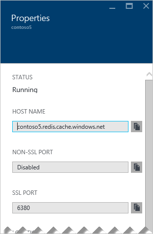

Zum Verbinden mit einer Instanz Azure Redis Cache benötigen Cache Clients Hostname, Ports und Tasten des Caches. Einige Clients möglicherweise durch weicht Namen auf diese Elemente verweisen. Abrufen von diese Elemente in Ihren Cache im [Azure-Portal](https://portal.azure.com) [Durchsuchen](../articles/redis-cache/cache-configure.md#configure-redis-cache-settings) , und klicken Sie auf **Einstellungen** oder **Alle Einstellungen**. 

### Hostname und ports

Zugriff auf den Host Name und Ports klicken Sie auf **Eigenschaften**.

### Tastenkombinationen

Klicken Sie zum Abrufen der Tastenkombinationen auf **Zugriffstasten**.

