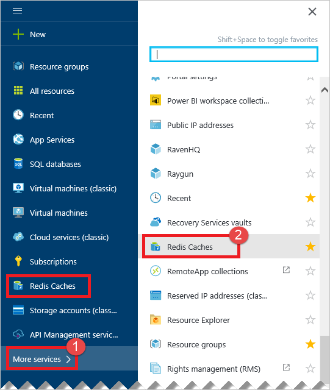
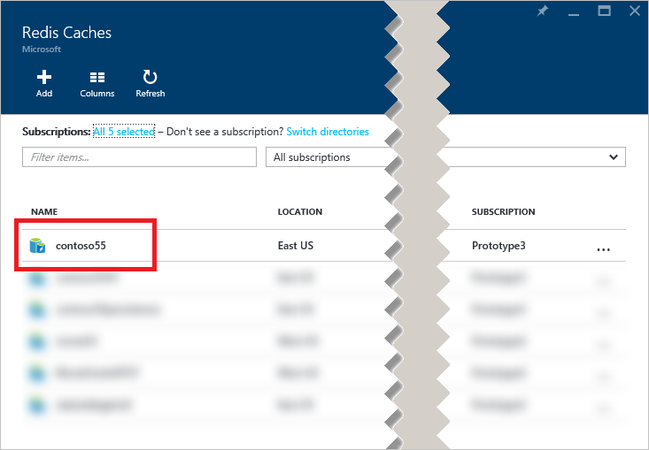
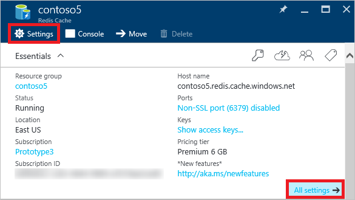

Im [Azure-Portal](https://portal.azure.com) mit dem Blade **Durchsuchen** können Caches zugegriffen werden.

Wenn Ihre Caches anzeigen möchten, klicken Sie auf **Weitere Dienste > zwischengespeichert Redis**. Wenn Sie an einen Redis Cache zuletzt besucht haben, können Sie **Caches Redis** direkt aus der Liste klicken, ohne auf **Weitere Dienste**.

Wählen Sie den gewünschten Cache zum Anzeigen der Eigenschaften für diesen Cache aus.

Klicken Sie auf **Einstellungen** oder **Alle Einstellungen** zum Anzeigen und Ihren Cache zu konfigurieren.

