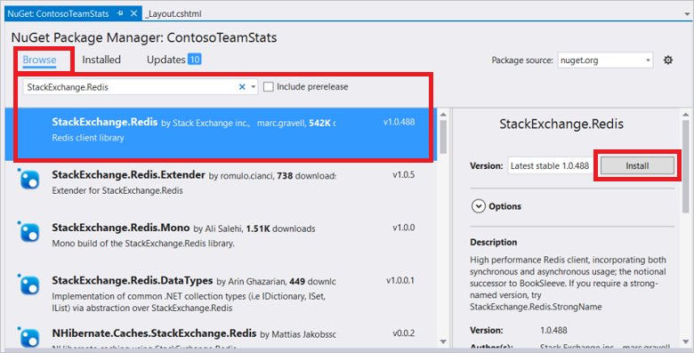

.NET Applications können den Cache **StackExchange.Redis** Client, die in Visual Studio ein NuGet-Paket, das die Konfiguration von Cache Clientanwendungen vereinfacht mit konfiguriert werden kann. 

>[AZURE.NOTE] Weitere Informationen finden Sie unter der [StackExchange.Redis](http://github.com/StackExchange/StackExchange.Redis) Github-Seite und der [StackExchange.Redis-Cache-Client-Dokumentation](http://github.com/StackExchange/StackExchange.Redis#documentation).

Um eine Clientanwendung in Visual Studio mit der StackExchange.Redis NuGet-Paket konfigurieren, mit der rechten Maustaste im Projekts im **Solution Explorer** , und wählen Sie **NuGet-Pakete verwalten**. 

Geben Sie **StackExchange.Redis** oder **StackExchange.Redis.StrongName** in das Suchtextfeld ein, wählen Sie die gewünschte Version aus den Ergebnissen aus, und klicken Sie auf **Installieren**.

>[AZURE.NOTE] Wenn Sie eine Version starken Namen der Clientbibliothek **StackExchange.Redis** verwenden möchten, wählen Sie **StackExchange.Redis.StrongName**; Wählen Sie andernfalls **StackExchange.Redis**aus.

NuGet-Paket downloads und fügt die erforderlichen Assemblyverweise für Ihre Clientanwendung auf Azure Redis Cache mit dem StackExchange.Redis-Cache-Client zugreifen.

>[AZURE.NOTE] Wenn Sie das Projekt zur Verwendung von StackExchange.Redis zuvor konfiguriert haben, können Sie die **NuGet-Paket-Manager**nach Updates suchen auf das Paket überprüfen. Um zu prüfen und aktualisierten Versionen der StackExchange.Redis NuGet-Paket installieren, klicken Sie auf **Updates** in der das Fenster **NuGet-Paket-Manager** . Wenn ein Update auf den StackExchange.Redis NuGet-Paket verfügbar ist, können Sie das Projekt zur Verwendung der aktualisierten Version aktualisieren.

