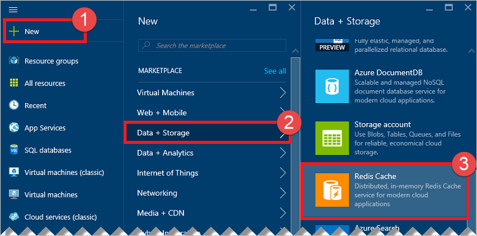
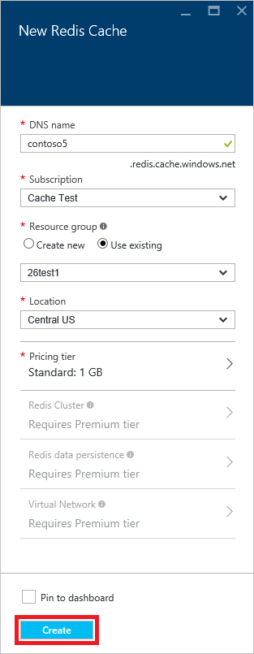
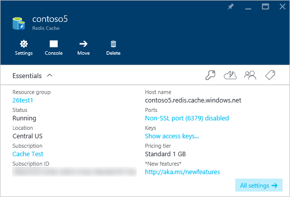

Um einen Cache erstellen, melden Sie sich zuerst der [Azure-Portal](https://portal.azure.com), und klicken Sie auf **neu**, **Daten + Speicher**, **Cache Redis**.

>[AZURE.NOTE] Wenn Sie ein Azure-Konto besitzen, können Sie [ein Azure-Konto für kostenlosen geöffnet](https://azure.microsoft.com/pricing/free-trial/?WT.mc_id=redis_cache_hero) ist in nur ein paar Minuten.

>[AZURE.NOTE] Neben Caches Azure-Portal, Sie können auch erstellen sie mithilfe der Ressourcenmanager Vorlagen, PowerShell oder Azure CLI.
>
>-  Zum Erstellen eines Caches Ressourcenmanager Vorlagen verwenden, finden Sie unter [Erstellen einer Redis Cache mithilfe einer Vorlage](../articles/redis-cache/cache-redis-cache-arm-provision.md).
>-  Zum Erstellen eines Caches mithilfe der Azure PowerShell finden Sie unter [Verwalten von Azure Redis Cache mit Azure PowerShell](../articles/redis-cache/cache-howto-manage-redis-cache-powershell.md).
>-  Zum Erstellen eines Caches mit Azure CLI finden Sie unter [Erstellen und Verwalten von Azure Redis Cache Schnittstelle der Azure Line (Azure CLI)](../articles/redis-cache/cache-manage-cli.md).

Geben Sie in das **Neue Redis Cache** Blade die gewünschte Konfiguration für den Cache aus.

 

-   **DNS-Name**Geben Sie einen Namen Cache für den Cache Endpunkt verwendet werden soll. Der Cache Name muss eine Zeichenfolge zwischen 1 und 63 Zeichen lang sein und enthalten nur Zahlen, Buchstaben, und die `-` Zeichen. Der Namen der Cache nicht beginnen oder enden mit den `-` Zeichen und aufeinander folgenden `-` Zeichen sind nicht zulässig.
-   Wählen Sie für **Abonnements**das Azure-Abonnement, das Sie für den Cache verwenden möchten. Wenn Ihr Konto nur ein Abonnement verfügt, es automatisch aktiviert, und der **Abonnement** Dropdown-Liste wird nicht angezeigt.
-   **Ressourcengruppe**aktivieren oder eine Ressourcengruppe für Ihren Cache zu erstellen. Weitere Informationen finden Sie unter [Verwenden von Ressourcen Gruppen zum Verwalten Ihrer Azure Ressourcen](../articles/azure-resource-manager/resource-group-overview.md). 
-   Verwenden Sie **Speicherort** , um die geografische Position angeben, in der der Cache gehostet wird. Optimale Leistung zu erzielen empfiehlt es sich dringend empfohlen, dass Sie den Cache in derselben Region als der Clientanwendung Cache erstellen.
-   Verwenden Sie **Preise in** , um die gewünschte Cachegröße und Features auszuwählen.
-   **Redis Cluster** , können Sie über mehrere Redis Knoten Caches größer als 53 GB und Shard Daten erstellen. Weitere Informationen finden Sie unter [So konfigurieren Sie für einen Premium Azure Redis Cache Cluster](../articles/redis-cache/cache-how-to-premium-clustering.md).
-   **Beibehaltung redis** bietet die Möglichkeit, Ihren Cache mit einer Firma Azure-Speicher beibehalten werden. Informationen zum Konfigurieren von dauerhaften finden Sie unter [Beibehaltung für einen Premium Azure Redis Cache konfigurieren](../articles/redis-cache/cache-how-to-premium-persistence.md).
-   **Virtuelle Netzwerk** bietet verbesserte Sicherheit und Isolation durch Einschränken des Zugriffs auf Ihren Cache mit nur solchen Clients innerhalb des angegebenen Azure-virtuellen-Netzwerks. Sie können alle Funktionen von VNet wie Subnetze, Richtlinien für Access-Steuerelement, und weitere Features zum weiteren Einschränken des Zugriffs auf Redis. Weitere Informationen finden Sie unter [Konfigurieren von Virtual Network-Unterstützung für einen Premium Azure Redis Cache](../articles/redis-cache/cache-how-to-premium-vnet.md).

Sobald die neuen Cacheoptionen konfiguriert sind, klicken Sie auf **Erstellen**. Sie können für den Cache erstellt werden ein paar Minuten dauern. Zum Überprüfen des Status, können Sie den Fortschritt auf der Startboard überwachen. Nach der Cache erstellt wurde, wird der neue Cache hat den Status **ausgeführt** und ist für die Verwendung mit [Standardeinstellungen](../articles/redis-cache/cache-configure.md#default-redis-server-configuration)bereit.

