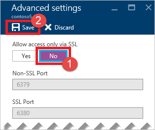

Aktivieren Sie den nicht-SSL-Anschluss, [Navigieren](../articles/redis-cache/cache-configure.md#configure-redis-cache-settings) Sie in Ihren Cache im [Azure-Portal](https://portal.azure.com) , und klicken Sie auf **Einstellungen > Erweiterte Einstellungen**. Klicken Sie auf **Nein** , für den **Zugriff gewähren nur über SSL** auf das **Blade Erweiterte Einstellungen** , und klicken Sie dann auf **Speichern**.

