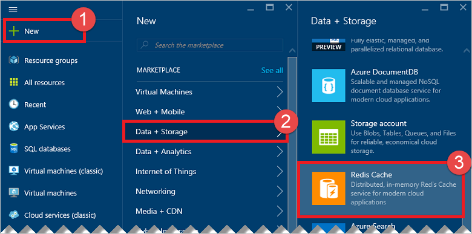

Zum Erstellen eines Premium Caches [Azure-Portal](https://portal.azure.com) anmelden, und klicken Sie auf **neu** > **Daten + Speicher** > **Redis Cache**.

>[AZURE.NOTE] Neben Caches Azure-Portal, Sie können auch erstellen sie mithilfe der Ressourcenmanager Vorlagen, PowerShell oder Azure CLI. Weitere Informationen finden Sie unter [Erstellen einer Cache](../articles/redis-cache/cache-dotnet-how-to-use-azure-redis-cache.md#create-a-cache).

Um Premium Features konfigurieren möchten, wählen Sie zuerst ein die Preise Ebenen in das **Auswählen der Preisgestaltung Stufe** Blade Premium.

