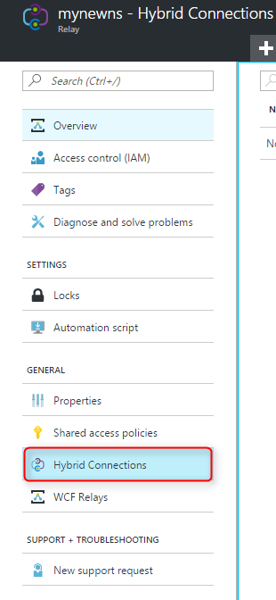
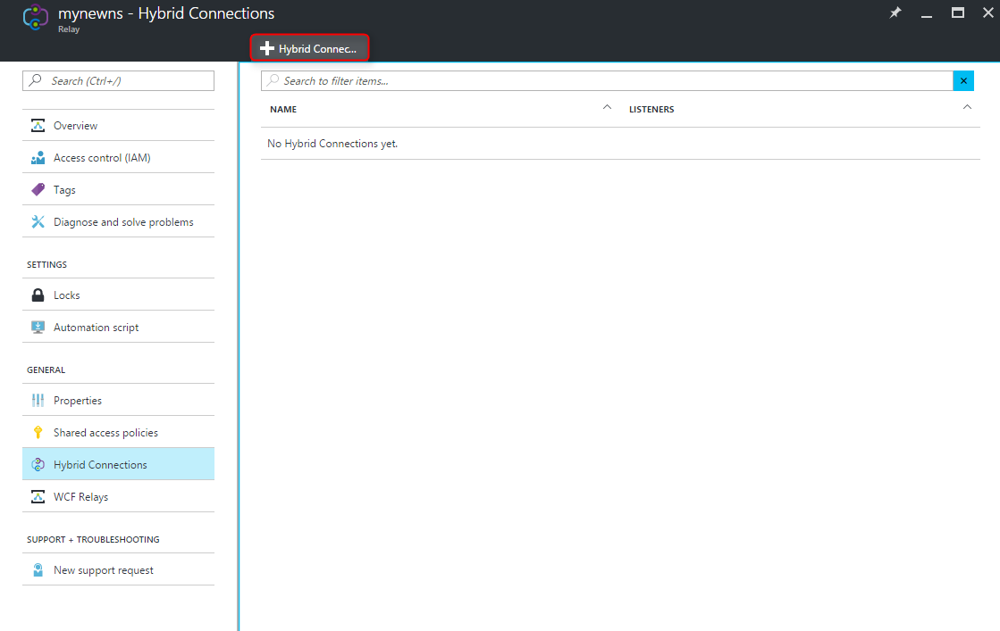
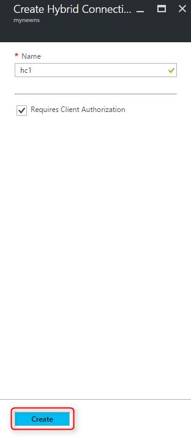

Stellen Sie sicher, dass Sie einen Namespace Relay, als angezeigte [hier]bereits erstellt haben[namespace-how-to].

1. Melden Sie sich bei der [Azure-Portal](https://portal.azure.com)an.

2. Klicken Sie im linken Navigationsbereich des Portals auf **Relay**.

3. Wählen Sie den Namespace, dem Sie in die Hybrid-Verbindung erstellen möchten. In diesem Fall ist es **mynewns1**.

    

4. Das Blade **Relay Namespace** wählen Sie **Hybrid Verbindungen**, und klicken Sie auf **+ Hybrid Verbindung**.

    

5. Geben Sie den **Verbindungsnamen Hybrid** , und lassen Sie die anderen Werte mit ihren Standardwerten.

    

7. Klicken Sie am unteren Rand der Blade auf **Erstellen**.

[namespace-how-to]: ../articles/service-bus-relay/relay-create-namespace-portal.md 