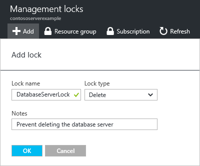

1. Wählen Sie das Blade der Einstellungen für die Ressource, Ressourcengruppe oder Abonnement, die Sie sperren möchten, **sperrt**.

      

2. Wählen Sie zum Hinzufügen einer Sperre **Hinzufügen**aus. Wenn Sie eine Sperre auf einer übergeordneten Ebene erstellen möchten, wählen Sie das übergeordnete Element. Die aktuell ausgewählte Ressource erbt die Sperre von den übergeordneten an. Beispielsweise könnten Sie die Ressourcengruppe aus, um eine Sperre für alle zugeordneten Ressourcen zu übernehmen sperren.

       

3. Geben Sie der Sperre eine Ebene Name und sperren. Optional können Sie Notizen hinzufügen, die die Sperre zu beschreiben.

       

4. Um die Sperre zu löschen, wählen Sie die drei Punkte und **Löschen** anhand der verfügbaren Optionen aus.

       