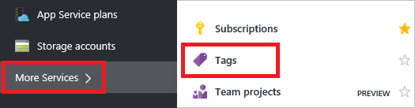
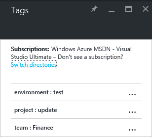
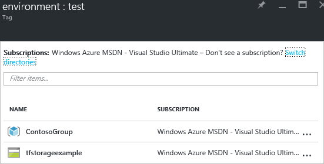

1. Wählen Sie zum Hinzufügen von Kategorien zu vorhandenen Ressourcen und Ressourcengruppe das Symbol Kategorie ein. 

     

1. Sie sehen eine Liste der Kategorien, die Ihre Organisation bereits auf Ressourcen angewendet wurde. Wenn Sie Kategorien nicht installiert haben, ist die Liste leer. Wenn Sie eine Kategorie hinzufügen möchten, geben Sie einen Namen und Wert und drücken Sie die EINGABETASTE. Nachdem Sie ein paar Kategorien hinzugefügt haben, sehen Sie basierte auf den bereits vorhandenen Tagnamen und Werte AutoVervollständigen-Optionen. Diese Optionen AutoVervollständigen eine konsistente Taxonomie über Ihre Ressourcen sicherzustellen und allgemeine Fehler, wie Rechtschreibfehlern vermeiden.

     

1. Wählen Sie zum Anzeigen Ihrer Taxonomie Kategorien im Portal **Weitere Dienste** und **Kategorien**aus.

     

1. Eine Zusammenfassung der Kategorien in Ihrem Abonnement angezeigt.

     

1. Wählen Sie eine der Kategorien die Ressourcen und Ressourcengruppen, mit die Kategorie angezeigt werden soll.

     

1. Fixieren der wichtigsten Kategorien zum Dashboard für den Schnellzugriff an.

     
