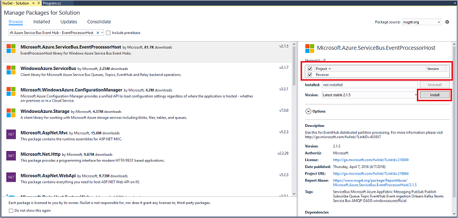

## <a name="receive-messages-with-eventprocessorhost"></a>Empfangen von Nachrichten mit EventProcessorHost

[EventProcessorHost][] ist eine, die Empfang von Ereignissen Ereignis Hubs durch Verwalten von beständigen Kontrollpunkten vereinfacht empfängt Parallel aus diesen Hubs Ereignis. Verwenden [EventProcessorHost][], können Sie Ereignisse über mehrere Empfänger aufteilen auch, wenn in unterschiedlichen Knoten gehostet. In diesem Beispiel wird gezeigt, wie [EventProcessorHost][] für einen einzelnen Empfänger verwendet werden soll. Im Beispiel [skaliert, Ereignis Verarbeitung][] veranschaulicht, wie [EventProcessorHost][] mit mehreren Empfängern zu verwenden.

Um [EventProcessorHost][]verwenden zu können, müssen Sie ein [Speicher Azure-Konto][]verfügen:

1. Melden Sie sich bei der [Azure-Portal][], und klicken Sie auf **neu** in der oberen linken Ecke des Bildschirms.

2. Klicken Sie auf **Daten + Speicher**, und klicken Sie auf **Speicher-Konto**.

    

3. Geben Sie in das Blade **Speicher-Konto erstellen** einen Namen für das Speicherkonto ein. Wählen Sie eine Azure-Abonnement, Ressourcengruppe und Speicherort für die Ressource zu erstellen. Klicken Sie dann auf **Erstellen**.

    

4. Klicken Sie in der Liste der Speicherkonten auf das Speicherkonto neu erstellten.

5. Klicken Sie in das Konto Speicher Blade **Tastenkombinationen**auf. Kopieren Sie den Wert von **Schlüssel1** später in diesem Lernprogramm verwenden.

    

4. Erstellen Sie ein neues Visual C#-Desktop-App-Projekt mit der **Anwendung Console** -Projektvorlage in Visual Studio. Geben Sie dem Projekt **Empfänger**ein.

    

5. Im Explorer-Lösung mit der rechten Maustaste in der Lösung, und klicken Sie dann auf **NuGet-Pakete verwalten, für die Lösung**.

6. Klicken Sie auf die Registerkarte **Durchsuchen** , und suchen Sie nach `Microsoft Azure Service Bus Event Hub - EventProcessorHost`. Stellen Sie sicher, dass im Feld **Versionen** des Projektnamens (**Empfänger**) angegeben ist. Klicken Sie auf **Installieren**, und akzeptieren Sie der Vereinbarung.

    

    Visual Studio-downloads, Installationen und fügt einen Verweis auf die [Azure Service Bus Ereignis Hub - EventProcessorHost NuGet-Paket](https://www.nuget.org/packages/Microsoft.Azure.ServiceBus.EventProcessorHost)mit sämtlichen abhängigen.

7. Mit der rechten Maustaste in des Projekts **Empfänger** , klicken Sie auf **Hinzufügen**, und klicken Sie dann auf **Klasse**. Nennen Sie die neue Klasse **SimpleEventProcessor**, und klicken Sie dann auf **Hinzufügen** , um die Klasse zu erstellen.

    

8. Fügen Sie die folgenden Aussagen am oberen Rand der Datei SimpleEventProcessor.cs hinzu:

    ```
    using Microsoft.ServiceBus.Messaging;
    using System.Diagnostics;
    ```

    Dann ersetzen Sie für den Textkörper der Klasse den folgenden Code ein:

    ```
    class SimpleEventProcessor : IEventProcessor
    {
        Stopwatch checkpointStopWatch;

        async Task IEventProcessor.CloseAsync(PartitionContext context, CloseReason reason)
        {
            Console.WriteLine("Processor Shutting Down. Partition '{0}', Reason: '{1}'.", context.Lease.PartitionId, reason);
            if (reason == CloseReason.Shutdown)
            {
                await context.CheckpointAsync();
            }
        }

        Task IEventProcessor.OpenAsync(PartitionContext context)
        {
            Console.WriteLine("SimpleEventProcessor initialized.  Partition: '{0}', Offset: '{1}'", context.Lease.PartitionId, context.Lease.Offset);
            this.checkpointStopWatch = new Stopwatch();
            this.checkpointStopWatch.Start();
            return Task.FromResult<object>(null);
        }

        async Task IEventProcessor.ProcessEventsAsync(PartitionContext context, IEnumerable<EventData> messages)
        {
            foreach (EventData eventData in messages)
            {
                string data = Encoding.UTF8.GetString(eventData.GetBytes());

                Console.WriteLine(string.Format("Message received.  Partition: '{0}', Data: '{1}'",
                    context.Lease.PartitionId, data));
            }

            //Call checkpoint every 5 minutes, so that worker can resume processing from 5 minutes back if it restarts.
            if (this.checkpointStopWatch.Elapsed > TimeSpan.FromMinutes(5))
            {
                await context.CheckpointAsync();
                this.checkpointStopWatch.Restart();
            }
        }
    }
    ```

    Diese Klasse wird von der **EventProcessorHost** zum Verarbeiten von Ereignissen vom Ereignis Hub empfangen aufgerufen werden. Beachten Sie, dass die `SimpleEventProcessor` Klasse verwendet eine Stoppuhr regelmäßig die Wissensstand Methode auf dem Kontext **EventProcessorHost** aufrufen. Dadurch wird sichergestellt, dass, wenn der Empfänger neu gestartet wird, nicht mehr als fünf Minuten zum Verarbeiten von Arbeit verloren geht.

9. Fügen Sie in der Klasse **Programm** Folgendes `using` -Anweisung am Anfang der Datei ein:

    ```
    using Microsoft.ServiceBus.Messaging;
    ```

    Ersetzen Sie anschließend die `Main` Methode in der `Program` Klasse mit den folgenden Code, und ersetzen den Namen des Ereignisses Hub und den Namespace Ebene Verbindungszeichenfolge, die Sie zuvor gespeichert haben und die Speicherkonto und einen Schlüssel, den Sie in den vorherigen Abschnitten kopiert haben. 

    ```
    static void Main(string[] args)
    {
      string eventHubConnectionString = "{Event Hub connection string}";
      string eventHubName = "{Event Hub name}";
      string storageAccountName = "{storage account name}";
      string storageAccountKey = "{storage account key}";
      string storageConnectionString = string.Format("DefaultEndpointsProtocol=https;AccountName={0};AccountKey={1}", storageAccountName, storageAccountKey);

      string eventProcessorHostName = Guid.NewGuid().ToString();
      EventProcessorHost eventProcessorHost = new EventProcessorHost(eventProcessorHostName, eventHubName, EventHubConsumerGroup.DefaultGroupName, eventHubConnectionString, storageConnectionString);
      Console.WriteLine("Registering EventProcessor...");
      var options = new EventProcessorOptions();
      options.ExceptionReceived += (sender, e) => { Console.WriteLine(e.Exception); };
      eventProcessorHost.RegisterEventProcessorAsync<SimpleEventProcessor>(options).Wait();

      Console.WriteLine("Receiving. Press enter key to stop worker.");
      Console.ReadLine();
      eventProcessorHost.UnregisterEventProcessorAsync().Wait();
    }
    ```

> [AZURE.NOTE] In diesem Lernprogramm verwendet eine einzelne Instanz von [EventProcessorHost][]. Um Durchsatz zu erhöhen, wird empfohlen, dass die Ausführung mehrerer Instanzen von [EventProcessorHost][], wie in der Stichprobe [skaliert, Verarbeitung von Ereignissen][] dargestellt. In diesen Fällen koordinieren die verschiedenen Instanzen automatisch für den Lastenausgleich miteinander die empfangenen Ereignisse. Wenn Sie mehrere Empfänger auf jeder Prozess *Alle* Ereignisse möchten, müssen Sie das **ConsumerGroup** Konzept verwenden. Wenn Ereignisse von verschiedenen Computern zu empfangen, ist dies möglicherweise sinnvoll, den Namen für die [EventProcessorHost][] Instanzen basierend auf dem Computer (oder die Rollen) angeben, in dem sie bereitgestellt werden. Weitere Informationen zu diesen Themen finden Sie unter den Themen [Ereignis Hubs Übersicht][] und [Ereignis Hubs Programming Guide][] .

<!-- Links -->
[Ereignis Hubs (Übersicht)]: ../articles/event-hubs/event-hubs-overview.md
[Ereignis Hubs Programming Guide]: ../articles/event-hubs/event-hubs-programming-guide.md
[Verarbeitung von Ereignissen skalieren]: https://code.msdn.microsoft.com/Service-Bus-Event-Hub-45f43fc3
[Azure-Speicher-Konto]: ../articles/storage/storage-create-storage-account.md
[EventProcessorHost]: http://msdn.microsoft.com/library/azure/microsoft.servicebus.messaging.eventprocessorhost(v=azure.95).aspx
[Azure-portal]: https://portal.azure.com