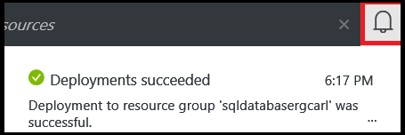

<!--
includes/sql-database-create-new-database-portal.md

Latest Freshness check:  2016-04-11 , carlrab.

As of circa 2016-04-11, the following topics might include this include:
articles/sql-database/sql-database-get-started-tutorial.md

-->
## Erstellen einer neuen SQL Azure-Datenbank

Gehen Sie folgendermaßen vor der Azure-Portal zum Erstellen einer neuen SQL Azure-Datenbank auf einem neuen oder vorhandenen Azure SQL-Datenbank logischen.

1. Wenn Sie derzeit nicht verbunden sind, schließen Sie an der [Azure-Portal](http://portal.azure.com).
2. Klicken Sie auf **neu**, geben Sie die **SQL-Datenbank**, und klicken Sie dann auf **SQL-Datenbank (neue Datenbank)**.

     

3. Klicken Sie auf **SQL-Datenbank (neue Datenbank)**.

     

4. Klicken Sie auf **Erstellen** , um eine neue Datenbank erstellen, in der SQL-Datenbank-Dienst.

     

5. Geben Sie die Werte für die folgenden Servereigenschaften:

 - Datenbankname
 - Abonnements: Dies gilt nur, wenn Sie mehrere Abonnements haben.
 - Ressourcengruppe: Wenn Sie noch die ersten Schritte sind, verwenden Sie die Ressourcengruppe des logischen Servers.
 - Select Quelle: Sie können eine leere Datenbank, Beispieldaten oder eine Sicherungskopie der Azure-Datenbank auswählen. Zum Migrieren einer lokalen SQL Server-Datenbank oder Laden von Daten mithilfe des Tools für die Befehlszeile BCP finden Sie unter den Links am Ende dieses Artikels.
 - Server: Einen neuen oder vorhandenen logischen Server.
 - Server-Administrator-Anmeldung
 - Kennwort
 - Preisgestaltung Ebene: Wenn Sie noch die ersten Schritte sind, verwenden Sie den Standardwert S0.
 - Sortierung: Dies gilt nur, wenn Sie eine leere Datenbank ausgewählt wurde.

        

6.  Klicken Sie auf **Erstellen**. Im Infobereich angezeigt können Sie sehen, dass Bereitstellung gestartet wurde.

     

7. Warten Sie für die Bereitstellung auf Fertig stellen, bevor Sie fortfahren mit dem nächsten Schritt fort.

     
