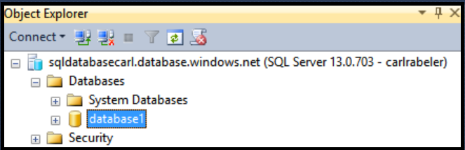
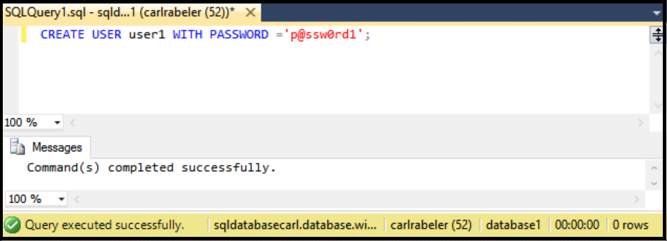

## <a name="create-new-database-user-using-ssms"></a>Erstellen Sie Neuer Datenbankbenutzer SSMS verwenden

Gehen Sie folgendermaßen vor, erstellen Sie einen neuen Datenbankbenutzer in einer vorhandenen Datenbank SSMS verwenden. 

Diesen Schritten wird vorausgesetzt, dass Sie mit SQL-Datenbank im Objekt-Explorer mit SSMS verbunden sind und als Hauptbenutzer Ebene Server-Administrator oder mit einem Benutzerkonto mit Berechtigungen zum Erstellen eines neuen Benutzers mit dem logischen SQL-Datenbankserver verbunden sind. 

1. Erweitern Sie den Knoten Datenbanken, und wählen Sie die Datenbank, in der Sie ein neues Benutzerkonto erstellen möchten, im Objekt-Explorer.

     

2. Mit der rechten Maustaste in der ausgewählten Datenbank aus, und klicken Sie dann auf **Abfrage**.

     

3. Im Fenster Abfrage bearbeiten Sie, und verwenden Sie die folgende Transact-SQL-Anweisung zum Erstellen eines eigenständigen Benutzers in der Datenbank. 

    ''' Benutzer1 mit Kennwort Benutzer erstellen='p@ssw0rd1';
    ```

     


