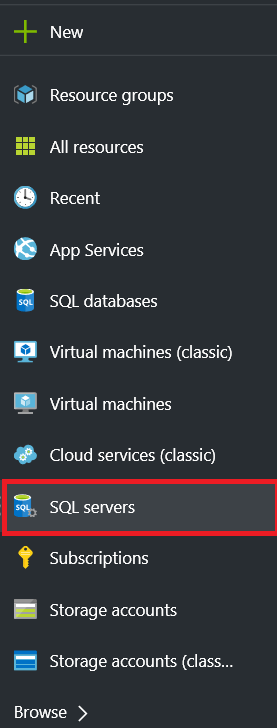
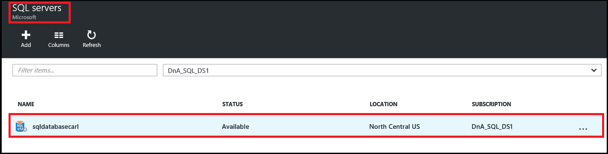
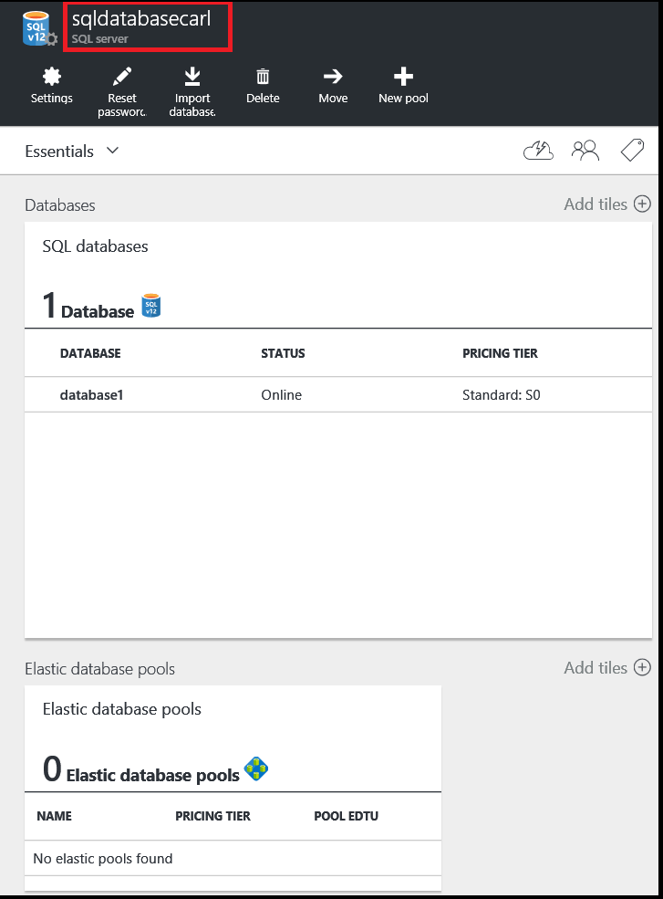
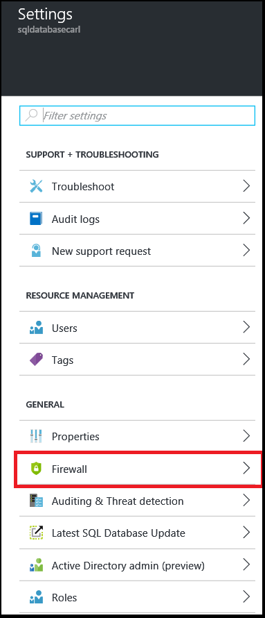
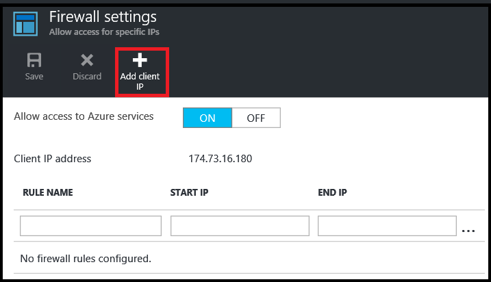
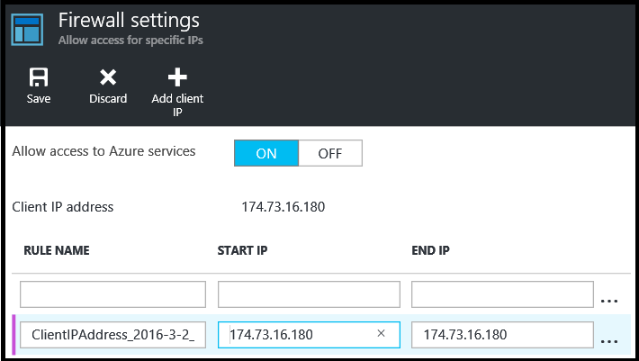
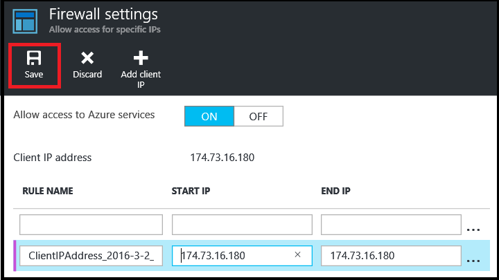

<!--
includes/sql-database-create-new-server-firewall-portal.md

Latest Freshness check:  2016-08-01 , rickbyh.

As of circa 2016-04-11, the following topics might include this include:
articles/sql-database/sql-database-get-started-tutorial.md
articles/sql-database/sql-database-configure-firewall-settings

-->
## Erstellen Sie eine neue Azure SQL Server-Ebene firewall

Gehen Sie folgendermaßen vor der Azure-Portal eine Ebene Server Firewall-Regel zu erstellen, die können Verbindungen aus eine einzelne IP-Adresse (dem Clientcomputer) oder eines gesamten Bereichs der IP-Adresse zu einem logischen SQL-Datenbankserver.

1. Wenn Sie derzeit nicht verbunden sind, schließen Sie an der [Azure-Portal](http://portal.azure.com).
2. Klicken Sie auf das standardmäßige Blade auf **SQL Server**.

    

3. Klicken Sie in der **SQL Server** -Blade auf dem Server mit dem Firewall-Regel erstellen.

    

4. Überprüfen Sie die Eigenschaften des Servers.

    

5. Klicken Sie auf das Blade **Einstellungen** auf **Firewall**.

    

    > [AZURE.NOTE] Sie können auch Access Server-Ebene **Firewall-Einstellungen** Blade aus der Symbolleiste des Blades **Datenbank** .

6. Klicken Sie auf **Add Client-IP-** zum Erstellen einer Regel für Ihre IP-Adresse Azure haben.

      

7. Klicken Sie auf die IP-Adresse, die hinzugefügt wurde, bearbeiten Sie die Firewalladresse optional Zugriff auf einen Bereich von IP-Adressen um zu ermöglichen.

      

8. Klicken Sie auf **Speichern** , um die Server Ebene Firewall-Regel erstellen.

     

    >[AZURE.IMPORTANT] Ihre IP-Adresse ändert sich möglicherweise von Zeit zu Zeit, und Sie können möglicherweise nicht auf den Server zugreifen, bis Sie eine neue Firewall-Regel erstellen. Sie können Ihre IP-Adresse mit [Bing](http://www.bing.com/search?q=my%20ip%20address)überprüfen. Fügen Sie Sie dann eine einzelne IP-Adresse oder einen Bereich von IP-Adressen ein. Details finden Sie unter [Firewall-Einstellungen verwalten](sql-database-configure-firewall-settings.md#manage-existing-server-level-firewall-rules-through-the-azure-portal) .
