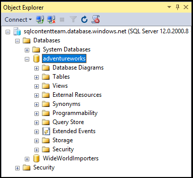

## Herstellen einer Verbindung mit SQL Server-Authentifizierung Azure SQL-Datenbank mit

Die folgenden Schritte durch Anzeigen Herstellen einer Verbindung mit einer SQL Azure-Server und die Datenbank mit SSMS Wenn Sie mit einem Server und einer Datenbank besitzen, finden Sie unter [Erstellen einer SQL-Datenbank in Minuten](../articles/sql-database/sql-database-get-started.md) zu erstellen.

1. Zunächst SSMS **Microsoft SQL Server Management Studio** in das Suchfeld für Windows, und klicken Sie dann auf die desktop-Anwendung.

2. Geben Sie im Fenster **Verbinden mit Server** die folgenden Informationen (wenn SSMS bereits ausgeführt wird, klicken Sie auf **Verbinden > Datenbank-Engine** So öffnen Sie das Fenster **Verbinden mit Server** ):

 - **Server-Typ**: die Standardeinstellung ist die Datenbank-Engine; Ändern Sie diesen Wert nicht.
 - **Server-Name**: Geben Sie den vollqualifizierten Namen der Ihr Azure SQL-Datenbankserver in folgendem Format ein: * &lt;Servername >*. **Database.Windows.NET**
 - **Authentifizierungstyp**: in diesem Artikel wird gezeigt, wie eine Verbindung mit **SQL Server-Authentifizierung**. Details zum Herstellen einer Verbindung mit Active Directory Azure finden Sie unter [Verbinden mithilfe der integrierten Active Directory-Authentifizierung](../articles/sql-database/sql-database-aad-authentication.md#connect-using-active-directory-integrated-authentication), verbinden Kennwortauthentifizierung Active Directory und [verwenden](../articles/sql-database/sql-database-aad-authentication.md#connect-using-active-directory-password-authentication) [Verbinden universeller Active Directory-Authentifizierung](../articles/sql-database/sql-database-ssms-mfa-authentication.md).
 - **Benutzername**: Geben Sie den Namen eines Benutzers mit Zugriff auf eine Datenbank auf dem Server (beispielsweise den *Serveradministrator* eingerichtet werden, wenn den Server erstellen). 
 - **Kennwort**: Geben Sie das Kennwort für den angegebenen Benutzer (beispielsweise das *Kennwort* eingerichtet werden, wenn den Server erstellen).
   
       

3. Klicken Sie auf **Verbinden**.
 
4. Standardmäßig weshalb neue Server keine definierten [Firewall-Regeln](../articles/sql-database/sql-database-firewall-configure.md) Clients Anfangs Verbindung gesperrt sind. Wenn der Server noch keine Firewall-Regel, mit dem Ihre bestimmte IP-Adresse die Verbindung herstellen können verfügt, fordert SSMS zum Erstellen einer Ebene Server Firewallregel für Sie ein.

    Klicken Sie auf **Anmelden** , und erstellen Sie eine Firewallregel Server Ebene. Müssen Sie Administrator Azure zum Erstellen einer Firewallregel Server Ebene ein.
 
       
 

5. Nachdem erfolgreich eine Verbindung zu Ihrer SQL Azure-Datenbank, **Objekt-Explorer** wird geöffnet, und Sie können nun die Datenbank zum [Ausführen von Verwaltungsaufgaben oder Abfragen von Daten](../articles/sql-database/sql-database-manage-azure-ssms.md)zugreifen.
 
     
 
     
## Problembehandlung bei Verbindungsfehlern

Die häufigsten Ursachen für Verbindungsfehlern werden Fehler in den Servernamen und Netzwerkkonnektivitätsprobleme vor. Denken Sie daran, <*Servername*> ist der Name des Servers, nicht der Datenbank, und Sie müssen den vollständigen Servernamen angeben:`<servername>.database.windows.net`

Überprüfen Sie auch den Benutzernamen und das Kennwort nicht keine Tippfehler oder zusätzliche Leerzeichen enthalten (Benutzernamen Groß-/Kleinschreibung nicht, aber Kennwörter sind). 

Sie können auch explizit die Protokoll und den Port Zahl mit den Servernamen wie folgt festlegen:`tcp:servername.database.windows.net,1433`

Probleme mit der Netzwerkkonnektivität können auch Verbindungsfehlern und Zeitlimit verursachen. Einfach wiederholen, um eine Verbindung herzustellen (Wenn Sie wissen, dass die Servernamen, Anmeldeinformationen und Firewall-Regeln richtig sind) kann zum Erfolg führen.

Details und Weitere Informationen zu Verbindungsproblemen finden Sie unter [Behandeln von Problemen, diagnostizieren und Fehler bei der SQL-Verbindung und vorübergehende Fehler für SQL-Datenbank zu vermeiden](../articles/sql-database/sql-database-connectivity-issues.md).

