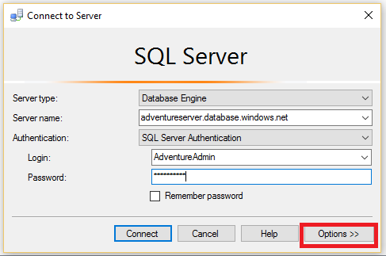
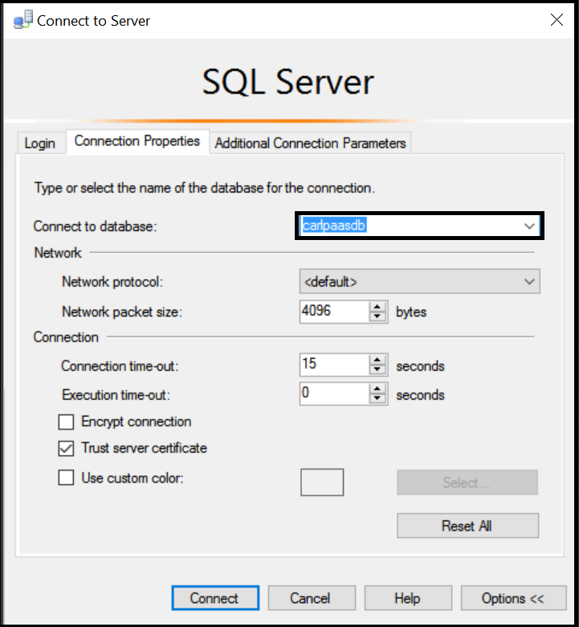

## Verbinden Sie mit Azure SQL-Datenbank als Benutzer

Gehen Sie folgendermaßen vor, für die Verbindung mit Azure SQL-Datenbank mit SSMS als Benutzer.

1. Typ "Microsoft SQL Server Management Studio" in der Windows-Suchfeld, und klicken Sie dann auf die desktop-Anwendung um SSMS zu starten.

2. Geben Sie im Fenster Server verbinden die folgenden Informationen ein:

- **Server-Typ**: die Standardeinstellung ist die Datenbank-Engine; Ändern Sie diesen Wert nicht.
 - **Server-Name**: Geben Sie den Namen des Servers ein, die SQL-Datenbank in das Format Followinbg hostet: * &lt;Servername >*. **Database.Windows.NET**
 - **Authentifizierungstyp**: Wenn Sie noch die ersten Schritte sind, wählen Sie SQL-Authentifizierung aus. Wenn Sie Active Directory für Ihre logischen SQL-Datenbankserver aktiviert haben, können Sie entweder Active Directory-Kennwortauthentifizierung oder Active Directory-integrierte Authentifizierung auswählen.
 - **Benutzername**: Wenn Sie SQL-Authentifizierung oder Active Directory-Kennwortauthentifizierung ausgewählt haben, geben Sie den Namen eines Benutzers mit Zugriff auf eine Datenbank auf dem Server.
 - **Kennwort**: Wenn Sie SQL-Authentifizierung oder Active Directory-Kennwortauthentifizierung ausgewählt haben, geben Sie das Kennwort für den angegebenen Benutzer.
   
       

3. Klicken Sie auf **Optionen** , um die Datenbank anzugeben, die Sie eine Verbindung herstellen möchten.

      
 
4. **Verbindung zur Datenbank herstellen**wählen Sie die Datenbank, die Sie eine Verbindung herstellen möchten.

     

5. Klicken Sie auf **Verbinden**.
 
6. Wenn die IP-Adresse des Clients keinen Zugriff auf die logischen SQL-Datenbankserver, werden Sie aufgefordert, melden Sie sich bei einem Azure-Konto und erstellen Sie eine Firewallregel Server Ebene. Wenn Sie sind ein Abonnementadministrator Azure-, klicken Sie auf **Melden Sie sich** , um eine Ebene Server Firewall-Regel erstellen. Wenn dies nicht der Fall ist, müssen Sie einen Administrator entweder eine Ebene Server Firewall-Regel oder eine Datenbank Ebene Firewall-Regel in der Datenbank erstellen, dem Sie eine Verbindung herstellen möchten.
 
      
 
7. Wenn Ihre Anmeldeinformationen gewähren Sie den Zugriff auf die angegebene Datenbank, Objekt-Explorer wird geöffnet, und Sie können jetzt ausführen Verwaltungsaufgaben oder Abfragen von Daten, die Benutzerberechtigungen Kontextinformationen.
  
      
      
 
## Problembehandlung bei Verbindungsfehlern

Der am häufigsten verwendete Grund Verbindungsfehlern werden Fehler im Servernamen (Denken Sie daran, <*Servername*> ist der Name des logischen Servers, nicht die Datenbank), den Benutzernamen oder das Kennwort, sowie den Server nicht sodass Verbindungen aus Gründen der Sicherheit. 

