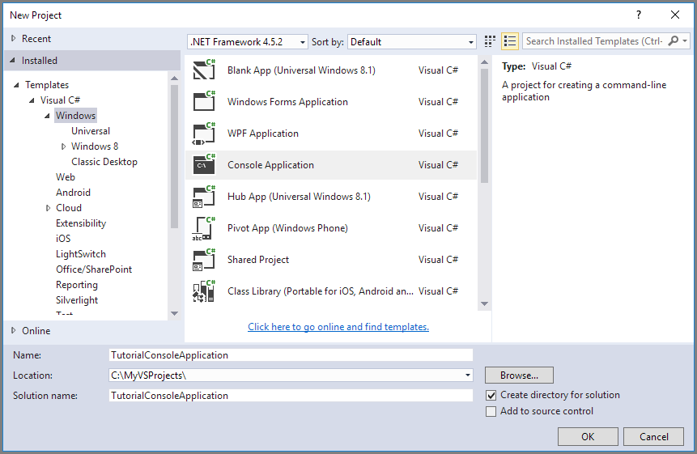

## Richten Sie Ihrer Entwicklungsumgebung ein

Als Nächstes richten Sie Ihre Entwicklungsumgebung in Visual Studio, damit Sie nun versuchen, die in diesem Handbuch bereitgestellten Codebeispielen sind.

### Erstellen Sie ein Projekt Windows Console-Anwendung

Erstellen Sie in Visual Studio eine neue Windows, wie dargestellt:

Alle in den Codebeispielen in diesem Lernprogramm hinzugefügt werden kann, **in der Main()-Methode** `program.cs` in Ihrer Anwendung Console.

Beachten Sie, dass Sie der Azure-Speicher Client-Bibliothek aus jede Art von .NET Anwendung, einschließlich einer Azure-Cloud-Dienst, einer Azure Web app, eine desktop-Anwendung oder einer mobilen Anwendung verwenden können. In diesem Handbuch verwenden wir eine Console-Anwendung zur Vereinfachung an.

### Verwenden Sie die erforderlichen Pakete installiert NuGet

Es gibt zwei Pakete, die Sie zu Ihrem Projekt zum Bearbeiten dieses Lernprogramms installieren müssen:

- [Microsoft Azure-Speicher-Client-Bibliothek für .NET](https://www.nuget.org/packages/WindowsAzure.Storage/): Dieses Paket bietet programmgesteuerten Zugriff auf Datenressourcen in Ihr Speicherkonto.
- [Microsoft Azure-Konfigurations-Manager-Bibliothek für .NET](https://www.nuget.org/packages/Microsoft.WindowsAzure.ConfigurationManager/): Dieses Paket stellt eine Klasse zum Analysieren einer Verbindungszeichenfolge aus einer Konfigurationsdatei, unabhängig davon, wo die Anwendung ausgeführt wird.

NuGet können Sie um beide Pakete zu erhalten. Gehen Sie folgendermaßen vor:

1. Mit der rechten Maustaste in Ihr Projekts im **Explorer Lösung** , und wählen Sie **NuGet-Pakete verwalten**.
2. Onlinesuche nach "WindowsAzure.Storage", und klicken Sie auf **Installieren** , um die Speicher-Client-Bibliothek und die zugehörigen Dateien zu installieren.
3. Onlinesuche nach "ConfigurationManager", und klicken Sie auf **Installieren** , um den Azure-Konfigurations-Manager zu installieren.

>[AZURE.NOTE] Das Paket Speicher-Client-Bibliothek ist auch im [Azure SDK für .NET](https://azure.microsoft.com/downloads/)enthalten. Allerdings empfiehlt es sich, dass Sie auch der Speicher-Client-Bibliothek aus NuGet installieren, um sicherzustellen, dass Sie immer über die neueste Version der Clientbibliothek verfügen.
>
>Die Abhängigkeiten ODataLib in der Bibliothek Speicher Client für .NET von der ODataLib gelöst werden (Version 5.0.2 und höher) Pakete verfügbar über NuGet und nicht über WCF Data Services. Die ODataLib-Bibliotheken können heruntergeladen direkt oder das Codeprojekt über NuGet optimiert werden. Die bestimmte ODataLib Pakete, die von der Speicher-Client-Bibliothek verwendet werden [OData](http://nuget.org/packages/Microsoft.Data.OData/5.0.2), [Edm](http://nuget.org/packages/Microsoft.Data.Edm/5.0.2)und [räumlichen](http://nuget.org/packages/System.Spatial/5.0.2). Während diese Bibliotheken von der Azure Table-Speicher-Klassen verwendet werden, sind sie für die Programmierung mit der Speicher-Client-Bibliothek erforderlich Abhängigkeiten an.

### Ermitteln der zielumgebung

Sie haben zwei Umgebungsoptionen für die Beispiele in diesem Handbuch ausgeführt:

- Sie können den Code für ein Konto Azure-Speicher in der Cloud ausführen. 
- Sie können den Code gegen Azure Speicheremulator ausführen. Speicheremulator ist einer lokalen Umgebung, die ein Konto Azure-Speicher in der Cloud emuliert. Der Emulator ist eine kostenlose Option zum Testen und Debuggen von Code, während Ihrer Anwendung in der Entwicklung befindet. Der Emulator verwendet einen bekannten Kontos und -Taste. Weitere Informationen hierzu finden Sie unter [Verwenden der Speicheremulator Azure für Entwicklung und Testen](../articles/storage/storage-use-emulator.md)

Wenn Sie ein Speicherkonto in der Cloud verwenden möchten, kopieren Sie die primäre Zugriffstaste für Ihr Speicherkonto vom Azure-Portal. Weitere Informationen finden Sie unter [anzeigen und kopieren Speicher Schlüssel zuzugreifen](../articles/storage/storage-create-storage-account.md#view-and-copy-storage-access-keys).

> [AZURE.NOTE] Sie können die Speicheremulator zur Vermeidung von anfallen alle Kosten im Zusammenhang mit Azure-Speicher adressieren. Wenn Sie ein Konto Azure-Speicher in der Cloud als Ziel auswählen, werden Kosten zur Durchführung dieses Lernprogramms jedoch geringfügig angesehen werden.

### Konfigurieren der Verbindungszeichenfolge Speicher

Der Azure-Speicher Clientbibliothek für .NET unterstützt, die mit einer Verbindungszeichenfolge Speicher Endpunkte und die Anmeldeinformationen für den Zugriff auf Speicherdienste konfigurieren. Die beste Methode zum Verwalten Ihrer Verbindungszeichenfolge Speicher ist in einer Konfigurationsdatei. 

Weitere Informationen zu Verbindungszeichenfolgen finden Sie unter [Konfigurieren einer Verbindungszeichenfolge zur Azure-Speicher](../articles/storage/storage-configure-connection-string.md).

> [AZURE.NOTE] Ihren kontoschlüssel Speicher ähnelt der Root-Kennwort für Ihr Speicherkonto. Seien Sie immer schützen Sie Ihren kontoschlüssel Speicher. Vermeiden Sie es an andere Benutzer programmieren, verteilen oder Speicherung in einer nur-Text-Datei, die für andere Personen zugänglich ist. Generieren Sie erneut den Key im Portal Azure verwenden, wenn Sie glauben, dass es möglicherweise beschädigt wurde.

Öffnen Sie zum Konfigurieren der Verbindungszeichenfolge der `app.config` Datei-Explorer-Lösung in Visual Studio. Einfügen des Inhalts der `<appSettings>` Element abgebildet. Ersetzen Sie `account-name` durch den Namen Ihres Kontos Speicher und `account-key` mit Ihrem Konto Zugriffstaste:

    <configuration>
        <startup> 
            <supportedRuntime version="v4.0" sku=".NETFramework,Version=v4.5.2" />
        </startup>
        <appSettings>
            <add key="StorageConnectionString" value="DefaultEndpointsProtocol=https;AccountName=account-name;AccountKey=account-key" />
        </appSettings>
    </configuration>

Beispielsweise werden Ihre Einstellung ähnelt:

    <add key="StorageConnectionString" value="DefaultEndpointsProtocol=https;AccountName=storagesample;AccountKey=nYV0gln6fT7mvY+rxu2iWAEyzPKITGkhM88J8HUoyofvK7C6fHcZc2kRZp6cKgYRUM74lHI84L50Iau1+9hPjB==" />

Um Speicheremulator adressieren, können Sie eine Verknüpfung, die den bekannten Kontonamen und Schlüssel zugeordnet ist. In diesem Fall werden Ihre Verbindung Zeichenfolge festlegen:

    <add key="StorageConnectionString" value="UseDevelopmentStorage=true;" />

