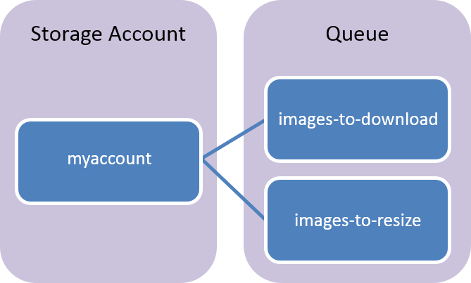

## Was ist der Warteschlange-Speicher?

Azure Warteschlange-Speicher ist ein Dienst für das Speichern einer großen Anzahl von Nachrichten, die über eine beliebige Stelle in der Welt über authentifizierten Anrufe mit HTTP oder HTTPS zugegriffen werden können. Eine einzelne Warteschlange Nachricht kann bis zu 64 KB sein, und eine Warteschlange kann Millionen von Nachrichten, auf die gesamte Kapazität Beschränkung eines Kontos Speicher enthalten.

Häufige Verwendungen Warteschlange-Speicher umfassen:

-   Erstellen einen Rückstand Arbeit asynchrone verarbeiten
-   Übergabe von Nachrichten aus einer Webrolle Azure an einer Azure Worker-Rolle

## Warteschlange Dienst Konzepte

Der Dienst Warteschlange enthält die folgenden Komponenten:

- **URL-Format:** Warteschlangen sind in folgendem Format ein URL adressiert:   
    http://`<storage account>`.queue.core.windows.net/`<queue>` 
      
    Die folgende URL Adressen eine Warteschlange im Diagramm:  
        
        http://myaccount.queue.core.windows.net/images-to-download

- **Speicherkonto:** Alle Zugriff auf Azure-Speicher erfolgt über ein Speicherkonto. Details zum Konto Speicherkapazität finden Sie unter [Leistung und Skalierbarkeit der Azure-Speicher](../articles/storage/storage-scalability-targets.md) .

- **Warteschlange:** Eine Warteschlange enthält eine Reihe von Nachrichten an. Alle Nachrichten müssen in einer Warteschlange. Beachten Sie, dass der Name der Warteschlange Kleinbuchstaben werden muss. Informationen zu Warteschlangen finden Sie unter [benennen Warteschlangen und Metadaten](https://msdn.microsoft.com/library/azure/dd179349.aspx).

- **Nachricht:** Eine Nachricht in einem beliebigen Format, von bis zu 64 KB sein. Die maximale Zeit, die eine Nachricht in der Warteschlange verbleiben kann, sieben Tage.
