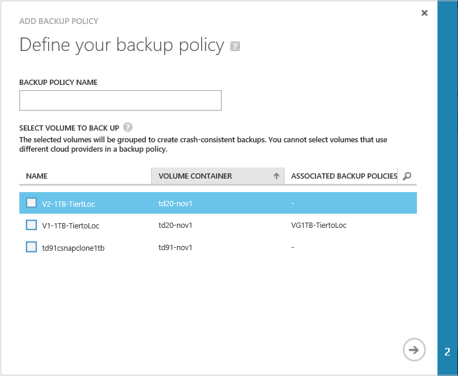
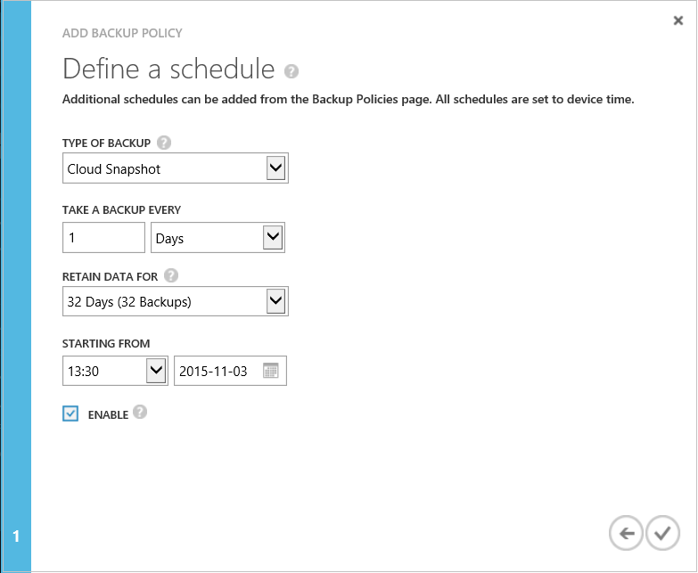

<!--author=v-sharos last changed: 11/06/15-->

#### Hinzufügen eine Sicherung StorSimple-Richtlinie

1. Klicken Sie auf der Seite Geräte für **Schnellstart** auf die Registerkarte **Sicherung Richtlinien** . Dadurch gelangen Sie zu der Seite **Sicherung Richtlinien** .

2. Klicken Sie am unteren Rand der Seite auf **Hinzufügen** , um die Sicherung Richtlinie hinzufügen-Assistenten zu starten.

    

3. Klicken Sie im Dialogfeld **Sicherungskopie Richtlinie hinzufügen** unter **der Sicherungsdatei Richtlinie definieren**folgendermaßen Sie vor:

    1. Geben Sie einen zusätzliche Richtliniennamen, der zwischen 3 und 150 Zeichen enthält.
    2. Klicken Sie auf den / die Kontrollkästchen, um eine oder mehrere Datenmengen dieser Sicherung Richtlinie zuzuweisen. Beachten Sie, dass Sie nicht Datenmengen auswählen können, die anderen Cloud-Dienstanbieter verwenden. Bei Verwendung von mehreren Cloud-Dienstanbieter, basierend auf Ihrer ersten Auswahl, wird die Liste Datenmengen, um nur in der Cloud-Service-Anbieter gehören angezeigt. Damit können Sie in der Gruppe Datenmengen, die an einen einzelnen Cloud Service Provider in eine Momentaufnahme gehören.
    3. Klicken Sie auf das Pfeilsymbol  um zur nächsten Seite zu wechseln.

     

4. Klicken Sie unter **Definieren eines Zeitplans**führen Sie folgende Schritte aus:
    1. Wählen Sie im Feld **Typ der Sicherung** **Cloud Snapshot** oder eine **Lokale Snapshot** in der Dropdown-Liste aus.
    2. Angeben die Häufigkeit von Sicherungskopien (Geben Sie eine Zahl, und wählen Sie dann mehrere **Tage** oder **Wochen** in der Dropdown-Liste aus.
    3. Geben Sie einen Aufbewahrungszeitplan aus.
    4. Geben Sie ein Datum und Uhrzeit für die Sicherungsdatei Richtlinie beginnen soll.  
    6. Klicken Sie auf das Kontrollkästchen-Symbol  um die Richtlinie zu speichern.

Die neu hinzugefügte Richtlinie werden der Tabellenansicht auf der Seite **Sicherung-Richtlinien** angezeigt.
 

