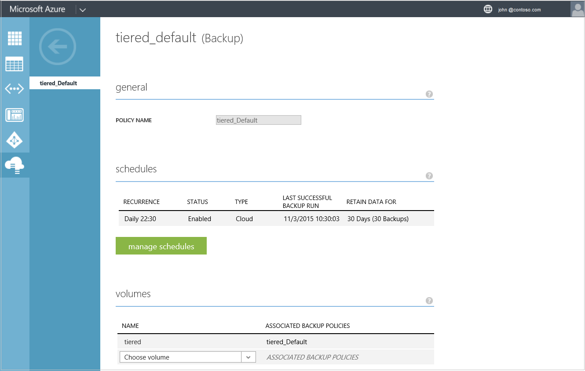
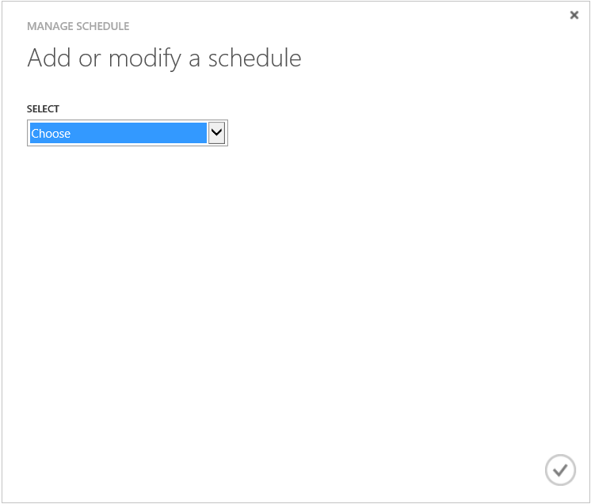
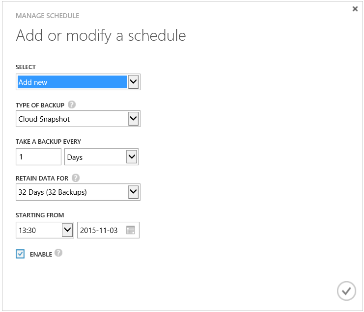

<!--author=SharS last changed: 11/04/15-->

#### Hinzufügen oder Ändern eines Sicherung StorSimple-Zeitplans

1. Klicken Sie auf der Seite Geräte für **Schnellstart** auf die Registerkarte **Sicherung Richtlinien** . Dadurch gelangen Sie zu der Seite **Sicherung Richtlinien** .

2. Wählen Sie in der tabellarischen Auflistung der Richtlinien aus, und klicken Sie auf die Richtlinie, die Sie bearbeiten möchten.

3. Klicken Sie unter **Allgemein**können Sie den Namen der Sicherungsdatei Richtlinie ändern.

     

4. Klicken Sie auf **Zeitpläne verwalten**. 

5. Klicken Sie im Dialogfeld **Terminplan verwalten** unter **Hinzufügen oder Ändern eines Zeitplans**folgendermaßen Sie vor:

    1. Aus der Dropdownliste wählen Sie einen vorhandenen Zeitplan oder **Hinzufügen** ein neues Projektplans zu erstellen.
    2. Klicken Sie auf das Kontrollkästchen-Symbol . 

        

    2. Wählen Sie den Typ des als lokale Sicherung oder Cloud Momentaufnahme aus.

         

    3. Geben Sie die Sicherungsdatei Häufigkeit, Aufbewahrung und Startzeit für den Zeitplan.

    4. Aktivieren Sie das Kontrollkästchen zu aktivieren oder deaktivieren Sie die Planung ein.

    5. Klicken Sie auf das Symbol "Überprüfen"  um den Zeitplan zu speichern.

5. Wählen Sie im Abschnitt **Datenmengen** die Datenmengen, denen dieser Richtlinie angewendet werden.

6. Klicken Sie am unteren Rand der Seite auf **Speichern** , um die Änderungen zu dieser Richtlinie zu speichern.

7. Sie werden zur Bestätigung aufgefordert. Klicken Sie auf **Ja,** um die Richtlinie zu speichern.

Die Seite **Sicherung Richtlinien** wird zum Speichern der Änderungen auf die Richtlinie aktualisiert.
 

