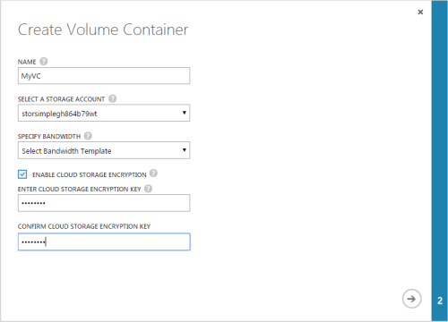
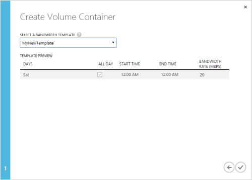

<!--author=SharS last changed: 1/7/2016-->

#### Hinzufügen ein Containers Lautstärke

1. Klicken Sie auf der Seite **Geräte** wählen Sie das Gerät, doppelklicken Sie darauf, und klicken Sie dann auf der Registerkarte **Lautstärke Container** .

2. Klicken Sie auf **Hinzufügen** am unteren Rand der Seite. Klicken Sie im Dialogfeld **Erstellen Lautstärke Container** folgendermaßen Sie vor:

  1. Geben Sie einen eindeutigen **Namen** für Ihre Lautstärke Container. Dieser Name kann maximal 32 Zeichen enthalten.
  2. Wählen Sie eine **Speicher-Konto** dieses Volume Container zugeordnet werden soll. Sie können wählen Sie aus vorhandenem Speicherkonto innerhalb des gleichen Abonnements oder **Weitere hinzufügen** ein Speicherkonto aus einem anderen Abonnement auswählen. Sie können auch das Speicherkonto auswählen, das beim Erstellen der Dienst zuerst generiert.
  3. Wenn Sie alle verfügbaren Bandbreite oder **benutzerdefinierte** Bandbreite Steuerelemente wendet nutzen möchten, geben Sie als **unbeschränkt** Bandbreite. Geben Sie für eine benutzerdefinierte Bandbreite einen Wert zwischen 1 und 1000/s aus. Wenn Sie basierend auf einem Zeitplan Bandbreite zuweisen möchten, können Sie die **Bandbreite Vorlage auswählen**.
  4. Es empfiehlt sich, dass Sie behalten **Aktivieren Cloud Speicher Verschlüsselung** zum Verschlüsseln der Daten, die in der Cloud vertraut ist aktiviert. Deaktivieren Sie die Verschlüsselung nur, wenn Sie andere bedeutet, dass Ihre Daten verschlüsselt beschäftigt sind. Sie können die Verschlüsselung festlegen, nachdem der Lautstärke Container erstellt wurde nicht ändern.
  5. Geben Sie einen **Cloud-Speicher Verschlüsselungsschlüssels** , die zwischen 8 und 32 Zeichen enthält. Das Gerät verwendet diese Schlüssel, um die verschlüsselten Daten zugreifen. Geben Sie im Feld **Bestätigen Cloud Speicher Verschlüsselungsschlüssels** den Cloud-Speicherschlüssel zur Bestätigung erneut ein. 
  6. Klicken Sie auf den Pfeil, um zur nächsten Seite zu gelangen.

     

3. Wenn Sie **Wählen Sie eine Vorlage Bandbreite**angegeben haben, wählen Sie aus der Dropdownliste mit den vorhandenen Bandbreite Vorlagen. Die Einstellungen Terminplan zu überprüfen, und klicken Sie auf das Symbol Kontrollkästchen .

     

Der Lautstärke Container werden gespeichert, und der neu erstellten Volume Container werden auf der Seite **Volume Container** aufgelistet werden.
 
