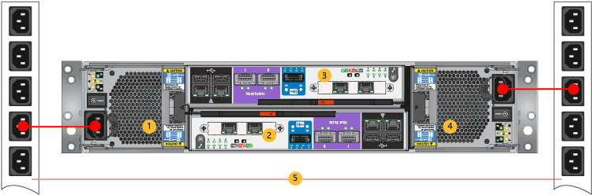

<!--author=alkohli last changed: 9/16/15-->

#### Mit Power-Kabel

1. Stellen Sie sicher, dass die Potenz auf jeder der Leistung wechselt und Kühlmodule (PCMs) werden in der Position aus.

2. Schließen Sie die entsprechenden Power an jeden der der PCMs in der primären Einheit an.

3. Fügen Sie die ab, die Shapes für Gestelle Power Verteilung Einheiten (PDUs) wie in der folgenden Abbildung gezeigt. Stellen Sie sicher, dass die zwei PCMs verwenden Sie separate Power Quellen.

    >[AZURE.IMPORTANT] Zur Sicherstellung der hohen Verfügbarkeit für Ihr System wird empfohlen, dass Sie ausschließlich die Potenz Kabel des Farbschemas in der folgenden Abbildung dargestellt gelten. 

    

    **Auf einem Gerät 8100 Kabel Power**

    |Beschriftung|Beschreibung|
    |:----|:----------|
    |1|PCM 0|
    |2|Controller 1|
    |3|Controller 0|
    |4|PCM 1|
    |5|PDUs|

4. Zum Aktivieren des Systems kippen Sie die Schalter Power auf beide PCMs in die Stellung ein.
