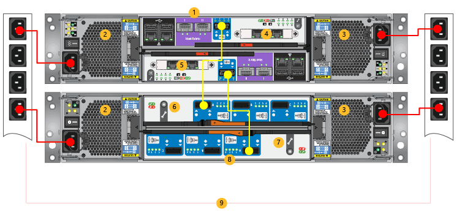

<!--author=alkohli last changed: 9/16/15-->

#### Auf Ihrem Gerät für Power Kabel

>[AZURE.NOTE] Beide Einheiten auf Ihrem Gerät StorSimple einbeziehen redundanten PCMs Für jede Einheit sowie müssen die PCMs installiert und werden bei einer Verbindung zu anderen Power-Quellen, um hohe Verfügbarkeit sicherzustellen.

1. Stellen Sie sicher, dass sich die Power Schalter auf alle der PCMs der Position aus befinden.

2. Klicken Sie auf der primären Einheit Herstellen einer Verbindung beide PCMs mit die ab. Die Power der entsprechenden werden in Rot im Diagramm Kabel Power unter identifiziert.

3. Stellen Sie sicher, dass die zwei PCMs auf die primäre Einheit separaten Power Quellen verwenden.

4. Fügen Sie an, die ab hoch auf den Shapes für Gestelle Verteilung Einheiten wie im Diagramm Kabel Power dargestellt.

5. Wiederholen Sie die Schritte 2 bis 4 für die Anlage EBOD.

6. Aktivieren der Einheit EBOD indem Kippen des Switches auf jede PCM an die Position auf.

7. Stellen Sie sicher, dass die Anlage EBOD aktiviert ist, indem er überprüft, ob eine grüne LED auf der Rückseite der EBOD Controller auf aktiviert sind.

8. Aktivieren Sie die primäre Einheit nach jeder PCM wechseln in die Stellung kippen.

9. Stellen Sie sicher, dass das System eingeschaltet ist, indem Sie den LED-Anzeigen aktiviert haben, klicken Sie auf Gerätecontroller sicherstellen.

10. Stellen Sie sicher, dass die Verbindung zwischen dem EBOD Controller und dem Gerätecontroller aktiv ist, überprüfen Sie, dass die vier LED neben den Port SAS auf dem Controller EBOD grün dargestellt werden.

    >[AZURE.IMPORTANT] Zur Sicherstellung der hohen Verfügbarkeit für Ihr System wird empfohlen, dass Sie ausschließlich die Potenz Kabel des Farbschemas in der folgenden Abbildung dargestellt gelten.

    

    **Power-Kabel**

    |Beschriftung|Beschreibung|
    |:----|:----------|
    |1|Primäre Einheit|
    |2|PCM 0|
    |3|PCM 1|
    |4|Controller 0|
    |5|Controller 1|
    |6|EBOD Controller 0|
    |7|EBOD Controller 1|
    |8|EBOD Einheit|
    |9|PDUs|
