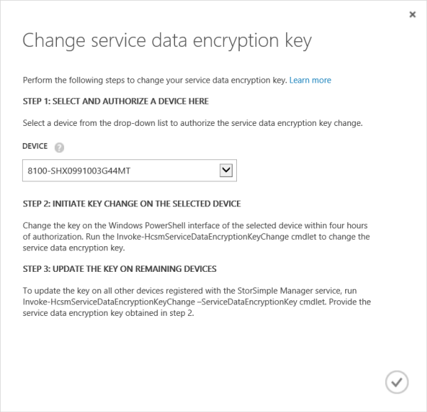

<!--author=SharS last changed: 12/01/15-->

### Schritt 1: Autorisieren Sie ein Gerät zum Ändern des Diensts Verschlüsselungsschlüssels für Daten in der klassischen Azure-portal

In der Regel fordert der Geräteadministrator Dienstadministrator zu autorisieren ein Gerät zum Dienst-Schlüssel für die Verschlüsselung der Daten zu ändern. Dienstadministrator autorisieren wird dann das Gerät so ändern Sie die Taste.

Dieser Schritt ist in der klassischen Azure-Portal ausgeführt. Dienstadministrator kann ein Gerät aus einer angezeigten Liste der Geräte auswählen, die autorisiert werden berechtigt sind. Das Gerät ist dann berechtigt, auf den Dienst Daten Verschlüsselung Key ändern zu starten.

#### Welche Geräte so ändern Sie Service-Schlüssel für die Verschlüsselung der Daten autorisiert werden können?

Ein Gerät muss die folgenden Kriterien erfüllen, bevor diese Dienst Daten Verschlüsselung Schlüsselaufgaben einleiten autorisiert werden kann:

- Das Gerät muss online zum Dienst Daten Verschlüsselung Key ändern Autorisierung berechtigt sein.

- Sie können das gleiche Gerät nach 30 Minuten erneut autorisieren, wenn die Änderung Key nicht eingeleitet wurde.

- Sie können ein anderes Gerät, autorisieren, vorausgesetzt, dass die wichtige Änderung nicht vom Gerät zuvor autorisierte eingeleitet wurde. Nachdem das neue Gerät autorisiert wurde, rufen Sie das alte Gerät kann nicht ändern.

- Sie können kein Gerät autorisieren, während das Rollover des Verschlüsselungsschlüssels Dienst Daten ausgeführt wird.

- Sie können ein Gerät autorisieren, wenn einige der Dienst registriert Geräte über die Verschlüsselung bereitgestellt haben, während andere Personen keine. In diesem Fall sind die in Frage kommenden Geräte ändern diejenigen, die den Dienst Datenschlüssel beendet haben.

> [AZURE.NOTE]
> Im Portal Azure klassischen sind StorSimple virtuelle Geräte nicht in der Liste der Geräte aufgeführt, die autorisiert werden können, um die wichtigsten Änderung zu starten.

Führen Sie die folgenden Schritte aus, um auszuwählen, und Autorisieren ein Gerät einleiten die Dienst Daten Verschlüsselung Key ändern.

#### Um ein Gerät so ändern Sie die Taste zu autorisieren

1. Klicken Sie auf der Seite Dienst Dashboard auf **Ändern Dienst Datenschlüssel**.

    

2. Klicken Sie im Dialogfeld **Dienst Daten Verschlüsselungsschlüssels ändern** wählen Sie aus, und Autorisieren ein Gerät einleiten die Dienst Daten Verschlüsselung Key ändern. Im Dropdown Listenfeld enthält, die in Frage kommenden Geräte autorisiert werden können.

3. Klicken Sie auf das Kontrollkästchen-Symbol .

### Schritt 2: Verwenden von Windows PowerShell für StorSimple einleiten die Dienst Daten Verschlüsselung Key ändern

Dieser Schritt ist in der Windows PowerShell für StorSimple-Oberfläche auf dem autorisierten StorSimple Gerät ausgeführt.

> [AZURE.NOTE] Bis zum Abschluss des wichtigsten Rollover, können keine Operationen im klassischen Azure-Portal von Ihrem Dienst StorSimple Manager ausgeführt werden.

Wenn Sie die Gerät serielle Konsole in Verbindung mit der Windows PowerShell-Benutzeroberfläche verwenden, führen Sie die folgenden Schritte aus.

#### Die Dienst Daten Verschlüsselung Key Änderung einleiten.

1. Wählen Sie die Option 1 mit Vollzugriff auf anmelden.

2. Geben Sie an der Befehlszeile ein:

     `Invoke-HcsmServiceDataEncryptionKeyChange`

3. Nachdem das Cmdlet erfolgreich abgeschlossen wurde, erhalten Sie einen neuen Dienst Verschlüsselung Registrierungsschlüssel. Kopieren und diesen Schlüssel für die Verwendung in Schritt 3 dieses Prozesses speichern. Dieser Schlüssel wird aktualisiert alle verbleibenden Geräte mit dem Dienst StorSimple Manager registriert verwendet werden.

    > [AZURE.NOTE] Dieses Verfahren muss innerhalb von vier Stunden Autorisieren von einem Gerät StorSimple eingeleitet werden.

   Diese neuen Product Key ist Klicken Sie dann auf alle Geräte abgelegt werden, die mit dem Dienst registriert sind, an den Dienst gesendet. Eine Warnung wird auf dem Dashboard Dienst angezeigt. Deaktivieren Sie den Dienst werden alle Vorgänge auf eingetragenen Geräten, und der Geräteadministrator müssen den Dienst Daten Verschlüsselungsschlüssel auf anderen Geräten zu aktualisieren. Die i/OS (Hosts Senden von Daten in der Cloud) wird jedoch nicht gestört werden.

   Wenn Sie ein einzelnes Gerät mit Ihrem Dienst registriert haben, der Rollover ist jetzt abgeschlossen und Sie können im nächsten Schritt überspringen. Wenn Sie mehrere Geräte an den Dienst registriert haben, fahren Sie mit Schritt 3 fort.

### Schritt 3: Aktualisieren der Schlüssel Dienst Daten auf anderen Geräten StorSimple

Diese Schritte müssen in der Windows PowerShell-Oberfläche von Ihrem Gerät StorSimple durchgeführt werden, wenn Sie mehrere Geräte an den StorSimple-Manager-Dienst registriert haben. Die Taste, die Sie in Schritt2 erhalten haben: Verwenden von Windows PowerShell für StorSimple einleiten die Dienst Daten Verschlüsselung Key ändern müssen verwendet werden, um alle verbleibenden StorSimple-Gerät StorSimple Manager Dienst registriert zu aktualisieren.

Führen Sie die folgenden Schritte aus, um die Verschlüsselung der Dienst Daten auf Ihrem Gerät zu aktualisieren.

#### Aktualisieren der Dienst Datenschlüssel

1. Verwenden Sie Windows PowerShell für StorSimple, um zur Konsole herstellen. Wählen Sie die Option 1 mit Vollzugriff anzumelden.

2. Geben Sie an der Befehlszeile ein:

    `Invoke-HcsmServiceDataEncryptionKeyChange – ServiceDataEncryptionKey`

3. Geben Sie den Dienst Daten Verschlüsselung Key, die Sie in ermittelt [Schritt2: Verwenden von Windows PowerShell für StorSimple einleiten die Dienst Daten Verschlüsselung Key ändern](#to-initiate-the-service-data-encryption-key-change).

