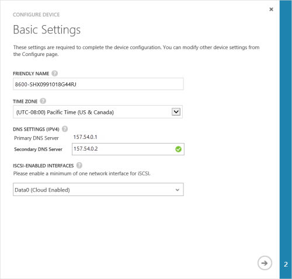
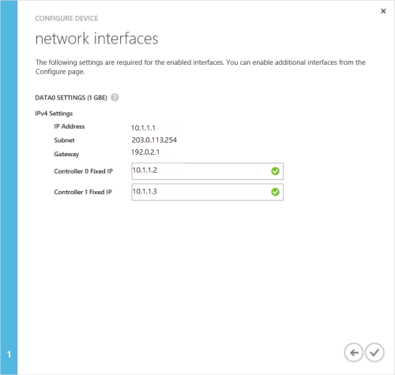
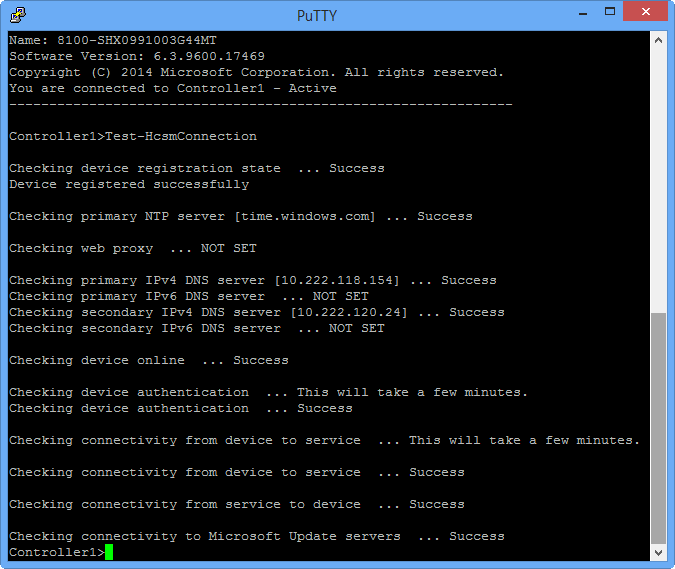

<!--author=alkohli last changed: 9/17/15-->

#### Zum Abschließen der minimalen StorSimple Gerät

1. Wählen Sie das Gerät aus, und klicken Sie auf **Schnellstart**. Klicken Sie auf die **vollständige Einrichtung einrichten** , um den Assistenten zum Konfigurieren von Geräten zu starten.

2. Folgendermaßen Sie in konfigurieren-Assistenten **Grundlegende Einstellungen** im Dialogfeld des Geräts vor:
  1. Geben Sie einen **Anzeigenamen** für Ihr Gerät. Der Standardnamen Gerät widerspiegeln Informationen, wie etwa die Gerätemodell und die fortlaufende Zahl. Sie können einen Anzeigenamen von bis zu 64 Zeichen zum Verwalten von Ihrem Geräts zuweisen.
  2. Festlegen der **Zeitzone** basierend auf die geografische Position in der das Gerät bereitgestellt wird. Ihr Gerät wird dieser Zeitzone für alle geplanten Vorgängen verwendet werden.
  3. Klicken Sie unter **DNS-Einstellungen**Geben Sie eine Adresse für Ihren **Sekundären DNS-Server**aus. Wenn Sie IPv6 verwenden, wird das Feld basierend auf dem IPv6-Präfix in der Windows PowerShell-Schnittstelle bereitgestellt ausgefüllt werden. 
  Wenn der sekundäre DNS-Server konfiguriert ist, werden Sie zum Speichern Ihrer Konfigurations Gerät nicht zulässig.
  4. Aktivieren Sie unter aktiviert iSCSI-Schnittstellen mindestens ein Netzwerk für iSCSI aus. Mindestens ein Netzwerk-Benutzeroberfläche in der Cloud aktiviert sein muss, und eine Benutzeroberfläche iSCSI aktiviert werden muss. Daten 0 ist automatisch Cloud-aktiviert.
 
      

3. Klicken Sie auf das Pfeilsymbol. 

4. Stellen Sie im Dialogfeld **Netzwerk-Schnittstellen** die festen IP-Adressen für Controller 0 und Controller 1 ein. **Der Controller feste IP-Adressen kostenlosen IP-Adressen im Subnetz zugegriffen werden, indem Sie die IP-Adresse des Geräts sein müssen.** Wenn die Daten 0 Benutzeroberfläche für IPv4 konfiguriert wurde, die festen IP-Adressen im IPv4-Format bereitgestellt werden müssen. Wenn Sie ein Präfix für IPv6-Konfiguration erhalten haben, werden automatisch die festen IP-Adressen in diese Felder ausgefüllt werden.

    

    Die festen IP-Adressen für den Controller sind für die Wartung die Updates für das Gerät verwendet und daher die feste IP-Adressen muss geroutet und eine Verbindung mit dem Internet herstellen. Sie können überprüfen, dass Ihre feste Controller IP-Adressen mithilfe der [Test-HcsmConnection] geroutet werden[ Test] Cmdlet. Das folgende Beispiel zeigt die feste Controller IP-Adressen, die mit dem Internet weitergeleitet werden und die Microsoft Update-Servern zugreifen können. 

     

5. Klicken Sie auf das Symbol Kontrollkästchen .
  Sie zu der Seite auf Geräte **Schnellstart** zurückgegeben werden kann.

 > [AZURE.NOTE] Sie können alle anderen Gerät-Einstellungen zu einem beliebigen Zeitpunkt ändern, durch den Zugriff auf der Seite **Konfigurieren** .

<!--Link reference-->
[Test]: https://technet.microsoft.com/library/dn715782(v=wps.630).aspx