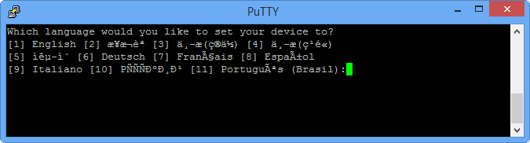

<!--author=SharS last changed: 02/22/2016-->

### <a name="to-configure-and-register-the-device"></a>Konfigurieren und das Gerät zu registrieren

1. Zugriff auf die Windows PowerShell-Benutzeroberfläche an Ihre StorSimple Gerät seriellen Konsole. Anweisungen finden Sie unter [Verwenden kitten Verbindung zu der seriellen Gerät-Konsole](#use-putty-to-connect-to-the-device-serial-console) . **Achten Sie darauf, dass Sie die Vorgehensweise genau befolgen, oder Sie werden nicht die Verwaltungskonsole zugreifen.**

2. Drücken Sie in der Sitzung, die angezeigt wird die EINGABETASTE einmal abzurufenden ein Eingabeaufforderungsfenster. 

3. Sie werden aufgefordert, die Sprache aus, die Sie für Ihr Gerät festlegen möchten. Geben Sie die Sprache aus, und drücken Sie dann die EINGABETASTE. 

    

4. Wählen Sie im Menü serielle Konsole, das angezeigt werden, die Option 1 mit Vollzugriff Anmelden aus. 

    
  
5. Führen Sie die folgenden Schritte aus, um die minimal erforderlichen Netzwerk-Einstellungen für Ihr Gerät zu konfigurieren.

    > [AZURE.IMPORTANT] Diese Konfigurationsschritte auf dem aktiven Controller des Geräts ausgeführt werden müssen. Menü der seriellen Konsole zeigt den Status der Controller in der Nachricht Banner an. Wenn Sie sind nicht mit dem aktiven Controller verbinden, trennen, und klicken Sie dann auf dem aktiven Controller verbinden.

      1. Geben Sie Ihr Kennwort ein, an der Befehlszeile. Das Kennwort für das Standard-Gerät ist **Kennwort1**.

      2. Geben Sie den folgenden Befehl ein:

           `Invoke-HcsSetupWizard`

      3. Ein Setup-Assistent wird angezeigt, helfen Ihnen die Konfiguration der Netzwerkeinstellungen für das Gerät. Geben Sie die folgende Informationen ein: 

       - IP-Adresse für Daten 0 Netzwerk-Benutzeroberfläche
       - Subnetz Eingabeformat
       - Gateway
       - IP-Adresse für den primären DNS-server
       - IP-Adresse für primäre NTP-server
 
        > [AZURE.NOTE] Sie müssen möglicherweise warten, bis ein paar Minuten, damit die Subnetz-Maske und die DNS-Einstellungen angewendet werden soll. 

      4. Konfigurieren Sie optional den Webproxyserver.

      > [AZURE.IMPORTANT] Achten Sie darauf, wenn Sie einen Webproxy verwenden, nur es so konfigurieren können, Web Proxy-Konfiguration ist optional. Weitere Informationen zum [Konfigurieren von Webproxy für Ihr Gerät](storsimple-configure-web-proxy.md)wechseln. 

6. Drücken Sie STRG + C, um den Setup-Assistenten zu beenden.
 
7. Installieren Sie die Updates wie folgt ein:
      1. Verwenden Sie das folgende Cmdlet, IP-Adressen für beide die Controller festzulegen:

         `Set-HcsNetInterface -InterfaceAlias Data0 -Controller0IPv4Address <Controller0 IP> -Controller1IPv4Address <Controller1 IP>`

      2. Führen Sie an der Befehlszeile `Get-HcsUpdateAvailability`. Sie sollten benachrichtigt, dass Updates verfügbar sind.

      3. Führen Sie `Start-HcsUpdate`. Sie können diesen Befehl ausführen, klicken Sie auf einen beliebigen Knoten. Updates werden auf dem ersten Controller angewendet, der Controller tritt ein Fehler auf, und klicken Sie dann die Updates auf dem anderen Controller angewendet werden.

      Sie können den Fortschritt der Aktualisierung überwachen, indem Sie ausführen `Get-HcsUpdateStatus`.    

       The following sample output shows the update in progress.
  
        ````
        Controller0>Get-HcsUpdateStatus
        RunInprogress       : True
        LastHotfixTimestamp : 4/13/2015 10:56:13 PM
        LastUpdateTimestamp : 4/13/2015 10:35:25 PM
        Controller0Events   :
        Controller1Events   : 
        ````
 
     Der folgende Beispielausgabe zeigt an, dass die Aktualisierung abgeschlossen ist.

        ````
        Controller1>Get-HcsUpdateStatus

        RunInprogress       : False
        LastHotfixTimestamp : 4/13/2015 10:56:13 PM
        LastUpdateTimestamp : 4/13/2015 10:35:25 PM
        Controller0Events   :
        Controller1Events   :

      Es kann bis zu 11 Stunden alle Updates, einschließlich der Windows-Updates beziehen dauern.

10. Führen Sie das folgende Cmdlet aus das Gerät Microsoft Azure Government-Portal verknüpft (da es standardmäßig öffentlichen Azure klassischen Portal verweist). Dies wird sowohl Controller neu zu starten. Es empfiehlt sich, dass Sie zwei PuTTY Sitzungen verwenden, um gleichzeitig mit beide Controller verbunden werden, damit Sie sehen können, wenn jeder Controller neu gestartet wird.

     `Set-CloudPlatform -AzureGovt_US`

    Eine bestätigungsmeldung wird angezeigt. Übernehmen Sie den Standardwert (**Y**).

11. Führen Sie das folgende Cmdlet aus, um Setup fortzusetzen:

     `Invoke-HcsSetupWizard`

     

    Wenn Sie Setup fortzusetzen, werden der Assistent die Version 2 aktualisieren. 

12. Akzeptieren Sie die Einstellungen im Netzwerk ein. Nachdem Sie jede Einstellung akzeptiert wird eine Meldung der Validierung angezeigt.
 
13. Aus Gründen der Sicherheit das Gerät Administratorkennwort läuft ab nach der ersten Sitzung, und Sie müssen Sie es jetzt ändern. Wenn Sie dazu aufgefordert werden, geben Sie ein Gerät Administratorkennwort. Ein gültiges Gerät Administratorkennwort muss zwischen 8 und 15 Zeichen lang sein. Das Kennwort muss enthalten die folgenden drei: Kleinbuchstaben, Großbuchstaben, numerischen und Sonderzeichen.

    <br/>

14. Der letzte Schritt im Setup-Assistenten registriert Ihr Gerät mit dem Dienst StorSimple-Manager. Zu diesem Zweck der Dienst Registrierungsschlüssel, die Sie in ermittelt Sprachmodule benötigen [Schritt2: Abrufen der Dienst Registrierungsschlüssel](../articles/storsimple/storsimple-deployment-walkthrough-gov-u2.md#step-2-get-the-service-registration-key). Nachdem Sie die Registrierungsschlüssel angeben, müssen Sie warten, 2-3 Minuten anzugeben, bevor Sie das Gerät registriert ist.

      > [AZURE.NOTE] STRG + C drücken Sie zu einem beliebigen Zeitpunkt, um den Setup-Assistenten zu beenden. Wenn Sie alle Netzwerkeinstellungen (IP-Adresse für Daten 0, Subnetz-Maske und Gateway) eingegeben haben, werden Ihre Einträge beibehalten.

    

15. Nachdem das Gerät registriert ist, werden ein Dienst Schlüssel Daten angezeigt. Kopieren Sie diesen Schlüssel, und speichern Sie sie an einem sicheren Ort. **Dieser Schlüssel wird mit der Dienst Registrierungsschlüssel zusätzliche Geräte mit dem Dienst StorSimple Manager registrieren erforderlich sein.** Weitere Informationen zu diesen Schlüssel finden Sie unter [StorSimple Sicherheit](../articles/storsimple/storsimple-security.md) .
    
        

      > [AZURE.IMPORTANT] Wenn Sie den Text aus dem Fenster serielle Konsole kopieren möchten, markieren Sie einfach den Text ein. Sie sollten dann zum Einfügen der Daten in die Zwischenablage oder einem beliebigen Texteditor sein. 
      > 
      > Verwenden Sie STRG + C nicht auf den Dienst Daten Verschlüsselungsschlüssel kopieren. Mit STRG + C bewirkt Sie den Assistenten zu beenden. Daher das Administratorkennwort Gerät wird nicht geändert, und das Gerät wird in das standardmäßige Kennwort zurückgesetzt.

16. Beenden der seriellen Konsole an.

17. Government Azure-Portal zurück, und gehen Sie folgendermaßen vor:
  1. Doppelklicken Sie auf dem Dienst StorSimple Manager zum Aufrufen der Seite **Schnellstart** .
  2. Klicken Sie auf **Ansicht verbunden Geräte**.
  3. Klicken Sie auf der Seite **Geräte** stellen Sie sicher, dass das Gerät zum Dienst erfolgreich eine Verbindung hergestellt hat, durch den Status nachschlagen. Der Gerätestatus sollte **Online**sein.
   
         
  
        Ist der Gerätestatus **Offline**, warten Sie ein paar Minuten, damit das Gerät online ist. 

        Wenn das Gerät nach ein paar Minuten noch offline ist, müssen Sie sicherstellen, dass Ihr Netzwerk Firewall in [networking Anforderungen für Ihr Gerät StorSimple](../articles/storsimple/storsimple-system-requirements.md)beschriebenen konfiguriert wurde. 

        Stellen Sie sicher, dass Port 9354 für ausgehende Kommunikation geöffnet ist, da es durch den Dienstbus für die Kommunikation StorSimple Manager Service-zu-Gerät verwendet wird.
     
        
