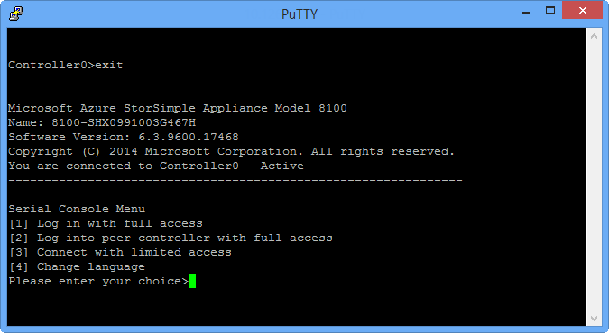
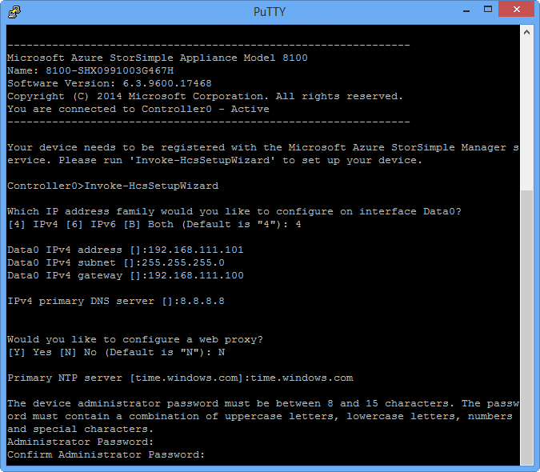
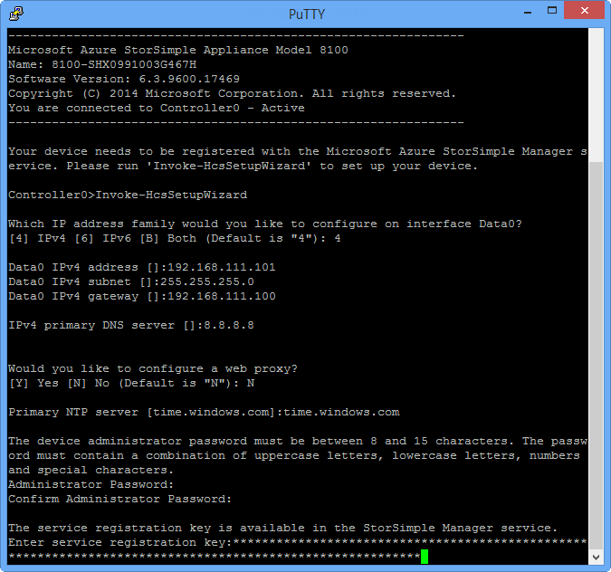
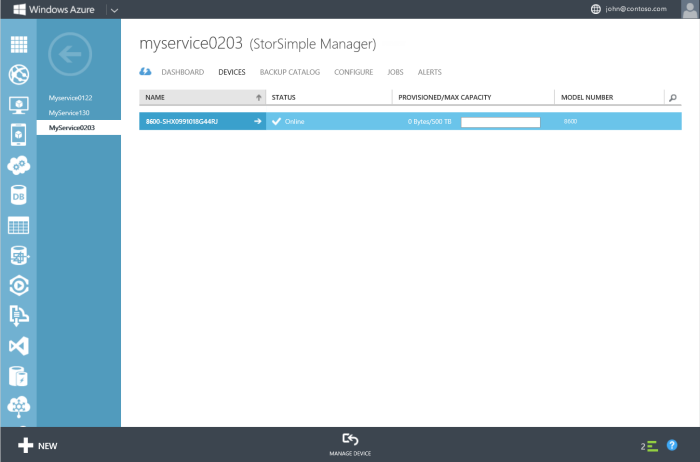

<!--author=alkohli last changed: 02/22/2016-->

### Konfigurieren und das Gerät zu registrieren

1. Zugriff auf die Windows PowerShell-Benutzeroberfläche an Ihre StorSimple Gerät seriellen Konsole. Anweisungen finden Sie unter [Verwenden kitten Verbindung zu der seriellen Gerät-Konsole](#use-putty-to-connect-to-the-device-serial-console) . **Achten Sie darauf, dass Sie die Vorgehensweise genau befolgen, oder Sie werden nicht die Verwaltungskonsole zugreifen.**

2. Drücken Sie in der Sitzung, die angezeigt wird die EINGABETASTE einmal abzurufenden ein Eingabeaufforderungsfenster. 

3. Sie werden aufgefordert, die Sprache aus, die Sie für Ihr Gerät festlegen möchten. Geben Sie die Sprache aus, und drücken Sie dann die EINGABETASTE. 

    

4. Wählen Sie im Menü serielle Konsole, das angezeigt werden, die Option 1 mit Vollzugriff Anmelden aus. 

    
  
     Führen Sie die Schritte 5 bis 12 so konfigurieren Sie die minimal erforderlichen Netzwerk-Einstellungen für Ihr Gerät. **Diese Konfigurationsschritte auf dem aktiven Controller des Geräts ausgeführt werden müssen.** Menü der seriellen Konsole zeigt den Status der Controller in der Nachricht Banner an. Wenn Sie nicht mit dem aktiven Controller verbunden sind, trennen, und klicken Sie dann auf dem aktiven Controller verbinden.

5. Geben Sie Ihr Kennwort ein, an der Befehlszeile. Das Kennwort für das Standard-Gerät ist **Kennwort1**.

6. Geben Sie den folgenden Befehl ein: `Invoke-HcsSetupWizard`. 

7. Ein Setup-Assistent wird angezeigt, helfen Ihnen die Konfiguration der Netzwerkeinstellungen für das Gerät. Geben Sie die folgenden Informationen: 
   - IP-Adresse für die Daten 0 Netzwerk-Benutzeroberfläche
   - Subnetz Eingabeformat
   - Gateway
   - IP-Adresse für den primären DNS-server
    
        Beachten Sie, dass das System Netzwerkeinstellungen nach jedem Schritt im Prozess überprüft wird.
   
      > [AZURE.NOTE] Sie müssen möglicherweise warten Sie einige Minuten für die Subnetz-Maske und die DNS-Einstellungen angewendet werden. Wenn Sie eine Fehlermeldung "Überprüfen Sie die Netzwerkkonnektivität mit Daten 0" erhalten möchten, aktivieren Sie die physische Netzwerkverbindung an der Schnittstelle 0 Daten von der aktiven Controller.

8. (Optional) den Web-Proxyserver konfigurieren. Web Proxy-Konfiguration ist zwar optional, **Achten Sie darauf, wenn Sie einen Webproxy, verwenden Sie nur hier konfigurieren können**. Weitere Informationen zum [Konfigurieren von Webproxy für Ihr Gerät](../articles/storsimple/storsimple-configure-web-proxy.md)wechseln.

9. Konfigurieren einer primären NTP für Ihr Gerät. NTP Server sind erforderlich, während der Zeit, damit sie mit der Cloud-Dienstanbieter authentifizieren kann Ihrem Gerät synchronisiert werden muss. Stellen Sie sicher, dass Ihr Netzwerk NTP Datenverkehr aus Datencenters weitergeleitet werden soll, mit dem Internet zulässt. Wenn dies nicht möglich ist, geben Sie einen internen NTP-Server aus. 
 
10. Aus Gründen der Sicherheit das Gerät Administratorkennwort läuft ab nach der ersten Sitzung, und Sie müssen Sie es jetzt ändern. Wenn Sie dazu aufgefordert werden, geben Sie ein Gerät Administratorkennwort. Ein gültiges Gerät Administratorkennwort muss zwischen 8 und 15 Zeichen lang sein. Das Kennwort muss enthalten die folgenden drei: Kleinbuchstaben, Großbuchstaben, numerischen und Sonderzeichen.

     

11. Der letzte Schritt im Setup-Assistenten registriert Ihr Gerät mit dem Dienst StorSimple-Manager. Zu diesem Zweck benötigen Sie den Dienst Registrierungsschlüssel, den Sie in Schritt 2 erhalten haben. Nachdem Sie die Registrierungsschlüssel angeben, müssen Sie warten, 2-3 Minuten anzugeben, bevor Sie das Gerät registriert ist.

      > [AZURE.NOTE] STRG + C drücken Sie zu einem beliebigen Zeitpunkt, um den Setup-Assistenten zu beenden. Wenn Sie alle Netzwerkeinstellungen (IP-Adresse für Daten 0, Subnetz-Maske und Gateway) eingegeben haben, werden Ihre Einträge beibehalten.

    

12. Nachdem das Gerät registriert ist, werden ein Dienst Schlüssel Daten angezeigt. Kopieren Sie diesen Schlüssel, und speichern Sie sie an einem sicheren Ort. **Dieser Schlüssel wird mit der Dienst Registrierungsschlüssel zusätzliche Geräte mit dem Dienst StorSimple Manager registrieren erforderlich sein.** Weitere Informationen zu diesen Schlüssel finden Sie unter [StorSimple Sicherheit](../articles/storsimple/storsimple-security.md) .
    
        

      > [AZURE.NOTE] Wenn Sie den Text aus dem Fenster serielle Konsole kopieren möchten, markieren Sie einfach den Text ein. Sie sollten dann zum Einfügen der Daten in die Zwischenablage oder einem beliebigen Texteditor sein. Verwenden Sie STRG + C nicht auf den Dienst Daten Verschlüsselungsschlüssel kopieren. Mit STRG + C bewirkt Sie den Assistenten zu beenden. Daher das Administratorkennwort Gerät wird nicht geändert, und das Gerät wird in das standardmäßige Kennwort zurückgesetzt.

13. Beenden der seriellen Konsole an.

14. Klassische Azure-Portal zurück, und führen Sie die folgenden Schritte aus:
  1. Doppelklicken Sie auf dem Dienst StorSimple Manager zum Aufrufen der Seite **Schnellstart** .
  2. Klicken Sie auf **Ansicht verbunden Geräte**.
  3. Klicken Sie auf der Seite **Geräte** stellen Sie sicher, dass das Gerät zum Dienst erfolgreich eine Verbindung hergestellt hat, durch den Status nachschlagen. Der Gerätestatus sollte **Online**sein.
   
         
  
        Ist der Gerätestatus **Offline**, warten Sie ein paar Minuten, damit das Gerät online ist. 

        Wenn das Gerät nach ein paar Minuten noch offline ist, müssen Sie sicherstellen, dass Ihr Netzwerk Firewall in [networking Anforderungen für Ihr Gerät StorSimple](../articles/storsimple/storsimple-system-requirements.md)beschriebenen konfiguriert wurde. 

        Stellen Sie sicher, dass Port 9354 für ausgehende Kommunikation geöffnet ist, da es durch den Dienstbus für die Kommunikation StorSimple Manager Service-zu-Gerät verwendet wird.
     
       
