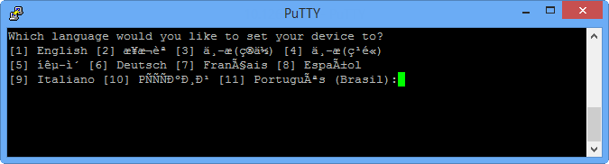
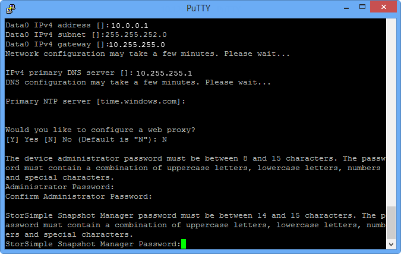
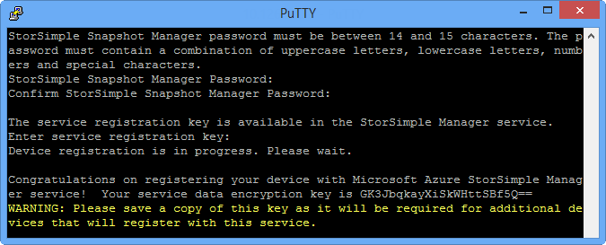
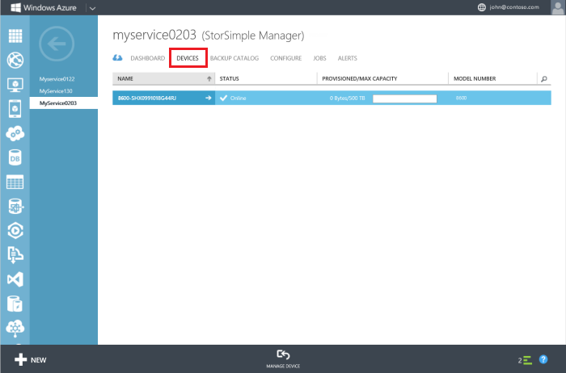

<!--author=alkohli last changed: 12/01/15-->

#### Konfigurieren und das Gerät zu registrieren

1. Zugriff auf die Windows PowerShell-Benutzeroberfläche an Ihre StorSimple Gerät seriellen Konsole. Anweisungen finden Sie unter [Verwenden kitten Verbindung zu der seriellen Gerät-Konsole](#use-putty-to-connect-to-the-device-serial-console) . **Achten Sie darauf, dass Sie die Vorgehensweise genau befolgen, oder Sie werden nicht die Verwaltungskonsole zugreifen.**

2. Drücken Sie in der Sitzung, die angezeigt wird die EINGABETASTE einmal abzurufenden ein Eingabeaufforderungsfenster. 

3. Sie werden aufgefordert, die Sprache aus, die Sie für Ihr Gerät festlegen möchten. Geben Sie die Sprache aus, und drücken Sie dann die EINGABETASTE. 

    

4. Wählen Sie im Menü serielle Konsole, das angezeigt werden, die Option 1 mit Vollzugriff Anmelden aus. 

    
  
     Führen Sie die Schritte 5 bis 12 so konfigurieren Sie die minimal erforderlichen Netzwerk-Einstellungen für Ihr Gerät. **Diese Konfigurationsschritte auf dem aktiven Controller des Geräts ausgeführt werden müssen.** Menü der seriellen Konsole zeigt den Status der Controller in der Nachricht Banner an. Wenn Sie nicht mit dem aktiven Controller verbunden sind, trennen, und klicken Sie dann auf dem aktiven Controller verbinden.

5. Geben Sie Ihr Kennwort ein, an der Befehlszeile. Das Kennwort für das Standard-Gerät ist **Kennwort1**.

6. Geben Sie den folgenden Befehl ein:

     `Invoke-HcsSetupWizard` 

7. Ein Setup-Assistent wird angezeigt, helfen Ihnen die Konfiguration der Netzwerkeinstellungen für das Gerät. Geben Sie die folgenden Informationen: 
   - IP-Adresse für die Daten 0 Netzwerk-Benutzeroberfläche
   - Subnetz Eingabeformat
   - Gateway
   - IP-Adresse für den primären DNS-server
   - IP-Adresse für primäre NTP-server
   
      > [AZURE.NOTE] Sie müssen möglicherweise warten Sie einige Minuten für die Subnetz-Maske und die DNS-Einstellungen angewendet werden. Wenn Sie erhalten eine "das Gerät ist nicht bereit." Fehler angezeigt wird, überprüfen Sie die Verbindung physischen Netzwerk an der Schnittstelle 0 Daten von der aktiven Controller.

8. (Optional) den Web-Proxyserver konfigurieren. Web Proxy-Konfiguration ist zwar optional, **Achten Sie darauf, wenn Sie einen Webproxy, verwenden Sie nur hier konfigurieren können**. Weitere Informationen zum [Konfigurieren von Webproxy für Ihr Gerät](../articles/storsimple/storsimple-configure-web-proxy.md)wechseln. Wenn Sie in diesem Schritt Probleme auftreten, lesen Sie Problembehandlung Anleitungen zu [Fehlern bei der Web-Proxy-Konfiguration](../articles/storsimple/storsimple-troubleshoot-deployment.md#errors-during-the-optional-web-proxy-settings).
 

      > [AZURE.NOTE] STRG + C drücken Sie zu einem beliebigen Zeitpunkt, um den Setup-Assistenten zu beenden. Änderungen an den Einstellungen, die Sie Punkte, bevor Sie diesen Befehl ausgestellt angewendet werden beibehalten.

9. Aus Gründen der Sicherheit das Gerät Administratorkennwort läuft ab nach der ersten Sitzung, und Sie müssen sie für nachfolgende Sitzungen ändern. Wenn Sie dazu aufgefordert werden, geben Sie ein Gerät Administratorkennwort. Ein gültiges Gerät Administratorkennwort muss zwischen 8 und 15 Zeichen lang sein. Das Kennwort muss eine Kombination aus Kleinbuchstaben, Großbuchstaben, Zahlen und Sonderzeichen enthalten.

10. Hier ist das Kennwort StorSimple Snapshot-Manager einstellen. Verwenden Sie dieses Kennwort, wenn Sie ein Gerät authentifizieren, mit dem Windows-Server ausgeführt StorSimple Snapshot-Manager. Wenn Sie dazu aufgefordert werden, geben Sie ein 14 bis 15 Zeichen-Kennwort ein. Das Kennwort muss eine Kombination aus drei der folgenden enthalten: Kleinbuchstaben, Großbuchstaben, numerischen und Sonderzeichen. 

    

    Sie können das Kennwort StorSimple Snapshot-Manager aus der StorSimple Manager-Service-Schnittstelle zurücksetzen. Die detaillierten Schritte finden Sie unter [Ändern der StorSimple Kennwörter mithilfe der embedseksamen StorSimple-Manager](../articles/storsimple/storsimple-change-passwords.md).

    In diesem Schritt Probleme zu analysieren, finden Sie unter Problembehandlung Anleitungen zu [Fehlern im Zusammenhang mit Kennwörtern](../articles/storsimple/storsimple-troubleshoot-deployment.md#errors-related-to-device-administrator-and-storsimple-snapshot-manager-passwords).

11. Der letzte Schritt im Setup-Assistenten registriert Ihr Gerät mit dem Dienst StorSimple-Manager. Zu diesem Zweck benötigen Sie den Dienst Registrierungsschlüssel, den Sie in Schritt 2 erhalten haben. Nachdem Sie die Registrierungsschlüssel angeben, müssen Sie warten, 2-3 Minuten anzugeben, bevor Sie das Gerät registriert ist.

    Um mögliche Gerät Registrierung Fehler zu beheben, finden Sie unter [Fehler bei der Registrierung Gerät](../articles/storsimple/storsimple-troubleshoot-deployment.md#errors-during-device-registration). Ausführliche Problembehandlung stattfindet, können Sie auch auf [schrittweise Problembehandlung Beispiel](../articles/storsimple/storsimple-troubleshoot-deployment.md#step-by-step-storsimple-troubleshooting-example)verweisen.

12. Nachdem das Gerät registriert ist, werden ein Dienst Schlüssel Daten angezeigt. Kopieren Sie diesen Schlüssel, und speichern Sie sie an einem sicheren Ort.
    
    > [AZURE.WARNING] Dieser Schlüssel wird mit der Dienst Registrierungsschlüssel zusätzliche Geräte mit dem Dienst StorSimple Manager registrieren erforderlich sein. Weitere Informationen zu diesen Schlüssel finden Sie unter [StorSimple Sicherheit](../articles/storsimple/storsimple-security.md) .

     

     Wenn Sie den Text aus dem Fenster serielle Konsole kopieren möchten, markieren Sie einfach den Text ein. Sie sollten dann zum Einfügen der Daten in die Zwischenablage oder einem beliebigen Texteditor sein. Verwenden Sie STRG + C nicht auf den Dienst Daten Verschlüsselungsschlüssel kopieren. Mit STRG + C bewirkt Sie den Assistenten zu beenden. Daher das Gerät Administratorkennwort und das Kennwort StorSimple Snapshot-Manager nicht geändert, und das Gerät wird in die Standard-Kennwörter zurückgesetzt.

13. Beenden der seriellen Konsole an.

14. Klassische Azure-Portal zurück, und führen Sie die folgenden Schritte aus:
  1. Doppelklicken Sie auf dem Dienst StorSimple Manager zum Aufrufen der Seite **Schnellstart** .
  2. Klicken Sie auf **Ansicht verbunden Geräte**.
  3. Klicken Sie auf der Seite **Geräte** stellen Sie sicher, dass das Gerät zum Dienst erfolgreich eine Verbindung hergestellt hat, durch den Status nachschlagen. Der Gerätestatus sollte **Online**sein. Ist der Gerätestatus **Offline**, warten Sie ein paar Minuten, damit das Gerät online ist.
   
     
  
      > [AZURE.IMPORTANT] Nachdem das Gerät online ist, schließen Sie die Netzwerkkabel, die Sie am Anfang dieses Schritts getrennt hatte.

Nachdem das Gerät registriert ist und nicht Onlinebetrieb, können Sie Ausführen der `Test-HcsmConnection -Verbose` um sicherzustellen, dass die Netzwerkkonnektivität fehlerfrei ist. Für die detaillierte Verwendung dieses Cmdlets wechseln Sie zu [cmdletreferenz zur für Test-HcsmConnection](https://technet.microsoft.com/library/dn715782.aspx).

 **Video verfügbar**

Wenn Sie ein Video zur Verfügung, die veranschaulicht, wie Sie konfigurieren und Ihrem Gerät über Windows PowerShell für StorSimple registrieren, klicken Sie auf [hier](https://azure.microsoft.com/documentation/videos/initialize-the-storsimple-appliance/).