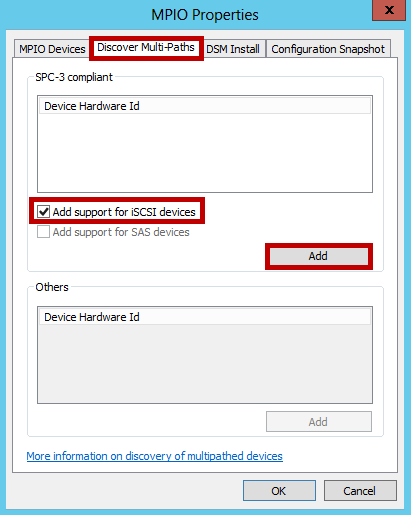

#### So konfigurieren Sie MPIO für StorSimple Datenmengen

1. Öffnen Sie die **MPIO-Konfiguration**. Klicken Sie auf **Server-Manager > Dashboards > Tools > MPIO**.

2. Wählen Sie die Registerkarte **Multipfade** aus, klicken Sie im Dialogfeld **Eigenschaften von MPIO** .

3. Wählen Sie die **Unterstützung für iSCSI-Geräte hinzufügen**aus, und klicken Sie dann auf **Hinzufügen**.  

    

4. Starten Sie den Server, wenn Sie dazu aufgefordert werden.
