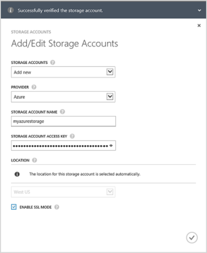
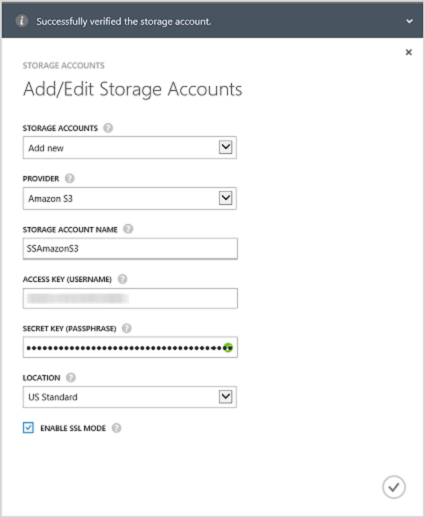
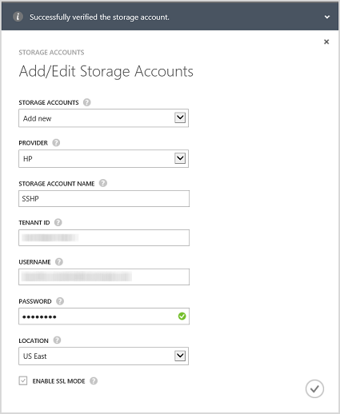
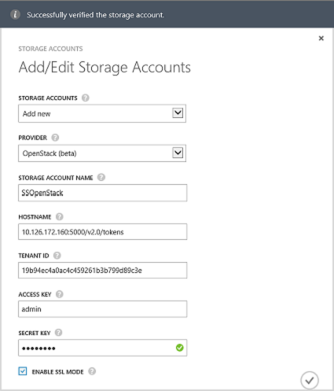

<!--author=alkohli last changed: 9/17/15-->

#### Zum Hinzufügen eines Kontos Speicher StorSimple 8000 Reihe Update 1.0

1. Klicken Sie auf der Startseite StorSimple Verwaltungsdienst wählen Sie den Dienst, und doppelklicken Sie darauf. Dadurch gelangen Sie zur Seite **Schnellstart** . Wählen Sie die Seite **Konfigurieren** .

2. Klicken Sie auf **Add/Edit Speicher-Konto**.

3. Klicken Sie im Dialogfeld **Add/Edit Speicher-Konto** auf **neue hinzufügen**.

4. Wählen Sie im Feld **Anbieter** den entsprechenden Cloud Service Provider aus. Unterstützte Provider Azure, Kürzel Amazon a3, Amazon S3 mit RRS, HP und OpenStack sind. Geben Sie die Anmeldeinformationen und die Position des Speicherkontos der Cloud-Dienstanbieter zugeordnet. Die Felder für Anmeldeinformationen präsentiert werden verschiedene je nach Cloud Service Provider, die, den Sie angegeben haben. 
  - Wenn Sie als Cloud Service Provider Azure ausgewählt haben, geben Sie den **Namen** und die primäre **Zugriffstaste** für Ihr Microsoft Azure-Speicher-Konto. Ein Azure-Konto wird der Speicherort automatisch ausgefüllt werden.

        

 - Wenn Sie Amazon S3 oder Amazon S3 mit RRS ausgewählt haben, geben Sie einen Anzeigenamen **Speicher Kontonamen**, **Zugriffstaste**, und **Geheim-Taste**. Für Amazon S3 und Amazon S3 mit RRS werden die folgenden Speicherorten unterstützt:

        - US Standard
        - US West (Oregon)
        - US West (Northern California)
        - EU (Ireland)
        - Asia Pacific (Singapore)
        - Asia Pacific (Sydney)
        - Asia Pacific (Tokyo)
        - South America (Sao Paulo)

        
            
 - Wenn Sie als Cloud Service Provider HP ausgewählt haben, geben Sie geeignet **Speicher Kontonamen**, **Mandanten-ID**, **Benutzername**und **Kennwort**. Für HP werden die folgenden Speicherorten unterstützt:

        - US East
        - US West
      
        
            
 - Wenn Sie als Cloud Service Provider **Openstack** ausgewählt haben, geben Sie einen **Hostname**, **Zugriffstaste**, und **Geheim-Taste**.

        > [AZURE.NOTE] Für alle die Cloud-Dienstanbieter, Azure ausschließen, darf ein Anzeigenamen ein. Sie können andere Anzeigenamen verwenden und Erstellen von mehr als ein Speicherkonto mit demselben Satz von Anmeldeinformationen.

        

5. Wählen Sie **SSL-Modus aktivieren** , um einen sicheren Kanal für die Kommunikation zwischen Ihrem Gerät und in der Cloud zu erstellen. Nur, wenn Sie in eine private Cloud betreiben, deaktivieren Sie das Kontrollkästchen **SSL-Modus aktivieren** .

      > [AZURE.NOTE] Wenn Sie HP als Ihren Anbieter verwenden, wird immer SSL aktiviert sein.
        
6. Klicken Sie auf das Kontrollkästchen-Symbol . Sie werden benachrichtigt, nachdem das Speicherkonto erfolgreich erstellt wurde.

7. Das Speicherkonto neu erstellten wird auf der Seite **Konfigurieren** , klicken Sie unter **Speicherkonten**angezeigt. Klicken Sie auf **Speichern** , um das neue Speicherkonto zu speichern. Klicken Sie auf **OK** , wenn Sie zur Bestätigung aufgefordert werden.
