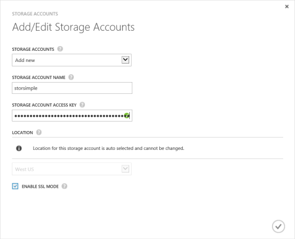

<!--author=SharS last changed: 9/17/15-->

#### Zum Hinzufügen eines neuen Kontos mit Speicher StorSimple Veröffentlichungsversion (GA)

1. Klicken Sie auf der Startseite StorSimple Verwaltungsdienst wählen Sie den Dienst, und doppelklicken Sie darauf. Dadurch gelangen Sie zur Seite **Schnellstart** . Wählen Sie die Seite **Konfigurieren** .

2. Klicken Sie auf **Add/Edit Speicher-Konto**.

3. Klicken Sie im Dialogfeld **Add/Edit Speicherkonto** folgendermaßen Sie vor:

  1. Klicken Sie auf **neue hinzufügen**.
  2. Geben Sie einen Namen für Ihr Speicherkonto ein.
  3. Angeben der primäre **Zugriffstaste** für Ihr Microsoft Azure-Speicher-Konto an.
  4. Wählen Sie **SSL-Modus aktivieren** , um einen sicheren Kanal für die Kommunikation zwischen Ihrem Gerät und in der Cloud zu erstellen. Nur, wenn Sie in eine private Cloud betreiben, deaktivieren Sie das Kontrollkästchen **SSL-Modus aktivieren** .
  5. Klicken Sie auf das Kontrollkästchen-Symbol . Sie werden benachrichtigt, nachdem das Speicherkonto erfolgreich erstellt wurde.

    

4. Das Speicherkonto neu erstellten wird auf der Seite **Konfigurieren** , klicken Sie unter **Speicherkonten**angezeigt. Klicken Sie auf **Speichern** , um das Konto neu erstellten Speicherplatz zu speichern. Klicken Sie auf **OK** , wenn Sie zur Bestätigung aufgefordert werden.
