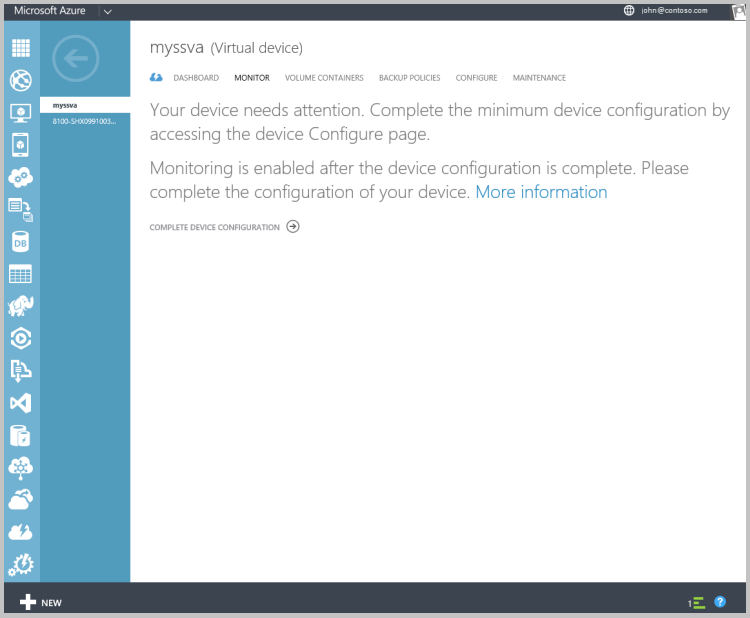
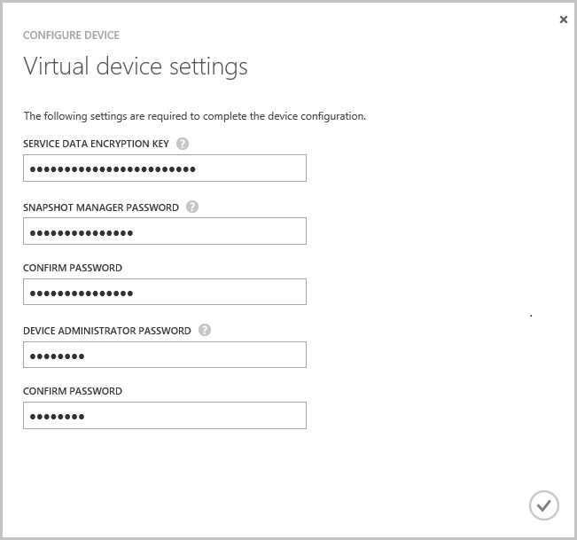
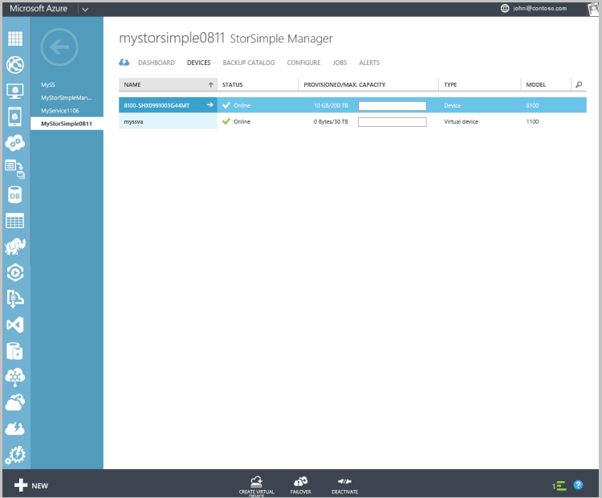

<!---author: alkohli, last updated: 11/05/2015 --->

#### Konfigurieren und registrieren virtuelle Gerät

1. Wählen Sie das soeben erstellten **Geräte** auf der Seite virtuelle StorSimple-Gerät. 

2. Klicken Sie auf die **vollständige Einrichtung einrichten**. Hierdurch wird den Assistent zum Konfigurieren von Geräten.

    

3. Geben Sie den **Dienst Datenschlüssel** in das bereitgestellte Feld ein.

4. Geben Sie die Kennwörter Snapshot-Manager und Gerät Administrator der Länge und Einstellungen angegeben haben.

5. Klicken Sie auf das Häkchen, um die ursprüngliche Konfiguration und Registrierung von virtuelles Gerät fertig zu stellen. 

    

Nachdem Sie die Konfiguration und Registrierung abgeschlossen, wird das Gerät online geschaltet. (Es kann für das Gerät online ist, mehrere Minuten dauern.)

