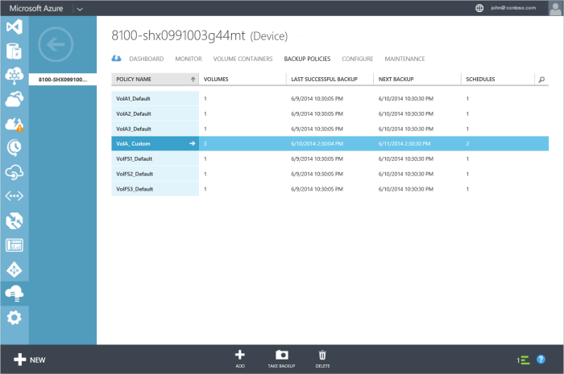

<!--author=SharS last changed: 9/15/15-->

#### So erstellen eine benutzerdefinierte Richtlinien

1. Klicken Sie auf der Seite **Geräte** klicken Sie auf **Sichern Richtlinien** , und klicken Sie dann auf **Hinzufügen**.

2. In **einer Sicherung Richtlinie hinzufügen** im Dialogfeld unter **der Sicherungsdatei Richtlinie definieren**:

    1. Geben Sie einen Richtliniennamen für die Sicherungsdatei ein.

    2. Wählen Sie die Datenmengen dieser Richtlinie hinzugefügt werden. Sie können auch mehrere Datenmengen hinzufügen, indem Sie sie aus der Dropdownliste auswählen.

    3. Klicken Sie auf das Kontrollkästchen-Symbol .

     Sie werden benachrichtigt, nachdem die Richtlinie erfolgreich erstellt wurde. Die Seite zusätzliche Richtlinien werden auch zum Anzeigen der neu erstellten Richtlinie aktualisiert werden.

4. Klicken Sie auf die Richtlinie benennen (erste Spalte) um zu Drilldown in die Details der Richtlinie, die Sie soeben erstellt haben.

5. Klicken Sie auf **Zeitpläne verwalten**.

6. Klicken Sie im Dialogfeld **Zeitpläne verwalten** :

    1. Wählen Sie **neu erstellen** , um einen weiteren Zeitplan hinzufügen.

    2. In der Dropdown-Liste fest, welche zusätzliche als **lokale** oder **Cloud** Momentaufnahme.

    3. Geben Sie die Sicherungsdatei Häufigkeit in Minuten, Stunden, Tagen oder Wochen ein.

    4. Wählen Sie eine Aufbewahrungsrichtlinie aus. Die Aufbewahrung hängen der Sicherung Häufigkeit.
 
    5. Wählen Sie die Startzeit und das Datum für die Richtlinie ein.

    6. Aktivieren Sie das Kontrollkästchen, um die Richtlinie zu aktivieren.

7. Klicken Sie auf das Kontrollkästchen-Symbol  auf Fertig stellen.

8. Sie können Sie die Richtliniendetails zurückgegeben werden kann. Klicken Sie auf **Speichern** , um die Änderungen zu speichern, die dieser Richtlinie vorgenommenen. Sie werden benachrichtigt, wenn die Richtlinie gespeichert wurde.

9. Navigieren Sie zu der Seite **Sicherung Richtlinien** zurück. Die tabellarische Auflistung der Sicherungsdatei Richtlinien wird aktualisiert, um die geänderte Richtlinie anzuzeigen.

    .

