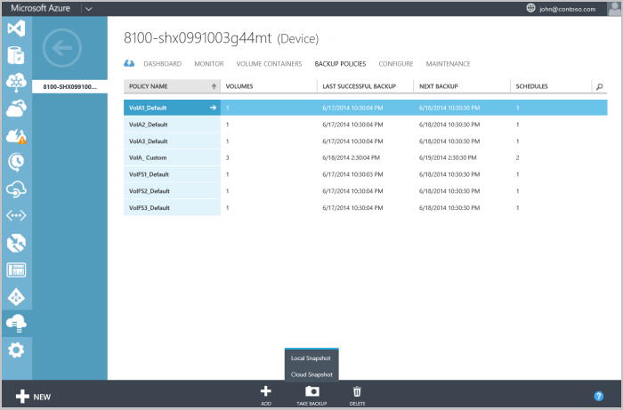
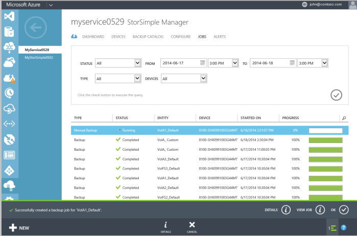

<!--author=SharS last changed: 9/15/15-->

#### Um eine manuelle Sicherung zu erstellen.

1. Wechseln Sie zur Registerkarte **Sicherung Richtlinien** , auf der Seite **Geräte** . Diese Registerkarte listet die Sicherung Richtlinien in Tabellenform, einschließlich der Richtlinie für den Datenträger, den Sie sichern möchten.

2. Wählen Sie die Richtlinie, indem Sie auf eine beliebige Stelle in der entsprechenden Zeile mit Ausnahme der ersten Spalte. Klicken Sie am unteren Rand der Seite auf die **Sicherung ausführen**. Die Schaltfläche Erweitert, um die Sicherungsoptionen anzeigen: lokale Snapshot und Cloud Snapshot. 

3. Wenn Sie eine der folgenden Optionen auswählen, werden Sie zur Bestätigung aufgefordert werden. Klicken Sie auf **Ja**. 

    
 
    Dadurch wird ein Projekt zum Erstellen einer Momentaufnahme gestartet. Sie sehen eine Benachrichtigung am unteren Rand der Seite, nachdem Sie der Auftrag erfolgreich erstellt wurde.

4. Um den Auftrag zu überwachen, klicken Sie auf **Ansicht Position** im Infobereich (am unteren Rand der Seite). 

    

5. Wenn das Sicherungsdatei Projekt abgeschlossen ist, wechseln Sie zur Registerkarte **Sicherungskatalog** .

6. Legen Sie die Auswahlmöglichkeiten Filter auf das entsprechende Gerät, Sicherung Richtlinie und Zeitraums. Klicken Sie auf das Symbol "Überprüfen"  nach dem Einrichten der Filter.

  Die Sicherung sollte in der Liste der Sätze Sicherung angezeigt werden, die im Katalog angezeigt wird.
