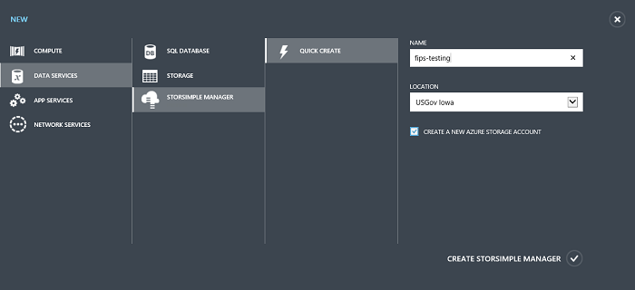
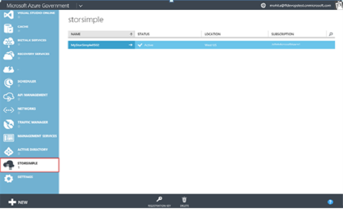

<!--author=SharS last changed: 9/17/15-->

#### So erstellen eine neue Dienstleistung

1. Verwenden Sie Ihre Anmeldeinformationen ein Microsoft-Konto anmelden bei der [Microsoft Azure Government-Portal](https://manage.windowsazure.us/)an.

2. Klicken Sie im Portal Government auf **neu** > **Data Services** > **StorSimple Manager** > **Symbolleiste erstellen**.

3. Im Formular, das angezeigt wird, führen Sie die folgenden Schritte aus:
  1. Geben Sie einen eindeutigen **Namen** für den Dienst. Dies ist einen Anzeigenamen ein, der zum Identifizieren des Dienstes verwendet werden kann. Der Namen kann zwischen 2 und 50 Zeichen enthalten, die Buchstaben, Zahlen und Bindestriche werden können. Der Name muss beginnen und enden mit einem Buchstaben oder einer Zahl zurück.
  2. Geben Sie einen **Speicherort** für Ihren Dienst. Speicherort bezieht sich auf die geografische Region, in dem Sie Ihr Gerät bereitstellen möchten. Wählen Sie **uns Regierungsstellen Iowa** oder **US-Regierungsstellen Virgina**.
  3. Wählen Sie ein **Abonnement** aus der Dropdownliste aus. Bei Ihrem Konto Abrechnung wird das Abonnement verknüpft. Dieses Feld ist nicht vorhanden, wenn Sie nur ein Abonnement besitzen.
  4. **Erstellen eines neuen Kontos mit Speicher** So erstellen ein Speicherkonto automatisch mit dem Dienst auswählen Dieses Speicherkonto muss einen besonderen Namen wie "storsimplebwv8c6dcnf".
  5. Klicken Sie auf **StorSimple-Manager erstellen** , um den Dienst zu erstellen.

       

     Sie gelangen zur Startseite **Dienst** . Die Erstellung von Diensten wird ein paar Minuten dauern. Nachdem der Dienst erfolgreich erstellt wurde, Sie entsprechend benachrichtigt, und der Status des Diensts ändert sich in **aktiv**.
 
       

