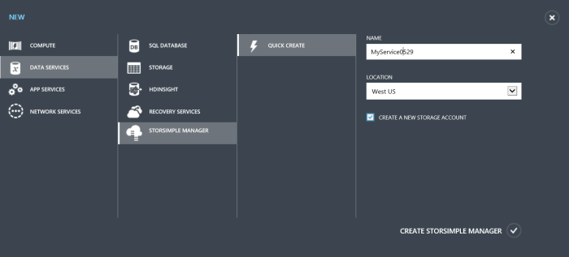
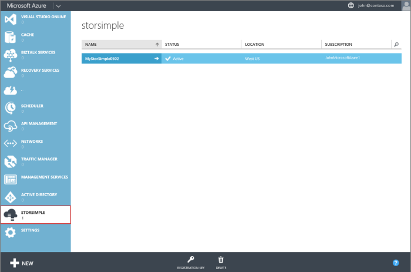

<!--author=alkohli last changed:01/14/2016-->

#### So erstellen eine neue Dienstleistung

1. Mit Microsoft-Konto Anmeldeberechtigungen, melden Sie sich im klassischen Azure-Portal unter dieser URL: [https://manage.windowsazure.com/](https://manage.windowsazure.com/).

2. Klicken Sie auf **neu**, im Portal Azure klassischen > **Data Services** > **StorSimple Manager** > **Schnellen Erstellen**.

3. Im Formular, das angezeigt wird, führen Sie die folgenden Schritte aus:
  1. Geben Sie einen eindeutigen **Namen** für den Dienst. Dies ist einen Anzeigenamen ein, der zum Identifizieren des Dienstes verwendet werden kann. Der Namen kann zwischen 2 und 50 Zeichen enthalten, die Buchstaben, Zahlen und Bindestriche werden können. Der Name muss beginnen und enden mit einem Buchstaben oder einer Zahl zurück.
  2. Geben Sie einen **Speicherort** für Ihren Dienst. Im Allgemeinen wählen Sie einen Speicherort, die geografische Region, in dem Sie Ihr Gerät bereitstellen möchten, am nächsten ist. Möglicherweise möchten Sie auch Folgendes berücksichtigen: 
     
        - Wenn Sie vorhandene Auslastung in Azure, die Sie auch Bereitstellen mit Ihrem Gerät StorSimple möchten haben, sollten Sie die Datacenter verwenden.
        - Ihre StorSimple-Manager-Dienst und Azure-Speicher können in zwei verschiedenen Speicherorten sein. In diesem Fall müssen Sie das StorSimple-Manager und Azure-Speicherkonto separat erstellen. Zum Erstellen eines Kontos Azure-Speicher wechseln Sie zu der Azure-Speicherdienst im klassischen Azure-Portal, und führen Sie die Schritte in [Erstellen eines Kontos Azure-Speicher](storage-create-storage-account.md#create-a-storage-account). Nachdem Sie dieses Konto erstellt haben, fügen sie den Schritten in [Konfigurieren eines neuen Speicherkonto für den Dienst](storsimple-deployment-walkthrough.md#configure-a-new-storage-account-for-the-service)der StorSimple Manager-Dienst hinzu.
         
  3. Wählen Sie ein **Abonnement** aus der Dropdownliste aus. Bei Ihrem Konto Abrechnung wird das Abonnement verknüpft. Dieses Feld ist nicht vorhanden, wenn Sie nur ein Abonnement besitzen.
  4. **Erstellen eines neuen Kontos mit Speicher** So erstellen ein Speicherkonto automatisch mit dem Dienst auswählen Dieses Speicherkonto muss einen besonderen Namen wie "storsimplebwv8c6dcnf". Wenn Sie Ihre Daten in einem anderen Speicherort benötigen, deaktivieren Sie dieses Kontrollkästchen. 
  5. Klicken Sie auf **StorSimple-Manager erstellen** , um den Dienst zu erstellen.

   

  Sie gelangen zur Startseite **Dienst** . Die Erstellung von Diensten wird ein paar Minuten dauern. Nachdem der Dienst erfolgreich erstellt wurde, Sie entsprechend benachrichtigt, und der Status des Diensts ändert sich in **aktiv**.
 
   

 **Video verfügbar**

Wenn Sie ein Video zur Verfügung, die veranschaulicht, wie Sie einen neuen StorSimple Manager-Dienst zu erstellen, klicken Sie auf [hier](https://azure.microsoft.com/documentation/videos/create-a-storsimple-manager-service/).