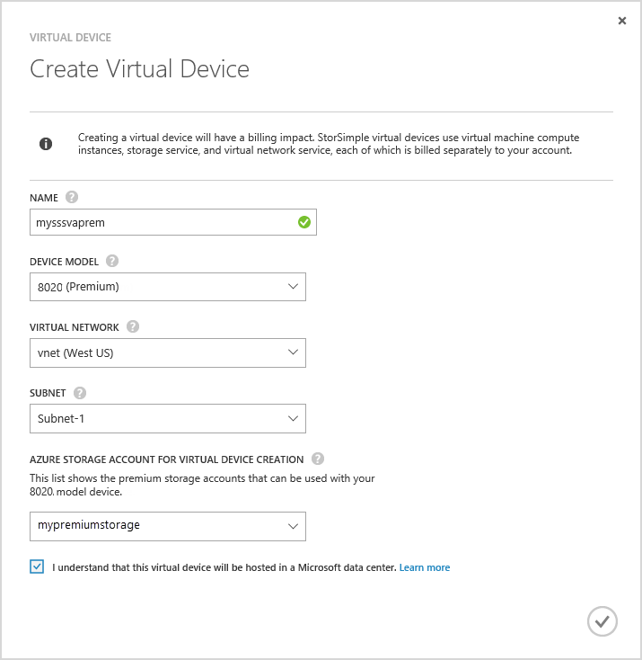
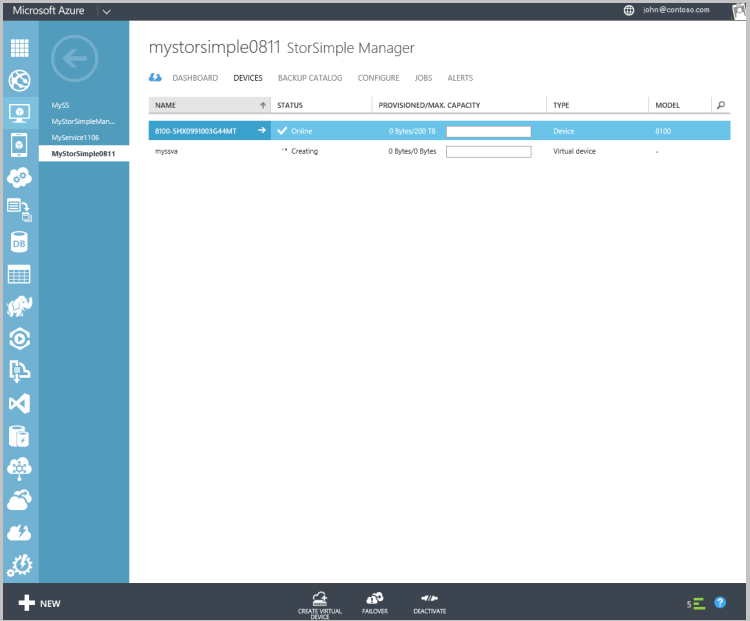

#### So erstellen ein virtuelles Gerät

1.  Wechseln Sie zu der **StorSimple Manager-** Dienst, der Azure-Portal.

2. Wechseln Sie zu der Seite **Geräte** . Klicken Sie auf **Erstellen virtuelle Gerät** am unteren Rand der Seite **Geräte** .

3. Geben Sie im **Dialogfeld Virtuelles Gerät erstellen**die folgenden Details ein.

     

    1. **Name** – einen eindeutigen Namen für das virtuelle Gerät.

    2. **Modell** - wählen Sie das Modell des virtuellen Geräts aus. In diesem Feld wird nur dargestellt, wenn Sie Update 2 oder höher ausgeführt werden. Eine 8010 Gerätemodell bietet 30 TB Standard-Speicher während 8020 64 TB Premium Speicher verfügt. Angeben von 8010
    3.  Element Ebene Abruf Szenarien aus Sicherungskopien bereitstellen zu können. Wählen Sie 8020 hohe Leistung, geringe Wartezeit Auslastung bereitstellen oder als sekundäre Gerät für die Wiederherstellung verwendet.
     
    4. **Version** - wählen Sie die Version von virtuelles Gerät aus. Wenn eine 8020 Gerätemodell ausgewählt ist, wird das Versionsfeld nicht für den Benutzer angezeigt. Diese Option ist nicht vorhanden, wenn alle physischen Geräte mit diesen Dienst registriert Update 1 (oder höher) ausgeführt werden. Dieses Feld wird nur dargestellt, wenn Sie eine Mischung vor dem Update 1 und Update 1 physische Geräte mit dem gleichen Dienst registriert haben. Ermitteln der Version des virtuellen Geräts die angegebene welches physisches Gerät Sie können Failover oder Klonen aus, es ist wichtig, dass Sie eine geeignete Version des virtuellen Geräts erstellen. Wählen Sie aus:

       - Version aktualisieren 0,3, wenn Sie über fehl oder DR auf einem physischen Gerät ausführen Update 0,3 oder einer früheren Version. 
       - Version Update 1, wenn Sie über fehl oder Klonen auf einem physischen Gerät Update 1 (oder höher) ausführen. 
       
    
    5. **Virtuelle Netzwerk** – Geben Sie ein virtuelles Netzwerk, die mit diesem virtuellen Gerät verwenden möchten. Wenn Premium Speicher (Update 2 oder höher) verwenden zu können, müssen Sie ein virtuelles Netzwerk auswählen, das mit dem Konto Premium Speicher unterstützt wird. Nicht unterstützte virtuelle Netzwerke werden in der Dropdown-Liste abgeblendet sein. Sie erhalten eine Warnung, wenn Sie ein nicht unterstütztes virtuelles Netzwerk auswählen. 

    5. **Speicher-Konto für das Erstellen eines virtuellen Gerät** – wählen Sie ein Speicherkonto zu halten Sie das Bild des virtuellen Geräts während der Bereitstellung. Dieses Speicherkonto sollten in derselben Region als virtuelles Gerät und virtuelles Netzwerk. Es sollte nicht zum Speichern von Daten, indem Sie entweder die physischen oder virtuelles Gerät verwendet werden. Standardmäßig wird ein neues Speicherkonto für diesen Zweck erstellt. Wenn Sie wissen, dass Sie bereits ein Speicherkonto verfügen, die für diese Verwendung geeignet ist, können Sie ihn aus der Liste auswählen. Wenn ein Premium virtuelles Gerät zu erstellen, wird die Dropdown-Liste nur Premium Speicher Konten angezeigt. 

        >[AZURE.NOTE] Das virtuelle Gerät kann nur mit den Azure-Speicherkonten arbeiten. Andere Cloud-Dienstanbieter wie Amazon, HP und OpenStack (die für das physische Gerät unterstützt werden) sind für das StorSimple virtuelle Gerät nicht unterstützt.
    
    1. Klicken Sie auf das Häkchen, um anzugeben, dass Sie wissen, dass auf dem virtuelle Gerät gespeicherten Daten in einem Microsoft-Datencenter gehostet werden soll. Wenn Sie nur ein physisches Gerät verwenden, wird Ihre Verschlüsselungsschlüssels mit Ihrem Gerät gespeichert; Daher kann Microsoft es nicht entschlüsseln. 
     
        Wenn Sie ein virtuelles Gerät verwenden, werden sowohl die Verschlüsselung und den Entschlüsselungsschlüssel in Microsoft Azure gespeichert. Weitere Informationen finden Sie unter [Sicherheitsaspekte der Verwendung eines virtuellen Geräts](storsimple-security/#storsimple-virtual-device-security).
    2. Klicken Sie auf das Kontrollkästchen-Symbol, um das virtuelle Gerät zu erstellen. Das Gerät kann ungefähr 30 Minuten dauern, bereitgestellt werden.

    

    
